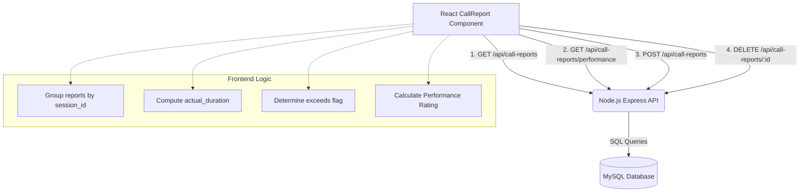

# Call Report Documentation: System Architecture & Technical Handbook

This document provides a highly detailed, comprehensive technical analysis and architectural guide for the **Call Report** module in the ACHME Communication CRM system. The Call Report module is an advanced service-activity tracking, session-management, and performance-analytics platform engineered in React (frontend) and backed by a Node.js/Express API with a MySQL database.

---

## 1. System Architecture & High-Level Overview

The Call Report module serves as the primary system of record for tracking technician on-site activities, customer visits, travel distances (KM), and call durations. It helps managers assess technician productivity and compliance against designated SLA (Service Level Agreement) durations.

### 1.1 Architectural Diagram

The system employs a client-server architecture. The frontend is a single-page interactive interface that orchestrates complex multi-record submissions as single "sessions", while the backend exposes standard REST API endpoints to read, write, update, and delete service reports in a MySQL database.



### 1.2 Database Schema Alignment

The backend database stores service reports as flat, individual rows in a table (typically named `call_reports` or `service_reports`). However, in the user interface, these flat rows are dynamically reconstructed into logical **Sessions** based on a shared `session_id`.

A single row in the database represents a **Breakpoint** (individual client call) and contains fields such as:
- `id` (Primary Key)
- `session_id` (UUID or unique string correlating multiple calls from the same session)
- `staff_name` (Technician's name)
- `executive_name` (Sales Executive's name)
- `report_date` (The date of the session/activity)
- `client_name` (Customer name visited)
- `location` (Physical location or branch visited)
- `phone` (Customer phone number)
- `start_time` (Datetime when service started)
- `end_time` (Datetime when service ended)
- `assigned_time` (SLA allocation in minutes, typically 30, 45, or 60)
- `actual_duration` (Difference in minutes between `end_time` and `start_time`)
- `is_exceeded` (Boolean flag indicating if `actual_duration > assigned_time`)
- `complaint` (Detailed description of work done / log)
- `remarks` (Mandatory justification if the call exceeded the SLA limit)
- `km` (Kilometers traveled for this call)
- `call_sequence` (Ordered sequence number of the call in that session, e.g. 1, 2, 3)

---

## 2. Component State Management & Lifecycle

The [callreport.jsx](file:///d:/ACHME_COMUNICATION-main/callreport.jsx) component uses React's `useState` hook to maintain component state. Because it handles bulk-form insertions, tabs switching, real-time analytics calculations, history filtering, and file exports, its state architecture is highly optimized.

### 2.1 State Variables Breakdown

| State Variable | Data Type | Default Value | Purpose |
| :--- | :--- | :--- | :--- |
| `activeTab` | String | `"reports"` | Determines the active view dashboard: either `"reports"` (session list) or `"performance"` (analytics). |
| `open` | Boolean | `false` | Controls the visibility of the primary Create/Edit Session modal overlay. |
| `isEdit` | Boolean | `false` | Indicates whether the open modal is in edit mode (updating an existing session) or create mode. |
| `editSessionId` | String / Null | `null` | Stores the `session_id` of the session currently being edited to associate database records. |
| `reports` | Array | `[]` | Holds the flat array of all call report records retrieved from the database backend. |
| `performance` | Array | `[]` | Holds technician performance aggregation statistics calculated by the server database. |
| `searchTerm` | String | `""` | Binds to the search input field to filter technicians by name dynamically. |
| `historyOpen` | Boolean | `false` | Controls the visibility of the technician history detail and export modal. |
| `historyStaff` | String | `""` | Stores the name of the technician currently selected for history review. |
| `historyData` | Array | `[]` | Holds call reports specific to the technician selected in the history modal. |
| `filterFrom` | String | `""` | Holds the "From Date" text value (`YYYY-MM-DD`) for filtering historical call logs. |
| `filterTo` | String | `""` | Holds the "To Date" text value (`YYYY-MM-DD`) for filtering historical call logs. |
| `executiveName` | String | `""` | Binds to the Sales Executive field in the primary session form metadata. |
| `staffName` | String | `""` | Binds to the Technician Name field in the primary session form metadata. |
| `calls` | Array | `[...]` | A highly dynamic array of call breakpoint objects, representing individual rows in the session form. |

### 2.2 React lifecycle (`useEffect`)

The component implements a standard initialization hook to pull critical data from the API server immediately upon mounting.

```javascript
useEffect(() => {
  fetchReports();
  fetchPerformance();
}, []);
```

- **`fetchReports()`**: Performs an asynchronous HTTP `GET` request to `http://localhost:3000/api/call-reports`. It populates the `reports` state array, which is subsequently grouped by `session_id` on the client side.
- **`fetchPerformance()`**: Performs an asynchronous HTTP `GET` request to `http://localhost:3000/api/call-reports/performance`. It populates the `performance` state array with pre-aggregated analyst rating data computed by the database server.

---

## 3. Data Transformation & Grouping Logic

Since the database stores calls as flat individual records, the frontend component must group them dynamically on the client side to display coherent "Technician Sessions".

### 3.1 Client-Side Session Grouping Engine

The grouping logic is computed in real-time inside the component render body using JavaScript's `Array.prototype.reduce()` array transformer. This guarantees that any changes in the underlying raw `reports` array immediately cascade and re-render the session list table.

```javascript
const groupedSessions = reports.reduce((acc, report) => {
  const sId = report.session_id || `NOSESS-${report.id}`;
  if (!acc[sId]) {
    acc[sId] = {
      session_id: sId,
      staff_name: report.staff_name,
      report_date: report.report_date,
      total_calls: 0,
      total_duration: 0,
      total_assigned: 0,
      total_km: 0,
      has_exceeded: false,
      clients: [],
      first_call_time: report.start_time,
      last_call_time: report.end_time,
    };
  }
  acc[sId].total_calls += 1;
  acc[sId].total_duration += report.actual_duration || 0;
  acc[sId].total_assigned += report.assigned_time || 0;
  acc[sId].total_km += Number(report.km) || 0;
  if (report.is_exceeded) acc[sId].has_exceeded = true;
  
  // Track overall session time span
  if (report.start_time && (!acc[sId].first_call_time || new Date(report.start_time) < new Date(acc[sId].first_call_time))) {
    acc[sId].first_call_time = report.start_time;
  }
  if (report.end_time && (!acc[sId].last_call_time || new Date(report.end_time) > new Date(acc[sId].last_call_time))) {
    acc[sId].last_call_time = report.end_time;
  }
  
  return acc;
}, {});
```

### 3.2 Key Aggregated Metas Calculated
- **`total_calls`**: Tracks how many breakpoints were processed during the technician's shift.
- **`total_duration`**: Sums the `actual_duration` of all calls in the session to show the active customer service hours.
- **`total_assigned`**: Sums the SLA targets in minutes to show the total allocated work window.
- **`total_km`**: Accumulates travel distance to assist with expense reimbursement.
- **`has_exceeded`**: A boolean flag set to `true` if *any* single call within the session exceeded its designated SLA limit. This triggers conditional styling (e.g. red tint bg) to highlight bottleneck sessions.
- **Time Span Tracking**: Compares timestamp dates dynamically to find the exact overall starting (`first_call_time`) and ending (`last_call_time`) points of the entire workday session.

---

## 4. Multi-Step Form Management: Form 1 & Form 2

The call report entry system features a unified dialog modal configured to operate as a logical multi-tier form.

```
+-------------------------------------------------------------+
|                     WORK SESSION DIALOG                     |
+-------------------------------------------------------------+
|                                                             |
|   [ Form 1: General Session Metadata ]                      |
|   Executive Name (Sales)       Technician Name              |
|   [____________________]      [____________________]        |
|                                                             |
|   -------------------------------------------------------   |
|                                                             |
|   [ Form 2: Dynamic Service Call Breakpoints (Rows) ]       |
|                                                             |
|   Call Row #1:                                              |
|   Client Name     Call Date   Start Time  End Time  Limit   |
|   [_________]     [Readonly]  [ 09:30  ]  [ 10:15 ] [ 30 ]  |
|   Location        KM          Duration     SLA Status       |
|   [_________]     [____]      [ 45 mins]   [⚠ Exceeded]     |
|   Work Log                    Remarks                       |
|   [____________________]      [Required: remarks...]        |
|                                                             |
|   Call Row #2:                                              |
|   [ ... ]                                                   |
|                                                             |
|   [+ Add Breakpoint Row]                                    |
|                                                             |
|   =======================================================   |
|   [ Save Work Session ]                      [ Cancel ]     |
+-------------------------------------------------------------+
```

### 4.1 Form 1: General Session Metadata

Form 1 captures global attributes related to the session.
- **Executive Name (Sales)**: Text field (`executiveName` state) identifying the salesperson responsible for client accounts visited during the session.
- **Technician Name (Required)**: Text field (`staffName` state) identifying the technician performing the physical operations. This field is designated as critical and triggers custom validation checks prior to API dispatch.

These fields are rendered in a responsive, two-column CSS grid:
```html
<SectionTitle>Staff & Session Info</SectionTitle>
<div className="grid grid-cols-1 md:grid-cols-2 gap-4">
  <div className="flex flex-col gap-1">
    <label className="text-xs font-bold text-gray-500 uppercase">Executive Name (Sales)</label>
    <input type="text" value={executiveName} onChange={e => setExecutiveName(e.target.value)} ... />
  </div>
  <div className="flex flex-col gap-1">
    <label className="text-xs font-bold text-gray-500 uppercase">Technician Name *</label>
    <input type="text" value={staffName} onChange={e => setStaffName(e.target.value)} required ... />
  </div>
</div>
```

---

### 4.2 Form 2: Dynamic Service Call Breakpoints (Rows)

Form 2 is a highly dynamic form enabling users to add, edit, validate, and delete an arbitrary number of call rows (breakpoints) associated with the session.

#### 4.2.1 Call Row Schema structure
Each call row object in the React `calls` state array contains:
```javascript
{
  id: Number,              // Unique identifier (typically Date.now() timestamp)
  client_name: String,     // Target customer name visited
  location: String,        // Area / City / State
  phone: String,           // Client contact number
  call_date: String,       // Defaults to current date (YYYY-MM-DD)
  start_time: String,      // Start time picker input value (HH:MM)
  end_time: String,        // End time picker input value (HH:MM)
  assigned_time: Number,   // SLA time allocated: 30, 45, or 60 minutes
  actual_duration: Number, // Difference between start and end times in minutes
  is_exceeded: Boolean,    // True if actual_duration > assigned_time
  service_details: String, // Work log description of the action taken
  remarks: String,         // Explanatory note justifying an SLA breach
  km: String / Number,     // Distance traveled in kilometers
}
```

#### 4.2.2 Dynamic Row Mutation Methods

- **`addCallRow()`**: Appends a new call template object with a unique timestamp ID to the React state array, immediately rendering another breakpoint card in the view.
```javascript
const addCallRow = () => {
  setCalls([...calls, {
    id: Date.now(), client_name: "", location: "", phone: "",
    call_date: localToday(),
    start_time: "", end_time: "", assigned_time: 30,
    actual_duration: 0, is_exceeded: false, service_details: "", remarks: "", km: "",
  }]);
};
```

- **`removeCallRow(id)`**: Filters out the row matching the specific ID, preventing deletion if it is the only row left.
```javascript
const removeCallRow = (id) => {
  if (calls.length > 1) setCalls(calls.filter(c => c.id !== id));
};
```

- **`updateCallField(id, field, value)`**: Handles inline cell changes. When critical time or limit properties change, it recalculates call durations and evaluates SLA threshold status dynamically.

---

## 5. Calculations & Form Validation Business Logic

The module implements critical business logic directly within React's state management, ensuring real-time calculation and validation in the UI without waiting for backend responses.

### 5.1 Real-Time Time and Duration Calculations

When a technician inputs the starting time (`start_time`) and ending time (`end_time`) for a visit, the `updateCallField` handler parses these inputs and calculates the duration automatically.

#### 5.1.1 Time String Parsing & Calculation Logic

```javascript
if (["start_time", "end_time", "assigned_time"].includes(field)) {
  const start = field === "start_time" ? value : c.start_time;
  const end = field === "end_time" ? value : c.end_time;
  const assigned = field === "assigned_time" ? Number(value) : c.assigned_time;
  if (start && end) {
    // Split HH:MM time strings into integer hour and minute parts
    const [sh, sm] = start.split(":").map(Number);
    const [eh, em] = end.split(":").map(Number);
    
    // Normalize times to total minutes from midnight
    const startMins = sh * 60 + sm;
    const endMins = eh * 60 + em;
    
    // Calculate elapsed duration
    const diffMins = endMins - startMins;
    if (!isNaN(diffMins)) {
      updated.actual_duration = diffMins > 0 ? diffMins : 0;
      
      // Determine if visit duration exceeded the SLA threshold
      updated.is_exceeded = updated.actual_duration > assigned;
    }
  }
}
```

This algorithm calculates the elapsed duration in minutes. If `actual_duration` exceeds the SLA `assigned_time`, `is_exceeded` is flagged as `true`.

### 5.2 Real-time Form Visual Feedback

This dynamic calculation triggers immediate visual cues in the UI:
1. **Status Badge Update**: The call card updates to show `"X mins ⚠ Exceeded"` in a red border or `"X mins"` in green text based on the calculated values.
2. **Conditional Validation Required Indicator**: If `is_exceeded` is true, a red `"* Required"` label is displayed in the Remarks textarea, signaling to the technician that a justification is required.

```html
<label className="text-xs font-bold text-gray-500 uppercase">
  Remarks {call.is_exceeded && <span className="text-red-500 font-bold">* Required</span>}
</label>
```

### 5.3 Advanced Pre-Submission Validation Engine

Before submitting data to the server, `handleSubmit` checks form inputs to prevent empty records and ensure SLA justification compliance:

```javascript
const handleSubmit = async (e) => {
  e.preventDefault();
  if (!staffName.trim()) return alert("Staff Name is required");
  
  // Mandatory Remarks Validation for Exceeded SLA limits
  if (calls.some(c => c.is_exceeded && !c.remarks.trim())) {
    return alert("Remarks are mandatory for all exceeded calls!");
  }
  
  // Prepares data payload to match backend SQL expectation...
}
```

This validation ensures that **no session can be saved if a technician exceeded their allocated call limit but failed to provide explanatory Remarks**, helping enforce operational standards.

---

## 6. Performance Dashboard & Analytics Tracking

The **Performance** tab provides managers with real-time technician metrics and ratings to evaluate operational efficiency.

### 6.1 Efficiency Metrics Calculations

Technician rating calculations are compiled by the SQL backend and displayed on the frontend:
- **`performance_rating`**: Calculated as:
  $$\text{Performance Rating} = \left( 1 - \frac{\text{Exceeded Calls}}{\text{Total Calls}} \right) \times 100\%$$
- **`total_calls`**: The total number of customer visits completed by the technician.
- **`exceeded_calls`**: The number of visits that exceeded the designated SLA limits.

### 6.2 Visual Presentation of Analytics

The ratings are displayed using clean progress bars with dynamic Tailwind CSS classes based on the rating score:

```html
<div className="flex justify-between text-xs font-bold text-gray-500 mb-1">
  <span>Efficiency</span>
  <span>{p.performance_rating}%</span>
</div>
<div className="w-full h-2 bg-gray-100 rounded-full overflow-hidden">
  <div 
    className={`h-full transition-all ${
      p.performance_rating > 80 ? "bg-green-500" : 
      p.performance_rating > 50 ? "bg-blue-500" : "bg-red-500"
    }`} 
    style={{ width: `${p.performance_rating}%` }}
  ></div>
</div>
```

- **Green (`bg-green-500`)**: > 80% Efficiency (Exceeded SLA limits on fewer than 20% of calls).
- **Blue (`bg-blue-500`)**: 51% to 80% Efficiency (Moderate SLA compliance).
- **Red (`bg-red-500`)**: <= 50% Efficiency (Frequently exceeds SLA limits, requiring manager review).

This visual system allows managers to quickly identify technicians who may need additional support or training.

---

## 7. Staff Service History & Excel Export Engine

The **Staff History Modal** allows users to filter technician logs by date and export records to Excel for external reporting.

### 7.1 Date Range Filtration

Technicians' visit history can be filtered by specific date ranges. The frontend constructs queries using `URLSearchParams` and fetches the filtered records from the API:

```javascript
const applyDateFilter = async () => {
  try {
    const params = new URLSearchParams();
    if (filterFrom) params.append("from", filterFrom);
    if (filterTo) params.append("to", filterTo);
    
    // Fetch reports filtered by date on the backend
    const res = await axios.get(`http://localhost:3000/api/call-reports?${params.toString()}`);
    
    // Filter the records for the selected technician on the frontend
    const staffCalls = res.data.filter(r => r.staff_name === historyStaff);
    setHistoryData(staffCalls);
  } catch (err) { console.error(err); }
};
```

This client-side date filtration updates the historical view in real time based on the response.

---

### 7.2 Custom Client-Side Excel Export Engine

The module includes a lightweight, client-side spreadsheet exporter. It generates a standard Comma-Separated Values (CSV) file, formatted with the required byte-order-mark (BOM) to ensure compatibility with Microsoft Excel.

```javascript
const downloadExcel = () => {
  const data = historyData;
  if (!data.length) return alert("No data to export");

  // Define column headers
  const headers = [
    "Call #", "Client Name", "Date", "Start Time", "End Time",
    "Location", "Duration (min)", "Limit (min)", "Status",
    "KM", "Executive", "Technician", "Work Log", "Remarks"
  ];

  // Process rows and format dates and times
  const rows = data.map(h => {
    const startTime = h.start_time ? new Date(h.start_time).toLocaleTimeString('en-IN', { hour: '2-digit', minute: '2-digit' }) : '';
    const endTime = h.end_time ? new Date(h.end_time).toLocaleTimeString('en-IN', { hour: '2-digit', minute: '2-digit' }) : '';
    const date = h.report_date ? new Date(h.report_date).toLocaleDateString('en-IN') : '';
    
    return [
      h.call_sequence, h.client_name, date, startTime, endTime,
      h.location || '', h.actual_duration, h.assigned_time,
      h.is_exceeded ? 'Exceeded' : 'On-Time',
      h.km || '', h.executive_name || '', historyStaff,
      h.complaint || '', h.remarks || ''
    ];
  });

  // Convert array to CSV format, escaping quotes
  const csvContent = [headers, ...rows]
    .map(row => row.map(cell => `"${String(cell).replace(/"/g, '""')}"`).join(","))
    .join("\n");

  // Append UTF-8 BOM (\uFEFF) for Excel auto-detection
  const blob = new Blob(["\uFEFF" + csvContent], { type: "text/csv;charset=utf-8;" });
  const url = URL.createObjectURL(blob);
  
  // Trigger file download
  const a = document.createElement("a");
  a.href = url;
  a.download = `ServiceReport_${historyStaff}_${new Date().toISOString().slice(0, 10)}.csv`;
  a.click();
  
  // Clean up
  URL.revokeObjectURL(url);
};
```

#### How it works:
1. **Time Formatting**: Formats timestamps into readable Indian Standard Time (`en-IN`) values for Excel.
2. **CSV Escaping**: Replaces nested double quotes with double-quotes (`""`) and wraps values in quotes to prevent formatting issues caused by commas in the `complaint` or `remarks` fields.
3. **Excel Compatibility**: Prepends the Byte-Order Mark (`\uFEFF`) to the CSV content, signaling to Excel that the file uses UTF-8 encoding. This ensures that special characters like currency symbols display correctly.

---

## 8. CRUD Operations: Edit, Update, and Delete Actions

The module supports full CRUD (Create, Read, Update, Delete) operations, allowing managers to maintain accurate records.

### 8.1 Edit Session Hydration

When a manager clicks the edit button on a session row, `openEdit` fetches the specific session details and populates the form states:

```javascript
const openEdit = async (session) => {
  try {
    const res = await axios.get(`http://localhost:3000/api/call-reports/session/${session.session_id}`);
    const sessionCalls = res.data;
    
    if (sessionCalls && sessionCalls.length > 0) {
      setStaffName(session.staff_name);
      setExecutiveName(sessionCalls[0].executive_name || "");
      
      // Hydrate form rows with data from the database
      setCalls(sessionCalls.map(c => ({
        id: c.id,
        client_name: c.client_name,
        location: c.location || "",
        phone: c.phone || "",
        call_date: c.report_date ? c.report_date.split("T")[0] : localToday(),
        start_time: c.start_time ? new Date(c.start_time).toTimeString().slice(0, 5) : "",
        end_time: c.end_time ? new Date(c.end_time).toTimeString().slice(0, 5) : "",
        assigned_time: c.assigned_time || 30,
        actual_duration: c.actual_duration || 0,
        is_exceeded: !!c.is_exceeded,
        service_details: c.complaint || "",
        remarks: c.remarks || "",
        km: c.km || "",
      })));
      
      setEditSessionId(session.session_id);
      setIsEdit(true); 
      setOpen(true);
    }
  } catch (err) { 
    console.error(err); 
    alert("Error loading session data");
  }
};
```

This method maps backend database entries into frontend row configurations and updates the open modal state to `isEdit: true` to prepare the form for editing.

---

### 8.2 Deleting Sessions (Cascading Execution)

When a session is deleted, the frontend maps through the session's individual call records and sends a delete request for each record to the API:

```javascript
const deleteSession = async (sId) => {
  if (!window.confirm("Delete this entire session?")) return;
  try {
    // Filter reports matching the target session ID
    const sessionReports = reports.filter(r => r.session_id === sId);
    
    // Send sequential delete requests for each record in the session
    for (const r of sessionReports) {
      await axios.delete(`http://localhost:3000/api/call-reports/${r.id}`);
    }
    
    // Refresh lists and analytics
    fetchReports(); 
    fetchPerformance();
  } catch (err) { console.error(err); }
};
```

This logic performs sequential API calls to delete each breakpoint in the session. Once complete, it refreshes both the session list and the performance metrics, ensuring the UI stays in sync with the database.

---

## 9. Styling & User Experience Guidelines

The Call Report module relies on custom Tailwind CSS classes and UX design patterns to create a clean, modern dashboard.

### 9.1 Tailwind CSS Styling Patterns

The component leverages several Tailwind utilities to build a responsive interface:
- **Card-based layouts** (`bg-white rounded-xl border shadow-sm`): Organizes metrics and analytics cleanly in the Performance tab.
- **Grids** (`grid grid-cols-1 md:grid-cols-3 gap-4`): Adjusts the layout from one column on mobile to three columns on desktop.
- **Overlays and Modals**: Uses custom styles for the modal overlay and slide-in animations.

```css
.overlay { 
  position: fixed; 
  top: 0; 
  left: 0; 
  width: 100%; 
  height: 100%; 
  background: rgba(0, 0, 0, 0.4); 
  backdrop-filter: blur(4px); 
  z-index: 1000; 
  opacity: 0; 
  visibility: hidden; 
  transition: all 0.3s; 
}
.overlay.show { 
  opacity: 1; 
  visibility: visible; 
}
```

### 9.2 SVG Icons (`lucide-react`)

The module uses clean vector icons from the Lucide React library to provide visual cues:
- `<User />`: Highlights technician names.
- `<Clock />` / `<History />`: Used next to call durations and SLA timers.
- `<MapPin />`: Highlights location details.
- `<Trash2 />` / `<Edit />`: standard actions for managing reports.

These icons help users scan information quickly, improving the overall usability of the CRM.
