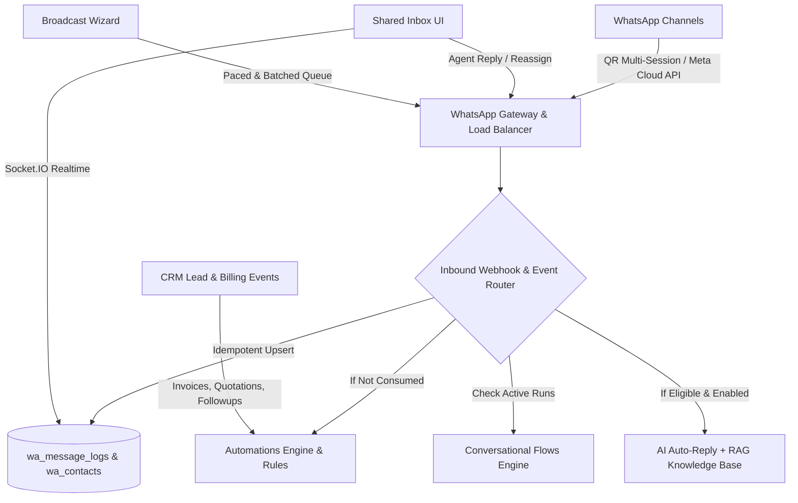

# Updated Implementation Plan: WhatsApp CRM Upgrade (wacrm Standard)

This implementation plan provides a comprehensive architectural and feature upgrade for the **WhatsApp CRM in MADHURA_CRM**, aligning the current codebase with the enterprise-grade specifications documented in [APP.md](file:///e:/MADHURA_CRM/APP.md).

---

## 1. Overview & Architecture Gap Analysis

MADHURA_CRM currently has a functional foundation with dual WhatsApp connectivity (`whatsapp-web.js` multi-session and Meta WhatsApp Cloud API), basic campaign sending, automations, templates, and OpenRouter AI replies. 

Based on [APP.md](file:///e:/MADHURA_CRM/APP.md), the system will be upgraded to a production-ready, enterprise-grade WhatsApp CRM platform with the following core pillars:

---

## User Review Required

> [!IMPORTANT]
> **Dual Engine Support (WhatsApp Web QR vs Meta Cloud API):**  
> We maintain dual engine flexibility. Users can link numbers via QR code scan (`whatsapp-web.js` multi-session) or connect official WhatsApp Business Accounts via Meta Cloud API with Webhook signing.

> [!IMPORTANT]
> **Encryption Key Requirement:**  
> Secrets (WhatsApp access tokens, AI provider API keys, webhook secrets) will now be encrypted at rest using AES-256-GCM. We will ensure automatic backward-compatibility migration for existing plaintext credentials.

> [!NOTE]
> **Full CRM Lead & Billing Synchronization:**  
> Inbound chats from new numbers will automatically create/link to CRM contacts, telecalls, or walkins, and automatically display client invoice/quotation/AMC history right in the chat sidebar.

---

## Proposed Changes

The implementation is organized into **8 core phases/modules**:

---

### Phase 1: Security, Encryption & Database Schema Expansion

#### [MODIFY] [backend/services/waDatabase.js](file:///e:/MADHURA_CRM/backend/services/waDatabase.js)
- Add missing tables and columns matching [APP.md](file:///e:/MADHURA_CRM/APP.md):
  - `wa_flows`, `wa_flow_nodes`, `wa_flow_runs`, `wa_flow_run_events` (for visual state-machine chatbot flows)
  - `wa_quick_replies` (saved reply snippets with shortcuts like `/pricing`)
  - `wa_api_keys` (scoped public API keys with SHA-256 hashes)
  - `wa_knowledge_chunks` with full-text search indexing (`fts`)
  - `wa_reactions` (emoji reactions table for messages)
  - Add `reply_to_message_id`, `interactive_reply_id`, `interactive_payload`, `media_mime_type`, `media_size` to `wa_message_logs`
  - Add `ai_auto_reply_disabled`, `ai_reply_count`, `assigned_agent_id` to chat/contact records

#### [NEW] [backend/services/waEncryption.js](file:///e:/MADHURA_CRM/backend/services/waEncryption.js)
- Implement AES-256-GCM authenticated encryption and decryption for credentials (`access_token`, `api_key`, `webhook_secret`).
- Support fallback for legacy unencrypted data with transparent in-flight upgrade on write.

#### [NEW] [backend/services/waSsrf.js](file:///e:/MADHURA_CRM/backend/services/waSsrf.js)
- Implement SSRF validation to prevent outbound webhooks from hitting loopback (`127.0.0.1`), private networks (`10.x`, `192.168.x`, `172.16-31.x`), or cloud metadata endpoints (`169.254.169.254`).

---

### Phase 2: Shared Multi-Agent Inbox & Realtime Features

#### [MODIFY] [frontend/src/pages/whatsapp.jsx](file:///e:/MADHURA_CRM/frontend/src/pages/whatsapp.jsx)
- **Message Quoting & Reply**: Add reply-to preview banner when typing and quote bubbles in message thread.
- **Emoji Reactions**: Add reaction picker popup on hover and reaction count chips on message bubbles.
- **Interactive Message Rendering**: Render clickable quick-reply buttons and list menus inside the chat bubbles.
- **Media Lightbox & Voice Player**: Full-screen image/video lightbox, voice message waveform player (`.ogg`/`.opus`/`.mp3`), and file download cards.
- **Quick Reply Picker**: Type `/` in composer to filter and insert quick response templates.
- **AI Takeover & Handoff Banner**: Visual status banner indicating whether AI auto-reply is currently active, paused, or handed off to a human agent, with a 1-click "Resume AI" / "Take Over" toggle.
- **Contact CRM Sidebar**: Right-side panel showing contact profile, tags, custom fields, and linked CRM history (Invoices, Quotations, AMC contracts, Telecalls).

#### [MODIFY] [backend/services/whatsappService.js](file:///e:/MADHURA_CRM/backend/services/whatsappService.js)
- Add handler for message reactions (`message_reaction` event) and sync via Socket.IO.
- Handle quote context (`msg.hasQuotedMsg`, `msg.getQuotedMessage()`).
- Add agent assignment tracking and notification trigger when a conversation is assigned to an employee.

---

### Phase 3: Meta Cloud API Webhook Processing & Reliability

#### [MODIFY] [backend/routes/waWebhookRoutes.js](file:///e:/MADHURA_CRM/backend/routes/waWebhookRoutes.js)
#### [MODIFY] [backend/services/whatsappCloudApi.js](file:///e:/MADHURA_CRM/backend/services/whatsappCloudApi.js)
- **Signature Verification**: Validate `x-hub-signature-256` HMAC-SHA256 signature using `META_APP_SECRET`.
- **Status Forward Ladder**: Enforce forward-only status updates (`pending` → `sent` → `delivered` → `read` → `replied`).
- **Idempotent Webhook Processing**: Guarantee duplicate webhook payloads from Meta are safely ignored.
- **Inbound Media Mirroring**: Automatically download temporary Meta media attachments to local CRM storage (`backend/uploads/whatsapp/`) so media remains accessible permanently.
- **Phone Variant Retry**: Implement E.164 phone normalization and trunk-prefix variants (`+91...`, leading 0 handling) with automatic retry on 404.

---

### Phase 4: 4-Step Broadcast Campaigns Wizard & Pacing

#### [MODIFY] [frontend/src/pages/whatsappCampaigns.jsx](file:///e:/MADHURA_CRM/frontend/src/pages/whatsappCampaigns.jsx)
- Transform campaign creation into a clean **4-step wizard**:
  1. **Step 1: Choose Template / Content**: Select approved template, text message, or media.
  2. **Step 2: Select Audience**: Filter contacts by Contact Groups, Lead Status, Tags, or CSV upload with live recipient count.
  3. **Step 3: Personalize Variables**: Dynamic mapping of variable placeholders (`{name}`, `{service}`, `{amount}`, `{invoice_no}`) with live phone preview.
  4. **Step 4: Schedule & Anti-Ban Safety**: Configure scheduled launch, random delay intervals (8-15s), pause batches (e.g. pause 3 mins after 25 messages), and daily sending cap.
- Add **Resume Campaign** button for interrupted/paused campaigns.
- Add live delivery breakdown cards (`Total`, `Sent`, `Delivered`, `Read`, `Replied`, `Failed`).
- Add **Export Campaign Analytics** to CSV.

#### [MODIFY] [backend/services/waCampaignEngine.js](file:///e:/MADHURA_CRM/backend/services/waCampaignEngine.js)
- Add resilient auto-recovery on server restarts for campaigns in `running` status.
- Strict opt-out filtering (automatically exclude any contact who replied `STOP` or `UNSUBSCRIBE`).

---

### Phase 5: Multi-Step Automations & CRM Lifecycle Schedulers

#### [MODIFY] [frontend/src/pages/whatsappAutomations.jsx](file:///e:/MADHURA_CRM/frontend/src/pages/whatsappAutomations.jsx)
- Support visual step chains:
  - **Triggers**: `new_lead`, `invoice_created`, `payment_due`, `payment_received`, `lead_followup`, `first_inbound_message`, `keyword_match`, `tag_added`.
  - **Conditions**: Check tag presence, lead status, time of day, or message content.
  - **Actions**: `send_message`, `send_template`, `send_interactive_buttons`, `add_tag`, `assign_agent`, `wait_delay`, `send_webhook`.
- Add interactive quick-reply button config editor.
- Add **Execution Logs Viewer** with search by phone, status (`sent`, `skipped`, `failed`), and error details.

#### [MODIFY] [backend/services/waAutomationService.js](file:///e:/MADHURA_CRM/backend/services/waAutomationService.js)
- Support async `wait` steps with persistent delay queue and execution resumption.
- Atomic execution counter updates.

---

### Phase 6: Conversational Flows & Chatbot State Machine

#### [NEW] [backend/services/waFlowEngine.js](file:///e:/MADHURA_CRM/backend/services/waFlowEngine.js)
- Runtime execution engine for interactive WhatsApp menus and chatbots:
  - Tracks `flow_runs` per active contact with state machine variables (`vars`).
  - Executes nodes: `start`, `send_message`, `send_buttons`, `send_list`, `collect_input`, `condition`, `set_tag`, `handoff`, `end`.
  - Reprompt limit with fallback handling (transfer to human if customer replies with unrecognized text).
  - Pauses active flow automatically when a human agent sends a manual message from the Shared Inbox.

#### [NEW] [frontend/src/pages/whatsappFlows.jsx](file:///e:/MADHURA_CRM/frontend/src/pages/whatsappFlows.jsx)
- Visual flow manager with interactive test simulator to preview chatbot conversations in real time before publishing.

---

### Phase 7: AI Auto-Reply & Grounded RAG Knowledge Base

#### [MODIFY] [backend/services/waAiReply.js](file:///e:/MADHURA_CRM/backend/services/waAiReply.js)
- Add per-conversation reply limits (e.g. max 3-5 AI replies before pausing to prevent infinite loops).
- Implement `[[HANDOFF]]` sentinel parser: if AI determines human assistance is required, automatically flag conversation for human takeover and notify agents.
- Ground responses with context from `wa_knowledge_base` (RAG search).
- Multi-provider support (OpenAI GPT-4o / Claude 3.5 / OpenRouter / DeepSeek).

#### [MODIFY] [backend/services/waKnowledgeBase.js](file:///e:/MADHURA_CRM/backend/services/waKnowledgeBase.js)
- Document chunking (~1000 characters) and lexical/semantic full-text search against uploaded company manuals, service catalogues, and FAQ documents.

#### [MODIFY] [frontend/src/pages/whatsappAccounts.jsx](file:///e:/MADHURA_CRM/frontend/src/pages/whatsappAccounts.jsx)
- Add AI Settings tab: Provider select, model selector, API key input, system prompt customization, knowledge base upload & test playground simulator.

---

### Phase 8: Unified Navigation & UI Polish

#### [MODIFY] [frontend/src/sidebars/adminsidebar.jsx](file:///e:/MADHURA_CRM/frontend/src/sidebars/adminsidebar.jsx)
#### [MODIFY] [frontend/src/sidebars/usersidebar.jsx](file:///e:/MADHURA_CRM/frontend/src/sidebars/usersidebar.jsx)
#### [MODIFY] [frontend/src/App.js](file:///e:/MADHURA_CRM/frontend/src/App.js)
- Organize WhatsApp into a cohesive sidebar hierarchy:
  - 💬 **Shared Inbox** (`/dashboard/whatsapp`)
  - 👥 **WhatsApp Contacts** (`/dashboard/whatsapp/contacts`)
  - 📑 **Message Templates** (`/dashboard/whatsapp/templates`)
  - 🚀 **Campaigns & Broadcasts** (`/dashboard/whatsapp/campaigns`)
  - ⚡ **Automations & Rules** (`/dashboard/whatsapp/automations`)
  - 🤖 **Chatbot Flows** (`/dashboard/whatsapp/flows`)
  - 🧠 **AI & Knowledge Base** (`/dashboard/whatsapp/ai`)
  - 📊 **Analytics & Reports** (`/dashboard/whatsapp/analytics`)
  - ⚙️ **Channels & Settings** (`/dashboard/whatsapp/accounts`)

---

## Verification Plan

### Automated Tests
1. **Schema & Encryption Verification**:
   - Run `node backend/services/waDatabase.js` to ensure all new tables and indexes are created without error.
   - Run unit test for `waEncryption.js` verifying AES-256-GCM encryption, decryption, and backward compatibility.
2. **Webhook Verification**:
   - Test `POST /api/whatsapp/webhook` with HMAC-SHA256 signature verification and message idempotency.
3. **Pacing & Anti-Ban Rate Limiting**:
   - Verify `_paceSend()` enforces min gap between concurrent campaign messages.

### Manual Verification
1. **Shared Inbox Interaction**:
   - Send and receive text, image, PDF document, and voice note from a real WhatsApp number.
   - Verify message quote preview, reaction popup, and contact sidebar info.
2. **Campaign Launch**:
   - Create a test broadcast to 3 contact numbers, verify personalization tags replace correctly, and observe the delivery status ladder (`sent` → `delivered` → `read`).
3. **Automation & AI Auto-Reply**:
   - Send a test message matching a keyword automation rule and verify instant response.
   - Test AI auto-reply with a FAQ question, verify grounded knowledge response, and trigger `[[HANDOFF]]` to confirm human takeover alert.
