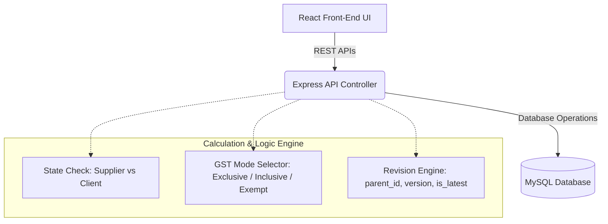

# ACHME CRM: Quotation Module Complete Engineering Specification

This document contains the complete technical specifications, database schema, mathematical business logic, backend REST API contracts, frontend page state, and document template rendering rules for the **Quotation Module** of the ACHME CRM platform. 

Provide this specification to your AI coding assistant to generate a fully working, production-grade implementation of the module.

---

## 1. System Overview & Architecture
The Quotation Module manages B2B customer proposals and sales quotes. It operates on a Node.js/Express backend, a MySQL database, and a React frontend. The module supports:
1. **Dynamic Client Selection & Sync**: Auto-filling billing information by fetching from an existing Client registry, with automatic synchronization between `customers` and `clients` tables.
2. **Multi-Mode GST Calculations**: Standardized GST (Exclusive, Inclusive, and Exempt) with automatic geographical routing (CGST/SGST vs. IGST) based on the supplier branch and customer state.
3. **Immutability & Version Control**: Editing a quotation does *not* overwrite database history. Instead, it marks the current record as inactive, increments the version number, and inserts a new latest revision connected to the parent quote.
4. **Interactive Proposals & Emailing**: Real-time PDF-friendly preview template rendering, SMTP-based email dispatching to clients, and customizable terms/conditions.



---

## 2. Database Schema DDL
The module uses five interconnected tables. Execute the following DDL script to initialize the database structure.

```sql
-- 1. Customers Table (Stores customer profile information for quotations)
CREATE TABLE IF NOT EXISTS `customers` (
  `id` INT NOT NULL AUTO_INCREMENT,
  `customer_name` VARCHAR(100) NOT NULL,
  `mobile_number` VARCHAR(20) DEFAULT NULL,
  `email` VARCHAR(100) DEFAULT NULL,
  `location_city` VARCHAR(100) DEFAULT NULL,
  `gst_number` VARCHAR(50) DEFAULT NULL,
  `created_by` INT DEFAULT NULL,
  `created_at` TIMESTAMP NULL DEFAULT CURRENT_TIMESTAMP,
  PRIMARY KEY (`id`)
) ENGINE=InnoDB DEFAULT CHARSET=utf8mb4 COLLATE=utf8mb4_unicode_ci;

-- 2. Clients Table (Shared client directory for auto-complete lookup and sync)
CREATE TABLE IF NOT EXISTS `clients` (
  `id` INT NOT NULL AUTO_INCREMENT,
  `name` VARCHAR(150) DEFAULT NULL,
  `company_name` VARCHAR(150) DEFAULT NULL,
  `email` VARCHAR(150) DEFAULT NULL,
  `phone` VARCHAR(20) DEFAULT NULL,
  `address` TEXT DEFAULT NULL,
  `state` VARCHAR(100) DEFAULT NULL,
  `pincode` VARCHAR(20) DEFAULT NULL,
  `gst_number` VARCHAR(20) DEFAULT NULL,
  `created_by` INT DEFAULT NULL,
  `created_at` TIMESTAMP NULL DEFAULT CURRENT_TIMESTAMP,
  PRIMARY KEY (`id`)
) ENGINE=InnoDB DEFAULT CHARSET=utf8mb4 COLLATE=utf8mb4_unicode_ci;

-- 3. Quotation Branches/Sender Addresses Table
CREATE TABLE IF NOT EXISTS `pi_from_addresses` (
  `id` INT NOT NULL AUTO_INCREMENT,
  `label` VARCHAR(100) NOT NULL,
  `address` TEXT NOT NULL,
  `created_at` TIMESTAMP NULL DEFAULT CURRENT_TIMESTAMP,
  PRIMARY KEY (`id`)
) ENGINE=InnoDB DEFAULT CHARSET=utf8mb4 COLLATE=utf8mb4_unicode_ci;

-- 4. Quotations Metadata Table (Parent)
CREATE TABLE IF NOT EXISTS `quotations` (
  `id` INT NOT NULL AUTO_INCREMENT,
  `customer_id` INT NOT NULL,
  `quotation_date` DATE NOT NULL,
  `subtotal` DECIMAL(10,2) DEFAULT '0.00',
  `total_tax` DECIMAL(10,2) DEFAULT '0.00',
  `total_cgst` DECIMAL(10,2) DEFAULT '0.00',
  `total_sgst` DECIMAL(10,2) DEFAULT '0.00',
  `total_igst` DECIMAL(10,2) DEFAULT '0.00',
  `total_discount` DECIMAL(10,2) DEFAULT '0.00',
  `grand_total` DECIMAL(10,2) DEFAULT '0.00',
  `reference_no` VARCHAR(50) DEFAULT NULL,
  `created_by` INT DEFAULT NULL,
  
  -- Versioning fields
  `parent_id` INT DEFAULT NULL,
  `version` INT DEFAULT '1',
  `is_latest` TINYINT(1) DEFAULT '1',
  `status` VARCHAR(50) DEFAULT 'Pending', -- Send, Pending, Close, Billed, Cancel
  
  -- Branch & Sender info
  `supplier_branch` VARCHAR(100) DEFAULT 'Coimbatore',
  `from_address_id` INT DEFAULT NULL,
  `from_address_custom` TEXT DEFAULT NULL,
  
  -- Client Billing metadata
  `client_company` VARCHAR(150) DEFAULT NULL,
  `client_address1` TEXT DEFAULT NULL,
  `client_address2` TEXT DEFAULT NULL,
  `client_city` VARCHAR(100) DEFAULT NULL,
  `client_state` VARCHAR(100) DEFAULT NULL,
  `client_pincode` VARCHAR(20) DEFAULT NULL,
  `client_country` VARCHAR(50) DEFAULT 'India',
  
  -- Tax details
  `tax_type` VARCHAR(20) DEFAULT 'GST18',
  `custom_tax` VARCHAR(20) DEFAULT NULL,
  `gst_mode` VARCHAR(20) DEFAULT 'Exclusive', -- Exclusive, Inclusive, Exempt
  
  -- Account Executive info
  `exec_name` VARCHAR(100) DEFAULT NULL,
  `exec_phone` VARCHAR(20) DEFAULT NULL,
  `exec_email` VARCHAR(150) DEFAULT NULL,
  
  -- T&C Toggle Configurations
  `terms_general` TINYINT(1) DEFAULT '0',
  `terms_tax` TINYINT(1) DEFAULT '0',
  `terms_project_period` VARCHAR(100) DEFAULT NULL,
  `terms_validity` VARCHAR(50) DEFAULT NULL,
  `terms_separate_orders` TEXT DEFAULT NULL, -- JSON string: {material: bool, installation: bool, usd: bool, boq: bool}
  `terms_payment` VARCHAR(100) DEFAULT NULL,
  `terms_payment_custom` VARCHAR(100) DEFAULT NULL,
  `terms_warranty` VARCHAR(100) DEFAULT NULL,
  `custom_terms` TEXT DEFAULT NULL,
  
  -- Bank Details
  `bank_details_id` VARCHAR(50) DEFAULT NULL,
  `bank_company` VARCHAR(150) DEFAULT NULL,
  `bank_name` VARCHAR(100) DEFAULT NULL,
  `bank_account` VARCHAR(50) DEFAULT NULL,
  `bank_ifsc` VARCHAR(50) DEFAULT NULL,
  `bank_branch` VARCHAR(100) DEFAULT NULL,
  
  `created_at` TIMESTAMP NULL DEFAULT CURRENT_TIMESTAMP,
  PRIMARY KEY (`id`),
  KEY `customer_id` (`customer_id`),
  CONSTRAINT `quotations_ibfk_1` FOREIGN KEY (`customer_id`) REFERENCES `customers` (`id`)
) ENGINE=InnoDB DEFAULT CHARSET=utf8mb4 COLLATE=utf8mb4_unicode_ci;

-- 5. Quotation Item Details Table (Child)
CREATE TABLE IF NOT EXISTS `quotation_items` (
  `id` INT NOT NULL AUTO_INCREMENT,
  `quotation_id` INT NOT NULL,
  `product_number` INT NOT NULL, -- Sorting sequence order
  `description` VARCHAR(255) NOT NULL,
  `brand_model` VARCHAR(150) DEFAULT NULL,
  `hsn_sac` VARCHAR(20) DEFAULT NULL,
  `uom` VARCHAR(20) DEFAULT 'Nos', -- Nos, Units, Pieces, Boxes, Sets, Meters, Kg, Liters
  `price` DECIMAL(10,2) NOT NULL,
  `quantity` INT NOT NULL,
  `tax` DECIMAL(10,2) DEFAULT '0.00', -- Individual item tax percentage (e.g. 18.00)
  `discount` DECIMAL(10,2) DEFAULT '0.00', -- Flat discount amount on this item
  `subtotal` DECIMAL(10,2) NOT NULL, -- Final subtotal of this item after discount & tax
  `created_at` TIMESTAMP NULL DEFAULT CURRENT_TIMESTAMP,
  PRIMARY KEY (`id`),
  KEY `quotation_id` (`quotation_id`),
  CONSTRAINT `quotation_items_ibfk_1` FOREIGN KEY (`quotation_id`) REFERENCES `quotations` (`id`) ON DELETE CASCADE
) ENGINE=InnoDB DEFAULT CHARSET=utf8mb4 COLLATE=utf8mb4_unicode_ci;
```

---

## 3. Mathematical Business Logic

### 3.1 Geographic GST Routing (CGST/SGST vs. IGST)
The application determines whether to charge intra-state tax (CGST + SGST) or inter-state tax (IGST) by comparing:
- The state of the **Supplier Branch** (e.g., Coimbatore -> Tamil Nadu, Bangalore -> Karnataka).
- The state of the **Client Address** (`client_state`).

1. Let `Supplier State` be resolved from the branch mapping:
   - Coimbatore Branch $\rightarrow$ "Tamil Nadu"
   - Chennai Branch $\rightarrow$ "Tamil Nadu"
   - Bangalore Branch $\rightarrow$ "Karnataka"
2. Let `Client State` be `client_state` (normalized to lowercase, trimmed).
3. **Intra-State (Same State)**: If `Supplier State` == `Client State`:
   - CGST Rate = $\text{Item Tax Rate} / 2$
   - SGST Rate = $\text{Item Tax Rate} / 2$
   - IGST Rate = $0$
4. **Inter-State (Different State)**: If `Supplier State` != `Client State`:
   - CGST Rate = $0$
   - SGST Rate = $0$
   - IGST Rate = $\text{Item Tax Rate}$

---

### 3.2 GST Calculation Modes

For each line item $i$, let:
- $P_i$ = Unit Price
- $Q_i$ = Quantity
- $D_i$ = Item Discount Amount (flat deduction)
- $T_i$ = Item GST Percentage (e.g., 18% as `18`)
- $A_i$ = Item Base Amount before discount = $P_i \times Q_i$
- $M_i$ = Discounted Amount = $A_i - D_i$

#### Mode A: GST Exclusive (GST added on top of price)
$$\text{Taxable Value}_i = M_i$$
$$\text{Tax Amount}_i = \text{Taxable Value}_i \times \frac{T_i}{100}$$
$$\text{Line Subtotal}_i = \text{Taxable Value}_i + \text{Tax Amount}_i$$

#### Mode B: GST Inclusive (GST extracted out of price)
$$\text{Taxable Value}_i = \frac{M_i}{1 + \frac{T_i}{100}}$$
$$\text{Tax Amount}_i = M_i - \text{Taxable Value}_i$$
$$\text{Line Subtotal}_i = M_i$$

#### Mode C: GST Exempt (Tax-free)
$$\text{Taxable Value}_i = M_i$$
$$\text{Tax Amount}_i = 0$$
$$\text{Line Subtotal}_i = M_i$$

---

### 3.3 Aggregated Order Totals
- **Subtotal**: $\sum (P_i \times Q_i)$
- **Total Discount**: $\sum D_i$
- **Total CGST**: $\sum (\text{Tax Amount}_i)$ if Same State else $0$ (divided by 2 for CGST and 2 for SGST)
- **Total SGST**: $\sum (\text{Tax Amount}_i)$ if Same State else $0$ (divided by 2 for CGST and 2 for SGST)
- **Total IGST**: $\sum (\text{Tax Amount}_i)$ if Different State else $0$
- **Total Tax**: $\text{Total CGST} + \text{Total SGST} + \text{Total IGST}$
- **Grand Total**:
  - Exclusive Mode: $\text{Subtotal} - \text{Total Discount} + \text{Total Tax}$
  - Inclusive Mode: $\text{Subtotal} - \text{Total Discount}$
  - Exempt Mode: $\text{Subtotal} - \text{Total Discount}$

---

## 4. Version Control & Revision History Logic
To maintain strict auditability, editing a quotation does **not** update the existing row directly. Instead, follow this exact workflow in the SQL transaction:

1. **Transaction Start**: Begin MySQL database transaction.
2. **Customer Sync**: Update the linked customer details in the `customers` table based on the customer ID of the active quotation.
3. **Retrieve Ancestor Data**: Query the existing quotation:
   ```sql
   SELECT customer_id, parent_id, version, reference_no FROM quotations WHERE id = ?;
   ```
4. **Determine Revision Details**:
   - Let `rootId` be: `parent_id` (if it is not null) or `id` (if `parent_id` is null). This resolves to the original parent quotation.
   - Let `newVersion` be: `version + 1`.
   - Keep the original `reference_no` (e.g. `QT-2026-004`).
5. **Mark Outdated**: Update all historical versions belonging to this tree to be non-latest:
   ```sql
   UPDATE quotations SET is_latest = 0 WHERE id = ? OR parent_id = ?;
   ```
6. **Insert New Version**: Insert a new record into the `quotations` table with:
   - `parent_id = rootId`
   - `version = newVersion`
   - `is_latest = 1`
   - `reference_no` = original reference number
   - All other input fields (new prices, terms, branch configuration) set from request body.
7. **Insert New Items**: Insert all item rows into `quotation_items` linked to the newly generated `quotation_id`.
8. **Transaction Commit**: Save changes. Returning the new ID and version to the UI client.

---

## 5. Backend REST API Contracts

All endpoints must verify the user's JWT bearer token (verify token middleware). Employees can only access quotations they created. Admins and subadmins can access all records.

### 5.1 Fetch Active Quotations
- **Endpoint**: `GET /api/quotations`
- **Controller Logic**: Fetch all quotations where `is_latest = 1`. If caller role is `employee`, append `AND created_by = ?`.
- **Query**:
  ```sql
  SELECT q.id, q.quotation_date AS invoice_date, q.grand_total, q.reference_no,
         q.version, q.is_latest, q.parent_id, q.status,
         c.customer_name, c.mobile_number, c.email,
         COALESCE(c.location_city, q.client_city) AS location_city,
         MIN(qi.description) AS description
  FROM quotations q
  JOIN customers c ON c.id = q.customer_id
  LEFT JOIN quotation_items qi ON qi.quotation_id = q.id
  WHERE q.is_latest = 1
  -- [Optional employee filter: AND q.created_by = ?]
  GROUP BY q.id
  ORDER BY q.id DESC
  ```

### 5.2 Fetch Revision History
- **Endpoint**: `GET /api/quotations/customer-history/:id`
- **Controller Logic**: Retrieve all historical (non-latest) versions of a quotation.
- **Query**:
  ```sql
  SELECT q.id, q.quotation_date AS invoice_date, q.grand_total, q.reference_no,
         q.version, q.is_latest, q.parent_id,
         c.customer_name, c.mobile_number, c.email,
         COALESCE(q.client_city, c.location_city) AS location_city
  FROM quotations q
  JOIN customers c ON c.id = q.customer_id
  WHERE q.is_latest = 0
    AND (
      q.parent_id = ?
      OR q.id = (SELECT parent_id FROM quotations WHERE id = ?)
      OR q.parent_id = (SELECT parent_id FROM quotations WHERE id = ? AND parent_id IS NOT NULL)
    )
  ORDER BY q.version DESC, q.id DESC
  ```

### 5.3 Fetch Quotation Details (With Items)
- **Endpoint**: `GET /api/quotations/:id`
- **Response Shape**: A flat list of rows containing outer quotation details combined with item data.
- **Query**:
  ```sql
  SELECT q.id AS quotation_id, q.quotation_date AS invoice_date, ...[All columns from quotations],
         c.customer_name, c.mobile_number, c.email, c.gst_number, c.location_city,
         qi.product_number, qi.description, qi.brand_model, qi.uom, qi.price,
         qi.quantity, qi.tax, qi.discount, qi.subtotal AS item_subtotal, qi.hsn_sac
  FROM quotations q
  JOIN customers c ON c.id = q.customer_id
  JOIN quotation_items qi ON qi.quotation_id = q.id
  LEFT JOIN pi_from_addresses fa ON fa.id = q.from_address_id
  WHERE q.id = ?
  ```

### 5.4 Create Quotation
- **Endpoint**: `POST /api/quotations/create`
- **Payload Structure**:
  ```json
  {
    "customer": {
      "customer_name": "Mr. John Doe",
      "mobile_number": "9876543210",
      "email": "john@example.com",
      "gst_number": "33AAHFA7876M1ZX",
      "location_city": "Coimbatore"
    },
    "quotation": {
      "quotation_date": "2026-06-13",
      "subtotal": 1000.00,
      "total_tax": 180.00,
      "total_cgst": 90.00,
      "total_sgst": 90.00,
      "total_igst": 0.00,
      "total_discount": 0.00,
      "grand_total": 1180.00
    },
    "items": [
      {
        "description": "Premium CCTV Camera Setup",
        "brand_model": "Hikvision 4MP",
        "hsn_sac": "8525",
        "uom": "Nos",
        "price": 1000.00,
        "quantity": 1,
        "tax": 18.00,
        "discount": 0.00,
        "subtotal": 1180.00
      }
    ],
    "extra": {
      "client_company": "Doe Industries",
      "client_address1": "123 Main St",
      "client_address2": "Peelamedu",
      "client_city": "Coimbatore",
      "client_state": "Tamil Nadu",
      "client_pincode": "641004",
      "client_country": "India",
      "supplier_branch": "Coimbatore",
      "gst_mode": "Exclusive",
      "exec_name": "Sales Person",
      "exec_phone": "9999999999",
      "exec_email": "sales@achme.com",
      "terms_general": true,
      "terms_tax": false,
      "terms_project_period": "15 days",
      "terms_validity": "30 days",
      "terms_separate_orders": {"material": false, "installation": false, "usd": false, "boq": false},
      "terms_payment": "100% Advance",
      "terms_warranty": "12 Months",
      "bank_details_id": "hdfc",
      "bank_company": "ACHME COMMUNICATION",
      "bank_name": "HDFC BANK",
      "bank_account": "00312320005822",
      "bank_ifsc": "HDFC0000031",
      "bank_branch": "Coimbatore"
    }
  }
  ```
- **Sync Logic**:
  1. Check if a client exists in `clients` by `phone`.
  2. If client does not exist, run `INSERT INTO clients`.
  3. If client exists, run `UPDATE clients` to synchronize fields.
  4. Generate a unique reference number: `QT-[Date]-[Random4Digits]`.
  5. Run MySQL `START TRANSACTION`. Insert into `customers`, then insert into `quotations`, then batch insert into `quotation_items`. Commit.

### 5.5 Update/Revise Quotation
- **Endpoint**: `PUT /api/quotations/:id`
- **Payload**: Same as create quotation.
- **Controller Logic**: Implements the immutable Version Control flow described in Section 4.

### 5.6 Patch Status
- **Endpoint**: `PATCH /api/quotations/:id`
- **Payload**: `{ "status": "Send" }`
- **Access Check**: Requires caller to be an admin/subadmin, or the creator of the quotation.

### 5.7 Delete Quotation
- **Endpoint**: `DELETE /api/quotations/:id`
- **Access Check**: Admin role only.
- **Behavior**: Atomically deletes records in `quotation_items` (linked by foreign key cascade) and the parent row in `quotations`.

### 5.8 Send Email
- **Endpoint**: `POST /api/quotations/send-email/:id`
- **Payload**: `{ "to": "client@example.com", "cc": "admin@achme.com", "subject": "Proposal", "body": "Hello..." }`
- **Logic**: Fetch SMTP credentials for the logged-in user or branch. Create a PDF attachment of the quotation (or inline HTML content) and send the mail via Nodemailer.

---

## 6. Frontend UI State & Forms

### 6.1 State Architecture
The React form relies on four core state structures:
- `customer`: Name, salutation, phone, email, GSTIN, city.
- `quotationData`: Date of the quotation.
- `items`: An array of object structures:
  `{ name, brand_model, hsn_sac, uom, price, qty, tax, discount }`
- `extra`: Configuration options like branch, bank, terms, billing addresses, and executive contact details.

### 6.2 Item List Actions
- **Add Item**: Check if `descInput` is present. Create a new object in `items` array with default properties. Clear inputs.
- **Edit Item**: Select an item by index, populate it back into input fields (`descInput`, `brandInput`), modify it, and save the updated array index.
- **Remove Item**: Delete item at index, adjust editing indices accordingly.
- **Totals Calculation Hook**: Run a React utility calculation (or client-side JS formula matching Section 3.3) on every key-stroke change to `price`, `qty`, `tax`, or `discount` in the items list, updating the totals dashboard instantly.

---

## 7. Document Template (InvoiceTemplate) Render Rules

The output page must render a highly polished, printable A4 document template. Follow these specific HTML structures and styles to ensure PDF and print alignment:

### 7.1 Header Section
1. **Logo & Company Info**: Left-aligned company logo (`logo.svg` or brand text) next to the resolved sender address:
   - Dynamic branch address (based on `supplier_branch` or custom address in database).
   - Display Supplier GSTIN.
2. **Title**: Centered large uppercase heading: **PROPOSAL** or **QUOTATION**.
3. **Metadata Grid**: A two-column grid displaying:
   - **Quotation Details**: Quotation No (`reference_no`), Version ID, Date, Validity, Sales Executive Name, and email.
   - **Customer Details**: Billing Company Name, Client Address, Pincode, Client State, Client Contact, and Client GSTIN.

### 7.2 Items Table
Render a bordered HTML table with the following columns:
1. **S.No**: Sequenced item number.
2. **Description of Goods**: Detailed product name and description, including model or brand details.
3. **HSN/SAC**: Code for the product/service category.
4. **Qty**: Quantity formatted.
5. **UOM**: Unit of measurement (e.g. Nos, Sets).
6. **Rate**: Price per unit.
7. **Discount**: Item discount amount.
8. **Taxable Value**: Computed base value (Rate $\times$ Qty - Discount).
9. **GST Rate**: Percentage (e.g., 18%).
10. **Tax Amount**: Calculated tax.
11. **Total Amount**: Final subtotal for the line item.

### 7.3 Bottom Tax & Terms Section
1. **Tax Breakdown Grid**:
   - If Same State: Display CGST and SGST with rates and split totals.
   - If Different State: Display IGST with rate and total.
2. **Total in Words**: Convert the `grand_total` variable into Indian Rupee words (e.g., *Rupees One Thousand One Hundred and Eighty Only*).
3. **Terms and Conditions**: Render bulleted list based on toggle variables:
   - **General Terms**: "Prices are based on current market rates..."
   - **Tax Terms**: "Tax rates are applicable as per government directives..."
   - **Project Period**: "Delivery and installation will be completed within [project_period]."
   - **Validity**: "This quotation is valid for [validity] days."
   - **Payment Terms**: "Payment mode: [payment]."
   - **Warranty**: "Products are covered by a [warranty] warranty period."
   - **Custom Terms**: Plaintext area with user-supplied custom remarks.
4. **Bank Details Block**: Card-styled display of Bank Name, Account Name, Account Number, Branch Location, and IFSC code.
5. **Authorized Signatory**: Right-aligned empty space with "For ACHME COMMUNICATION" and a placeholder line for signature.

---
*End of Specification Document. Pass this directly to your AI builder to implement the fully functioning CRM Quotation Module.*
