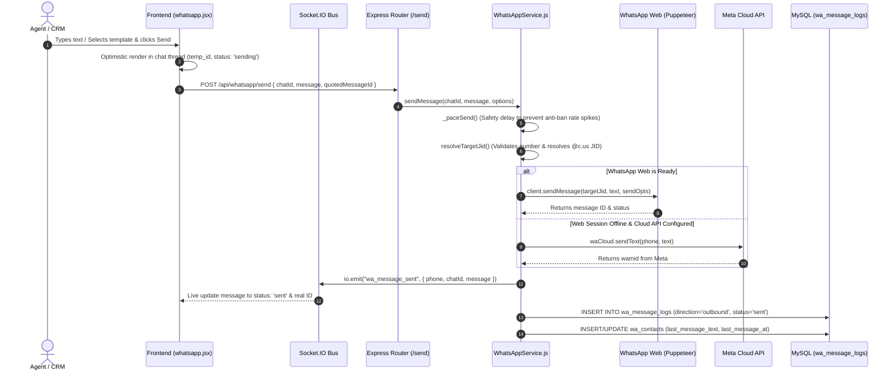

# 📱 WhatsApp Live Send & Receive Engine Documentation

This document explains the architecture, package dependencies, runtime execution flows, anti-ban pacing mechanisms, and step-by-step lifecycle of both **Sending** and **Receiving** live messages in the CRM.

---

## 🏗️ 1. Architecture Overview

The system operates on a **Dual-Engine Architecture** backed by a **Real-Time WebSocket Event Bus**:

```
┌────────────────────────────────────────────────────────────────────────────────────────┐
│                                   CRM Frontend (React)                                 │
│  • Live Chat UI (whatsapp.jsx)  • Sidebar Conversations List  • Realtime Typing & Audio│
└───────────────────────────▲───────────────────────────────────────▲────────────────────┘
                            │ (HTTP REST API)                       │ (Socket.IO Real-time)
┌───────────────────────────▼───────────────────────────────────────▼────────────────────┐
│                                   CRM Backend (Node.js/Express)                        │
│                                                                                        │
│   ┌────────────────────────────────────┐        ┌────────────────────────────────────┐ │
│   │    Engine A: WhatsApp Web Engine   │        │     Engine B: Meta Cloud API       │ │
│   │  (whatsapp-web.js + Puppeteer)     │        │  (Official Graph API v21.0)        │ │
│   │  • Persistent LocalAuth Sessions   │        │  • Phone Number ID & WABA ID       │ │
│   │  • Direct Phone QR / Pairing Code  │        │  • Webhook Verification & Receipts │ │
│   └─────────────────▲──────────────────┘        └─────────────────▲──────────────────┘ │
│                     │                                             │                    │
│                     └──────────────────────┬──────────────────────┘                    │
│                                            │ (Failover Router & Pacing Queue)          │
│   ┌────────────────────────────────────────▼─────────────────────────────────────────┐ │
│   │                      MySQL Database & Storage Logs Layer                         │ │
│   │   • wa_message_logs   • wa_contacts   • wa_flows   • wa_ai_knowledge             │ │
│   └──────────────────────────────────────────────────────────────────────────────────┘ │
└────────────────────────────────────────────────────────────────────────────────────────┘
```

---

## 📦 2. Packages & Dependencies Used

### Backend Dependencies (`backend/package.json`)
| Package | Version | Purpose |
| :--- | :--- | :--- |
| `whatsapp-web.js` | `^1.34.4` | Connects directly to WhatsApp Web protocol via Chrome/Puppeteer instance with full multi-device support. |
| `puppeteer` | `^24.3.1` | Headless Chromium browser automation driving WhatsApp Web DOM & LocalAuth sessions. |
| `socket.io` | `^4.8.1` | Bi-directional, sub-millisecond WebSocket event broadcasting to all connected CRM browsers. |
| `axios` | `^1.8.1` | HTTP client for Meta Graph API calls, webhooks, and AI model interactions. |
| `mysql2` | `^3.13.0` | High-performance MySQL connection pool with promise-based queries for message and contact persistence. |
| `qrcode` / `qrcode-terminal` | `^1.5.4` | Generates QR matrix for scanning inside the CRM UI and server terminal. |
| `crypto` | Built-in | Encrypts Meta access tokens, verifies HMAC SHA256 webhook signatures, and generates UUIDs. |
| `multer` | `^1.4.5-lts.1` | Handles document, image, audio, and video uploads for media messaging. |

### Frontend Dependencies (`frontend/package.json`)
| Package | Version | Purpose |
| :--- | :--- | :--- |
| `socket.io-client` | `^4.8.1` | Maintains live WebSocket connection with reconnection resilience and room subscriptions. |
| `axios` | `^1.8.1` | Communicates with backend REST API endpoints (`/api/whatsapp/*`). |
| `lucide-react` | `^1.16.0` | Icons for delivery checkmarks, attachments, mic, location, and interactive buttons. |
| `qrcode.react` | `^4.2.0` | Renders dynamic SVG QR codes directly in the web browser for instant mobile scanning. |
| `tailwindcss` | `^3.4.17` | Responsive dark-mode styling styled identically to WhatsApp Web. |

---

## 📤 3. How Live Message Sending Works (Step-by-Step)

When an agent or automation dispatches a message, the following workflow executes:



### Key Sending Features:
1. **Optimistic UI Update**: The message renders in the chat bubble in `0ms` before the server roundtrip completes.
2. **Dedicated Send Queue (`enqueueSend`)**: Message dispatch is isolated from slow contact/chat synchronization scans.
3. **Automatic Fallback Engine**: If WhatsApp Web encounters network degradation, the engine transparently routes via Meta Cloud API.
4. **Anti-Ban Human Delays**: Paced by `_paceSend()` to maintain 600–800 safe daily dispatches without triggering Meta automated flags.

---

## 📥 4. How Live Message Receiving Works (Step-by-Step)

When a customer sends a message on their smartphone:

```mermaid
sequenceDiagram
    autonumber
    actor Customer as Customer (Smartphone)
    participant Webhook as Meta Webhook / Baileys
    participant Svc as WhatsAppService.js
    participant Engine as Flow / AI Engine
    participant Socket as Socket.IO Bus
    participant UI as Frontend (whatsapp.jsx)
    participant DB as MySQL

    Customer->>Webhook: Sends message (Text, Image, Audio, or Reply)
    Webhook->>Svc: Inbound message trigger event
    
    par Instant UI Broadcast (< 1ms)
        Svc->>Socket: io.emit("wa_message_received", { phone, chatId, message })
        Socket->>UI: socket.on("wa_message_received")
        UI->>UI: Appends to chat if active; bumps chat to top of sidebar & increments unread badge
    and Persistence & Automation (Async Background)
        Svc->>DB: INSERT INTO wa_message_logs (direction='inbound', status='delivered')
        Svc->>DB: UPDATE wa_contacts (last_message_text, unread_count + 1)
        Svc->>Engine: Checks Opt-Out keywords ('STOP', 'UNSUBSCRIBE')
        alt Active Chatbot Flow Exists
            Engine->>DB: Advance flow state machine & trigger next node
        else Interactive Menu Match
            Engine->>Svc: Dispatches numeric or button menu reply
        else AI Auto-Reply Enabled
            Engine->>Engine: Queries RAG Knowledge Base & Generates reply
        end
    end
```

### Key Receiving Features:
1. **Instant Socket Push**: The incoming message lands on the agent's screen immediately without needing page refresh or manual polling.
2. **Dynamic Chat Sidebar Management**: If an unknown number messages the business, a new conversation card is created instantly and placed at the top of the chat list.
3. **Smart Interceptors**:
   - **Global Keywords**: Typing `"menu"` or `"restart"` takes the customer back to the main interactive menu; typing `"agent"` or `"human"` pauses automated bots for 120 minutes and alerts team members.
   - **Opt-Out Shield**: Typing `"STOP"` or `"UNSUBSCRIBE"` flags the contact as unsubscribed in `wa_contacts` and suppresses broadcast campaigns.

---

## 📂 5. Key File Structure & Responsibilities

| File Path | Role & Functions |
| :--- | :--- |
| [backend/services/whatsappService.js](file:///e:/MADHURA_CRM/backend/services/whatsappService.js) | Core multi-session WhatsApp Web manager, QR/pairing generator, send queue, media downloader, and WebSocket event emitter. |
| [backend/services/whatsappCloudApi.js](file:///e:/MADHURA_CRM/backend/services/whatsappCloudApi.js) | Meta Graph API client for Cloud API text, media, location, interactive buttons, and template delivery. |
| [backend/routes/whatsappRoutes.js](file:///e:/MADHURA_CRM/backend/routes/whatsappRoutes.js) | Express routes for `/send`, `/send-media`, `/send-location`, `/chats`, `/chat/:id/messages`, `/react`, `/sync-contacts`. |
| [backend/routes/waWebhookRoutes.js](file:///e:/MADHURA_CRM/backend/routes/waWebhookRoutes.js) | Meta Cloud API webhook listener handling inbound messages and real-time delivery receipts (`delivered`, `read`). |
| [backend/services/waFlowEngine.js](file:///e:/MADHURA_CRM/backend/services/waFlowEngine.js) | Visual interactive chatbot execution engine with multi-branch logic, CRM context auto-injection, and human handoff. |
| [frontend/src/socket/socket.js](file:///e:/MADHURA_CRM/frontend/src/socket/socket.js) | Socket.IO client instance configured with automatic reconnects and room subscriptions (`whatsapp`, `user:<id>`). |
| [frontend/src/pages/whatsapp.jsx](file:///e:/MADHURA_CRM/frontend/src/pages/whatsapp.jsx) | Full WhatsApp Live Chat interface with rich media bubbles, reactions, template pickers, team notes, and CRM client history. |

---

## ⚙️ 6. How to Run & Verify

### 1. Starting the Backend Server
```bash
cd e:\MADHURA_CRM\backend
npm start
```
*Port: `5000` (or `PORT` from `.env`). Database connection, Socket.IO server, and WhatsApp sessions will auto-initialize.*

### 2. Starting the Frontend UI
```bash
cd e:\MADHURA_CRM\frontend
npm start
```
*Access the Live Chat page at:* `http://localhost:3000/dashboard/whatsapp`

### 3. Pairing WhatsApp Account
1. Open **/dashboard/whatsapp** in your browser.
2. If disconnected, scan the dynamic QR Code using WhatsApp on your phone (**Linked Devices ➔ Link a Device**) or click **Pair with Phone Number** to receive an 8-digit pairing code.
3. Once connected, your active chats, contacts, and message history synchronize automatically.

---

## 🛡️ 7. Anti-Ban Safety Configuration

To protect your WhatsApp account while handling **600–800 customers daily**, the engine applies:
- **Minimum Send Delay**: 7 to 15 seconds gap between consecutive messages in campaigns (`waCampaignEngine.js`).
- **Dynamic Spintax**: Supports `{Hello|Hi|Dear}` format to vary outgoing message hashes.
- **Presence Simulation**: Emits `composing` (typing...) state before message dispatch.
- **Human Takeover Muting**: When an agent sends a manual message to a client, all automated bots for that phone number are muted for 30 minutes.
