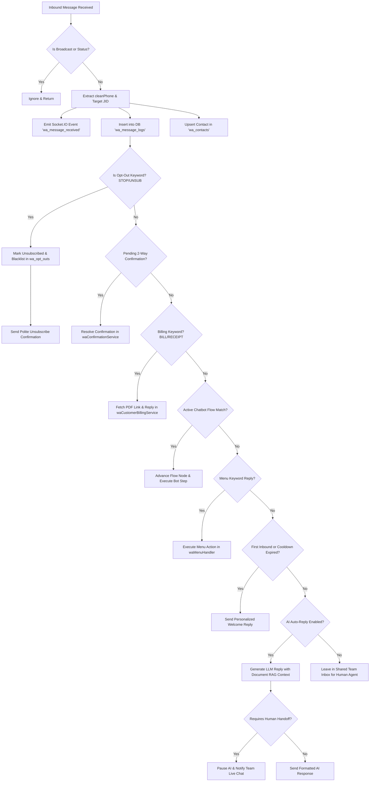
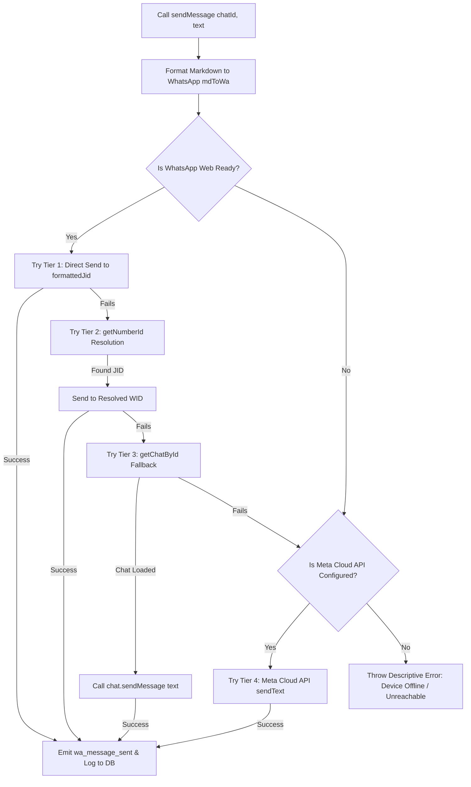

# 📱 WhatsApp Enterprise Standalone Suite — Complete Master Architecture & Implementation Blueprint

> **Document Version**: 3.0.0  
> **System Classification**: Omnichannel Communication & Autonomous WhatsApp Operations Engine  
> **Protocol Support**: Multi-Device WhatsApp Web (WAP / Puppeteer) + Official Meta WhatsApp Cloud API (Graph API v22.0)  
> **Primary Objective**: Exhaustive technical specification, source code architecture, database DDL, protocol mechanics, and deployment guide allowing any engineer or AI system to reproduce, decouple, and operate the platform standalone.

---

## 📑 Master Table of Contents
1. [Executive Overview & Dual-Engine Hybrid Paradigm](#1-executive-overview--dual-engine-hybrid-paradigm)
2. [High-Level Architectural Diagrams](#2-high-level-architectural-diagrams)
3. [Standalone Directory & Complete File Inventory](#3-standalone-directory--complete-file-inventory)
4. [Low-Level Protocols, Dependencies & Engine Internals](#4-low-level-protocols-dependencies--engine-internals)
5. [Database Architecture & Complete DDL Schema (25+ Tables)](#5-database-architecture--complete-ddl-schema-25-tables)
6. [Multi-Session & Multi-Device Lifecycle Engine](#6-multi-session--multi-device-lifecycle-engine)
7. [Inbound & Outbound Messaging Pipeline](#7-inbound--outbound-messaging-pipeline)
8. [Multi-Modal Media & Binary Attachment Pipeline](#8-multi-modal-media--binary-attachment-pipeline)
9. [Visual Chatbot Flow Engine (`waFlowEngine.js`)](#9-visual-chatbot-flow-engine-waflowenginejs)
10. [Enterprise Bulk Broadcast & Anti-Ban Broadcaster (`waCampaignEngine.js`)](#10-enterprise-bulk-broadcast--anti-ban-broadcaster-wacampaignenginejs)
11. [AI Conversational Assistant & Document RAG Knowledge Base](#11-ai-conversational-assistant--document-rag-knowledge-base)
12. [Two-Way Interactive Confirmations & Customer Self-Service](#12-two-way-interactive-confirmations--customer-self-service)
13. [CRM Decoupling Strategy & Webhook Integration Layer](#13-crm-decoupling-strategy--webhook-integration-layer)
14. [Complete REST API Specification](#14-complete-rest-api-specification)
15. [Real-Time WebSocket Protocol (Socket.IO Event Taxonomy)](#15-real-time-websocket-protocol-socketio-event-taxonomy)
16. [Security Architecture, Anti-Ban & Compliance Protocols](#16-security-architecture-anti-ban--compliance-protocols)
17. [Frontend Architecture & UI Component Hierarchy](#17-frontend-architecture--ui-component-hierarchy)
18. [Step-by-Step Standalone Replication & Deployment Runbook](#18-step-by-step-standalone-replication--deployment-runbook)
19. [Troubleshooting, Self-Check Tests & Failure Recovery](#19-troubleshooting-self-check-tests--failure-recovery)

---

## 1. Executive Overview & Dual-Engine Hybrid Paradigm

The **WhatsApp Enterprise Standalone Suite** is an enterprise-grade communication server and autonomous workflow automation engine designed to bridge WhatsApp communication channels with operational workflows, customer databases, AI agents, and marketing campaign engines.

```
       ┌────────────────────────────────────────────────────────────────────────┐
       │                DUAL-ENGINE HYBRID CONNECTIVITY PLATFORM               │
       └───────────────────────────────────┬────────────────────────────────────┘
                                           │
                ┌──────────────────────────┴──────────────────────────┐
                ▼                                                     ▼
 ┌─────────────────────────────┐                       ┌─────────────────────────────┐
 │    WHATSAPP WEB ENGINE      │                       │     META CLOUD API ENGINE   │
 │   (Headless Chromium /      │                       │   (Official Graph API v22)  │
 │    LocalAuth Puppeteer)     │                       │                             │
 │                             │                       │                             │
 │ • Zero per-message Meta fees│                       │ • Guaranteed 99.99% uptime  │
 │ • Multi-device phone linking│                       │ • Verified Blue Badge badge │
 │ • Native button/list UI     │                       │ • High-volume scale (100k+) │
 │ • Live Chat Inbox sync      │                       │ • Official Meta templates   │
 └──────────────┬──────────────┘                       └──────────────┬──────────────┘
                │                                                     │
                └──────────────────────────┬──────────────────────────┘
                                           ▼
       ┌────────────────────────────────────────────────────────────────────────┐
       │                   INTELLIGENT SENDER LOAD BALANCER                    │
       │     (Pool-Based Sender Allocation, Anti-Ban Pacing & Failover)        │
       └───────────────────────────────────┬────────────────────────────────────┘
                                           │
         ┌───────────────────┬─────────────┴───────┬───────────────────┐
         ▼                   ▼                     ▼                   ▼
 ┌───────────────┐   ┌───────────────┐     ┌───────────────┐   ┌───────────────┐
 │ Visual Flow   │   │ Event-Driven  │     │ Mass Outreach │   │ AI Brain &    │
 │ Bot (24/7)    │   │ Automations   │     │ Broadcaster   │   │ Document RAG  │
 └───────────────┘   └───────────────┘     └───────────────┘   └───────────────┘
```

### Core Value Propositions & Functional Capabilities
1. **Hybrid Multi-Protocol Senders**: Run official Meta WhatsApp Cloud API credentials alongside real WhatsApp Web sessions linked via QR Code or 8-digit Pairing Code on a single unified dashboard.
2. **Multi-Session Multi-Tenant Architecture**: Supports multiple phone numbers simultaneously, each operating inside an isolated browser profile sandbox with independent state tracking and distinct sender pools.
3. **Multi-Turn Chatbot Flow Engine**: Visual state-machine engine executing complex multi-step branching conversational bots with interactive buttons, lists, CRM data lookups, input validations, media attachments, and live-agent handoffs.
4. **Autonomous Event-Driven Auto-Actions**: Background triggers for customer onboarding, payment receipt generation, overdue billing reminders, field service updates, and first-time contact welcome greetings with configurable cooldown intervals.
5. **High-Scale Anti-Ban Broadcast Engine**: Bulk campaigns equipped with recursive Spintax randomization (`{Hello|Hi|Hey} {name}`), randomized human jitter pacing (8s–20s), progressive account warm-up curves, interruptible execution, and instant opt-out blacklist handling.
6. **AI Assistant with Document RAG (Retrieval-Augmented Generation)**: Connects OpenRouter, OpenAI, Google Gemini, Anthropic Claude, or local Ollama LLMs directly to parsed enterprise documents (`.pdf`, `.docx`, `.csv`, `.txt`) to answer customer inquiries accurately with automated human takeover detection.
7. **Omnichannel Shared Team Inbox**: Real-time multi-agent live chat interface powered by Socket.IO with chat assignment, internal notes, canned quick replies, message status tick tracking (Sent $\to$ Delivered $\to$ Read), and media previews.

---

## 2. High-Level Architectural Diagrams

### 2.1 Complete System Architecture & Data Flow

```
+----------------------------------------------------------------------------------------------------+
|                                    CLIENT / USER INTERFACE LAYER                                   |
|                                                                                                    |
|  [ React 18 SPA / Vite / Vanilla CSS Design System ]                                               |
|    - Live Chat Inbox (Conversation Window, Media Viewer, Audio Player, Contact Sidebar)            |
|    - Campaign Broadcaster (Audience Selector, Spintax Previewer, Pacing Scheduler)                 |
|    - Visual Flow Builder (Node Graph Editor, Condition Builder, Live Flow Simulator)               |
|    - AI & Knowledge Base (Document Drag-and-Drop, Prompt Editor, Temperature Controls)            |
|    - Multi-Account Hub (QR Code Scanner, Pairing Code Modal, Session Health Indicators)          |
+-------------------------------------------------+--------------------------------------------------+
                                                  | HTTP / HTTPS REST API (Express 5)
                                                  | WebSockets / WSS (Socket.IO 4.8)
+-------------------------------------------------v--------------------------------------------------+
|                                    BACKEND APPLICATION RUNTIME                                     |
|                                                                                                    |
|  +-----------------------------------------------------------------------------------------------+  |
|  |                            AUTHENTICATION & ROUTE DISPATCH LAYER                              |  |
|  |   authMiddleware.js | sessionKeyResolver.js | ssrfValidator.js | multerUploadEngine.js        |  |
|  +-----------------------------------------------+-----------------------------------------------+  |
|                                                  |                                                 |
|  +-----------------------------------------------v-----------------------------------------------+  |
|  |                             CORE BUSINESS SERVICES & PIPELINES                                |  |
|  |                                                                                               |  |
|  |   [ waLoadBalancer.js ]     [ waSessionManager.js ]    [ waCloudService.js ]                  |  |
|  |   Health Scoring / Rotations Multi-Device Browser Hub   Meta Graph API v22.0 Client           |  |
|  |                                                                                               |  |
|  |   [ waFlowEngine.js ]       [ waCampaignEngine.js ]    [ waAutomationService.js ]             |  |
|  |   Visual Bot State Machine  Spintax & Warm-up Worker   Drip Schedulers & Dynamic Tokens       |  |
|  |                                                                                               |  |
|  |   [ waAiReply.js ]          [ waKnowledgeBase.js ]     [ waConfirmationService.js ]           |  |
|  |   LLM Prompt & Tool Calling Document Parser (PDF/Word) 2-Way Interactive Confirmation State   |  |
|  +-----------------------------------------------+-----------------------------------------------+  |
+--------------------------------------------------+-------------------------------------------------+
                                                   |
                                                   | MySQL Pool (mysql2 / InnoDB utf8mb4)
                                                   v
+----------------------------------------------------------------------------------------------------+
|                                     PERSISTENCE STORAGE LAYER                                      |
|                                                                                                    |
|  - Relational Schema: 25+ Tables (`wa_accounts`, `wa_contacts`, `wa_message_logs`, `wa_flows`...)  |
|  - File System Storage: LocalAuth Chromium Profiles (`/whatsapp-sessions/<userId>/`)               |
|  - Media Cache: Inbound/Outbound Attachments (`/uploads/wa-media/`)                                |
+----------------------------------------------------------------------------------------------------+
```

### 2.2 Inbound Message Processing Pipeline (State Machine)



---

## 3. Standalone Directory & Complete File Inventory

When running this suite as a standalone microservice or platform, the project structure is organized as follows:

```
whatsapp-suite/
├── backend/
│   ├── config/
│   │   ├── database.js                 # MySQL connection pool configuration
│   │   └── defaultSettings.json        # Out-of-the-box system constants
│   ├── middleware/
│   │   ├── auth.js                     # JWT Token & API Key validator
│   │   └── waSsrf.js                   # Media URL SSRF validation & IP filter
│   ├── patches/
│   │   └── whatsapp-web.js+1.34.7.patch # Hotfix for WhatsApp Web WAP & ID changes
│   ├── routes/
│   │   ├── waAccountRoutes.js          # Account CRUD, QR code, phone pairing
│   │   ├── waAnalyticsRoutes.js        # Analytics, ROI, delivery charts
│   │   ├── waAutomationRoutes.js       # Drip campaign rules, triggers
│   │   ├── waCampaignRoutes.js         # Broadcast creation, pause/resume, stats
│   │   ├── waContactRoutes.js          # Audience book, tags, CSV import/export
│   │   ├── waDripRoutes.js             # Drip sequence builder endpoints
│   │   ├── waFlowRoutes.js             # Visual flowbot CRUD & simulation
│   │   ├── waGroupRoutes.js            # Group discovery & community broadcast
│   │   ├── waPaymentsRoutes.js         # WhatsApp Pay & UPI checkout endpoints
│   │   ├── waReminderRoutes.js         # Interactive calendar reminders
│   │   ├── waTemplateRoutes.js         # Meta official template management
│   │   ├── waWebhookRoutes.js          # Meta Cloud API inbound webhook listener
│   │   └── whatsappRoutes.js           # Live chat messages, media, actions
│   ├── services/
│   │   ├── mdToWa.js                   # Markdown to WhatsApp formatting parser
│   │   ├── waAiReply.js                # LLM response engine (OpenRouter/OpenAI/Gemini)
│   │   ├── waAiTools.js                # Function calling / Agent tools implementation
│   │   ├── waAutomationService.js      # Background rules, welcome messages & placeholders
│   │   ├── waCampaignEngine.js         # Enterprise broadcast worker & Spintax parser
│   │   ├── waCloudService.js           # Official Meta Graph API v22.0 client
│   │   ├── waConfirmationService.js    # 2-way interactive confirmation state machine
│   │   ├── waCustomerBillingService.js # Autonomous bill & invoice delivery engine
│   │   ├── waDatabase.js               # Automatic database DDL migrations & seeders
│   │   ├── waEncryption.js             # AES-256-GCM token encryption helpers
│   │   ├── waFlowEngine.js             # Visual chatbot execution engine & state tracker
│   │   ├── waKnowledgeBase.js          # Document ingestion (PDF/Word/CSV) & RAG search
│   │   ├── waLeadCapture.js            # Auto-lead capture from conversations
│   │   ├── waLoadBalancer.js           # Multi-sender health scoring & round-robin
│   │   ├── waMenuHandler.js            # Legacy text menu processor
│   │   ├── waQueue.js                  # In-memory / Redis priority job queue
│   │   ├── waReminderScheduler.js      # Time-based reminder dispatcher
│   │   └── whatsappService.js          # Puppeteer WhatsApp Web master manager
│   ├── sockets/
│   │   └── chatSocket.js               # Real-time WebSocket server (Socket.IO)
│   ├── uploads/
│   │   ├── wa-docs/                    # Knowledge base source documents
│   │   └── wa-media/                   # Inbound & outbound media attachments
│   ├── whatsapp-sessions/              # Persistent Chromium user profiles
│   ├── package.json                    # Backend dependencies & postinstall hooks
│   └── server.js                       # HTTP server bootstrap & socket initialization
├── frontend/
│   ├── public/
│   │   └── favicon.ico                 # App icon
│   ├── src/
│   │   ├── assets/                     # Icons, audio chimes, illustrations
│   │   ├── components/
│   │   │   ├── Navbar.jsx              # Module navigation bar
│   │   │   ├── RichMessageContent.jsx  # Interactive button/list/card renderer
│   │   │   ├── WAContactAvatar.jsx     # Avatar with dynamic initials & color hash
│   │   │   └── WAVariablePicker.jsx    # Dynamic variable chip selector
│   │   ├── pages/
│   │   │   ├── LiveChat.jsx            # Multi-agent live inbox
│   │   │   ├── Accounts.jsx            # Account manager, QR scanner & pairing
│   │   │   ├── Campaigns.jsx           # Mass broadcast creator & pacing monitor
│   │   │   ├── Flowbot.jsx             # Visual drag-and-drop bot builder
│   │   │   ├── Automations.jsx         # Event triggers & drip sequences
│   │   │   ├── Contacts.jsx            # Audience directory & CSV import
│   │   │   ├── Templates.jsx           # Message templates & quick replies
│   │   │   ├── Groups.jsx              # Community & group broadcaster
│   │   │   └── Analytics.jsx           # Delivery, read rate & response charts
│   │   ├── services/
│   │   │   ├── api.js                  # Axios client with JWT interceptor
│   │   │   └── socket.js               # Socket.IO client connection manager
│   │   ├── App.jsx                     # Root React router
│   │   ├── index.css                   # Master CSS design system tokens
│   │   └── main.jsx                    # React entry point
│   ├── package.json                    # Frontend dependencies
│   └── vite.config.js                  # Vite build configuration
├── .env.example                        # Environment variables template
├── docker-compose.yml                  # Production multi-container orchestration
├── Dockerfile                          # Backend container definition with Puppeteer/Chrome
└── README.md                           # Quickstart guide
```

---

## 4. Low-Level Protocols, Dependencies & Engine Internals

### 4.1 `whatsapp-web.js` Internal Injection Mechanics
The WhatsApp Web engine interfaces directly with WhatsApp Web's browser runtime by injecting helper functions into the page context. WhatsApp Web internally uses private Webpack modules exposing `Store` collections:

```javascript
// Internal Window Store Injections
window.Store = {
  Chat: window.require('WAWebCollections').Chat,
  Msg: window.require('WAWebCollections').Msg,
  Contact: window.require('WAWebCollections').Contact,
  WidFactory: window.require('WAWebWidFactory'),
  SendMsg: window.require('WAWebSendMsgChatAction'),
  QueryExist: window.require('WAWebQueryExistsJob'),
  UserPrefs: window.require('WAWebUserPrefsMeUser')
};
```

#### Message Key Construction Protocol
When constructing an outbound message via browser evaluation, the engine builds a unique `MsgKey`:
$$\text{MsgKey} = \langle \text{fromMe: true}, \text{remoteJid: } \text{chatId}, \text{id: } \text{newId()}, \text{participant: } \text{senderJid} \rangle$$

```javascript
const newId = await window.require('WAWebMsgKey').newId();
const meUser = window.require('WAWebUserPrefsMeUser').getMaybeMePnUser();
const lidUser = window.require('WAWebUserPrefsMeUser').getMaybeMeLidUser();
const from = (chat.id && chat.id.isLid && chat.id.isLid()) ? lidUser : (meUser || lidUser);

const newMsgKey = new (window.require('WAWebMsgKey'))({
  from: from,
  to: chat.id,
  id: newId,
  selfDir: 'out'
});
```

### 4.2 Meta Cloud API (Graph API v22.0) Webhook Security & Verification

Meta Cloud API communication operates over standard HTTPS REST endpoints and Webhook callbacks.

#### 1. Webhook Challenge Verification (GET `/api/whatsapp/webhook`)
During initial webhook registration in the Meta App Dashboard, Meta sends a challenge query:

```javascript
router.get("/webhook", (req, res) => {
  const mode = req.query["hub.mode"];
  const token = req.query["hub.verify_token"];
  const challenge = req.query["hub.challenge"];

  if (mode === "subscribe" && token === process.env.WA_VERIFY_TOKEN) {
    console.log("✅ Meta Webhook challenge verified successfully");
    return res.status(200).send(challenge);
  }
  res.sendStatus(403);
});
```

#### 2. HMAC SHA-256 Payload Signature Verification (POST `/api/whatsapp/webhook`)
Every incoming event payload from Meta contains the `X-Hub-Signature-256` header:
$$\text{Signature} = \text{"sha256="} + \text{HMAC-SHA256}(\text{RawBody}, \text{APP\_SECRET})$$

```javascript
function verifyMetaSignature(req, res, buf, encoding) {
  const signature = req.headers["x-hub-signature-256"];
  if (!signature) return;
  const hmac = crypto.createHmac("sha256", process.env.WA_APP_SECRET);
  hmac.update(buf, encoding);
  const expectedSignature = "sha256=" + hmac.digest("hex");
  if (signature !== expectedSignature) {
    throw new Error("Invalid Meta Webhook signature");
  }
}
```

### 4.3 Headless Chromium Launch Flags for Linux / Windows Environments

To guarantee stability inside Docker containers, server environments, and virtual machines without memory leaks or sandbox permission errors, Puppeteer must be initialized with the following flags:

```javascript
const puppeteerOptions = {
  headless: true,
  executablePath: getExecutablePath(),
  args: [
    "--no-sandbox",
    "--disable-setuid-sandbox",
    "--disable-dev-shm-usage",
    "--disable-accelerated-2d-canvas",
    "--no-first-run",
    "--no-zygote",
    "--disable-gpu",
    "--disable-extensions",
    "--disable-background-networking",
    "--disable-background-timer-throttling",
    "--disable-backgrounding-occluded-windows",
    "--disable-breakpad",
    "--disable-component-update",
    "--disable-default-apps",
    "--disable-sync",
    "--disable-translate",
    "--metrics-recording-only",
    "--mute-audio",
    "--no-default-browser-check"
  ]
};
```

---

## 5. Database Architecture & Complete DDL Schema (25+ Tables)

The following complete SQL DDL schema initializes the full standalone database. It includes all tables, data types, indexes, unique constraints, foreign keys, and default seed rows.

```sql
-- Create Database
CREATE DATABASE IF NOT EXISTS whatsapp_db CHARACTER SET utf8mb4 COLLATE utf8mb4_unicode_ci;
USE whatsapp_db;

-- 1. Accounts & Multi-Tenant Credentials
CREATE TABLE IF NOT EXISTS wa_accounts (
  id INT AUTO_INCREMENT PRIMARY KEY,
  account_name VARCHAR(255) NOT NULL,
  phone_number VARCHAR(30) DEFAULT NULL,
  phone_number_id VARCHAR(255) DEFAULT NULL,
  access_token TEXT DEFAULT NULL,
  waba_id VARCHAR(255) DEFAULT NULL,
  app_secret TEXT DEFAULT NULL,
  verify_token VARCHAR(255) DEFAULT 'crm_verify_123',
  business_account_id VARCHAR(255) DEFAULT NULL,
  connection_type ENUM('cloud_api','web_session') DEFAULT 'cloud_api',
  is_active TINYINT(1) DEFAULT 1,
  is_default TINYINT(1) DEFAULT 0,
  webhook_url VARCHAR(500) DEFAULT NULL,
  quality_rating VARCHAR(50) DEFAULT 'UNKNOWN',
  verified_name VARCHAR(255) DEFAULT NULL,
  code_verification_status VARCHAR(50) DEFAULT NULL,
  created_by INT DEFAULT NULL,
  created_at TIMESTAMP DEFAULT CURRENT_TIMESTAMP,
  updated_at TIMESTAMP DEFAULT CURRENT_TIMESTAMP ON UPDATE CURRENT_TIMESTAMP,
  UNIQUE KEY uq_phone_number (phone_number)
) ENGINE=InnoDB DEFAULT CHARSET=utf8mb4 COLLATE=utf8mb4_unicode_ci;

-- 2. Sender Load Balancing Pools
CREATE TABLE IF NOT EXISTS wa_sender_pools (
  id INT AUTO_INCREMENT PRIMARY KEY,
  pool_name VARCHAR(100) NOT NULL,
  strategy ENUM('round_robin','least_busy','random','priority') DEFAULT 'round_robin',
  is_active TINYINT(1) DEFAULT 1,
  created_at TIMESTAMP DEFAULT CURRENT_TIMESTAMP,
  updated_at TIMESTAMP DEFAULT CURRENT_TIMESTAMP ON UPDATE CURRENT_TIMESTAMP
) ENGINE=InnoDB DEFAULT CHARSET=utf8mb4 COLLATE=utf8mb4_unicode_ci;

CREATE TABLE IF NOT EXISTS wa_sender_pool_members (
  id INT AUTO_INCREMENT PRIMARY KEY,
  pool_id INT NOT NULL,
  account_id INT NOT NULL,
  weight INT DEFAULT 1,
  daily_limit INT DEFAULT 1000,
  sent_today INT DEFAULT 0,
  is_healthy TINYINT(1) DEFAULT 1,
  last_used_at DATETIME DEFAULT NULL,
  created_at TIMESTAMP DEFAULT CURRENT_TIMESTAMP,
  FOREIGN KEY (pool_id) REFERENCES wa_sender_pools(id) ON DELETE CASCADE,
  FOREIGN KEY (account_id) REFERENCES wa_accounts(id) ON DELETE CASCADE,
  UNIQUE KEY uq_pool_account (pool_id, account_id)
) ENGINE=InnoDB DEFAULT CHARSET=utf8mb4 COLLATE=utf8mb4_unicode_ci;

-- 3. Audience Contacts & Groups
CREATE TABLE IF NOT EXISTS wa_contacts (
  id INT AUTO_INCREMENT PRIMARY KEY,
  name VARCHAR(255) NOT NULL,
  phone VARCHAR(20) NOT NULL,
  country_code VARCHAR(5) DEFAULT '91',
  email VARCHAR(255) DEFAULT NULL,
  tags JSON DEFAULT NULL,
  custom_fields JSON DEFAULT NULL,
  opt_in_status TINYINT(1) DEFAULT 1,
  is_blocked TINYINT(1) DEFAULT 0,
  is_unsubscribed TINYINT(1) DEFAULT 0,
  source VARCHAR(100) DEFAULT 'Manual',
  profile_pic_url TEXT DEFAULT NULL,
  avatar_url TEXT DEFAULT NULL,
  assigned_agent_id INT DEFAULT NULL,
  assigned_agent_name VARCHAR(255) DEFAULT NULL,
  ticket_status ENUM('open','pending','resolved','closed') DEFAULT 'open',
  ai_enabled TINYINT(1) DEFAULT 1,
  ai_paused_until DATETIME DEFAULT NULL,
  ai_reply_count INT DEFAULT 0,
  last_message_text TEXT DEFAULT NULL,
  last_message_at DATETIME DEFAULT NULL,
  unread_count INT DEFAULT 0,
  notes TEXT DEFAULT NULL,
  created_by INT DEFAULT NULL,
  created_at TIMESTAMP DEFAULT CURRENT_TIMESTAMP,
  updated_at TIMESTAMP DEFAULT CURRENT_TIMESTAMP ON UPDATE CURRENT_TIMESTAMP,
  UNIQUE KEY uq_contact_phone (phone)
) ENGINE=InnoDB DEFAULT CHARSET=utf8mb4 COLLATE=utf8mb4_unicode_ci;

CREATE TABLE IF NOT EXISTS wa_contact_groups (
  id INT AUTO_INCREMENT PRIMARY KEY,
  name VARCHAR(255) NOT NULL,
  description TEXT DEFAULT NULL,
  total_contacts INT DEFAULT 0,
  created_by INT DEFAULT NULL,
  created_at TIMESTAMP DEFAULT CURRENT_TIMESTAMP,
  updated_at TIMESTAMP DEFAULT CURRENT_TIMESTAMP ON UPDATE CURRENT_TIMESTAMP
) ENGINE=InnoDB DEFAULT CHARSET=utf8mb4 COLLATE=utf8mb4_unicode_ci;

CREATE TABLE IF NOT EXISTS wa_group_contacts (
  id INT AUTO_INCREMENT PRIMARY KEY,
  group_id INT NOT NULL,
  name VARCHAR(255) DEFAULT NULL,
  phone VARCHAR(20) NOT NULL,
  country_code VARCHAR(5) DEFAULT '91',
  notes TEXT DEFAULT NULL,
  created_at TIMESTAMP DEFAULT CURRENT_TIMESTAMP,
  FOREIGN KEY (group_id) REFERENCES wa_contact_groups(id) ON DELETE CASCADE,
  UNIQUE KEY uq_group_phone (group_id, phone)
) ENGINE=InnoDB DEFAULT CHARSET=utf8mb4 COLLATE=utf8mb4_unicode_ci;

CREATE TABLE IF NOT EXISTS wa_opt_outs (
  id INT AUTO_INCREMENT PRIMARY KEY,
  phone VARCHAR(20) NOT NULL,
  reason VARCHAR(100) DEFAULT 'user_request',
  opt_out_keyword VARCHAR(50) DEFAULT NULL,
  opted_out_at TIMESTAMP DEFAULT CURRENT_TIMESTAMP,
  UNIQUE KEY uq_optout_phone (phone)
) ENGINE=InnoDB DEFAULT CHARSET=utf8mb4 COLLATE=utf8mb4_unicode_ci;

-- 4. Inbound & Outbound Message Logs
CREATE TABLE IF NOT EXISTS wa_message_logs (
  id INT AUTO_INCREMENT PRIMARY KEY,
  session_key VARCHAR(100) DEFAULT 'default',
  phone VARCHAR(30) NOT NULL,
  direction ENUM('inbound','outbound') NOT NULL,
  message_type VARCHAR(50) DEFAULT 'text',
  message_text LONGTEXT DEFAULT NULL,
  wa_message_id VARCHAR(255) DEFAULT NULL,
  reply_to_message_id VARCHAR(255) DEFAULT NULL,
  media_url TEXT DEFAULT NULL,
  status ENUM('pending','sent','delivered','read','failed') DEFAULT 'sent',
  error TEXT DEFAULT NULL,
  sent_at DATETIME DEFAULT NULL,
  delivered_at DATETIME DEFAULT NULL,
  read_at DATETIME DEFAULT NULL,
  is_read TINYINT(1) DEFAULT 0,
  created_at TIMESTAMP DEFAULT CURRENT_TIMESTAMP,
  INDEX idx_phone (phone),
  INDEX idx_wa_msg_id (wa_message_id),
  INDEX idx_session_phone (session_key, phone)
) ENGINE=InnoDB DEFAULT CHARSET=utf8mb4 COLLATE=utf8mb4_unicode_ci;

CREATE TABLE IF NOT EXISTS wa_reactions (
  id INT AUTO_INCREMENT PRIMARY KEY,
  wa_message_id VARCHAR(255) NOT NULL,
  phone VARCHAR(30) NOT NULL,
  emoji VARCHAR(16) NOT NULL,
  sender_type ENUM('agent','customer','bot') DEFAULT 'agent',
  created_at TIMESTAMP DEFAULT CURRENT_TIMESTAMP,
  INDEX idx_react_msg (wa_message_id)
) ENGINE=InnoDB DEFAULT CHARSET=utf8mb4 COLLATE=utf8mb4_unicode_ci;

-- 5. Broadcasts & Campaigns
CREATE TABLE IF NOT EXISTS wa_campaigns (
  id INT AUTO_INCREMENT PRIMARY KEY,
  name VARCHAR(255) NOT NULL,
  campaign_type ENUM('broadcast','scheduled','drip','recurring') DEFAULT 'broadcast',
  account_id INT DEFAULT NULL,
  group_id INT DEFAULT NULL,
  template_id INT DEFAULT NULL,
  message_text LONGTEXT DEFAULT NULL,
  media_url TEXT DEFAULT NULL,
  media_type VARCHAR(50) DEFAULT NULL,
  status ENUM('draft','scheduled','running','paused','completed','cancelled','failed') DEFAULT 'draft',
  total_recipients INT DEFAULT 0,
  sent_count INT DEFAULT 0,
  delivered_count INT DEFAULT 0,
  read_count INT DEFAULT 0,
  failed_count INT DEFAULT 0,
  pacing_speed_sec INT DEFAULT 12,
  scheduled_at DATETIME DEFAULT NULL,
  started_at DATETIME DEFAULT NULL,
  completed_at DATETIME DEFAULT NULL,
  created_by INT DEFAULT NULL,
  created_at TIMESTAMP DEFAULT CURRENT_TIMESTAMP,
  updated_at TIMESTAMP DEFAULT CURRENT_TIMESTAMP ON UPDATE CURRENT_TIMESTAMP
) ENGINE=InnoDB DEFAULT CHARSET=utf8mb4 COLLATE=utf8mb4_unicode_ci;

CREATE TABLE IF NOT EXISTS wa_campaign_messages (
  id INT AUTO_INCREMENT PRIMARY KEY,
  campaign_id INT NOT NULL,
  phone VARCHAR(20) NOT NULL,
  name VARCHAR(255) DEFAULT NULL,
  custom_fields JSON DEFAULT NULL,
  message_text LONGTEXT DEFAULT NULL,
  media_url TEXT DEFAULT NULL,
  wa_message_id VARCHAR(255) DEFAULT NULL,
  status ENUM('queued','sent','delivered','read','failed','opted_out') DEFAULT 'queued',
  opt_out TINYINT(1) DEFAULT 0,
  error TEXT DEFAULT NULL,
  sent_at DATETIME DEFAULT NULL,
  delivered_at DATETIME DEFAULT NULL,
  read_at DATETIME DEFAULT NULL,
  created_at TIMESTAMP DEFAULT CURRENT_TIMESTAMP,
  FOREIGN KEY (campaign_id) REFERENCES wa_campaigns(id) ON DELETE CASCADE,
  INDEX idx_camp_status (campaign_id, status)
) ENGINE=InnoDB DEFAULT CHARSET=utf8mb4 COLLATE=utf8mb4_unicode_ci;

-- 6. Visual Chatbot Flows
CREATE TABLE IF NOT EXISTS wa_flows (
  id INT AUTO_INCREMENT PRIMARY KEY,
  name VARCHAR(255) NOT NULL,
  description TEXT DEFAULT NULL,
  trigger_type ENUM('keyword','first_inbound','all_inbound','welcome','manual') DEFAULT 'keyword',
  trigger_keywords TEXT DEFAULT NULL,
  entry_node_key VARCHAR(100) DEFAULT 'start',
  is_active TINYINT(1) DEFAULT 1,
  total_runs INT DEFAULT 0,
  completed_runs INT DEFAULT 0,
  created_by INT DEFAULT NULL,
  created_at TIMESTAMP DEFAULT CURRENT_TIMESTAMP,
  updated_at TIMESTAMP DEFAULT CURRENT_TIMESTAMP ON UPDATE CURRENT_TIMESTAMP
) ENGINE=InnoDB DEFAULT CHARSET=utf8mb4 COLLATE=utf8mb4_unicode_ci;

CREATE TABLE IF NOT EXISTS wa_flow_nodes (
  id INT AUTO_INCREMENT PRIMARY KEY,
  flow_id INT NOT NULL,
  node_key VARCHAR(100) NOT NULL,
  node_type ENUM('trigger','send_message','send_media','send_buttons','send_list','collect_input','condition','crm_lookup','handoff','delay','end') NOT NULL,
  title VARCHAR(255) DEFAULT NULL,
  config JSON NOT NULL,
  position_x INT DEFAULT 0,
  position_y INT DEFAULT 0,
  created_at TIMESTAMP DEFAULT CURRENT_TIMESTAMP,
  FOREIGN KEY (flow_id) REFERENCES wa_flows(id) ON DELETE CASCADE,
  UNIQUE KEY uq_flow_node (flow_id, node_key)
) ENGINE=InnoDB DEFAULT CHARSET=utf8mb4 COLLATE=utf8mb4_unicode_ci;

CREATE TABLE IF NOT EXISTS wa_flow_sessions (
  id INT AUTO_INCREMENT PRIMARY KEY,
  flow_id INT NOT NULL,
  phone VARCHAR(30) NOT NULL,
  current_node_key VARCHAR(100) NOT NULL,
  session_vars JSON DEFAULT NULL,
  status ENUM('active','completed','timeout','abandoned','handed_off') DEFAULT 'active',
  last_interaction_at DATETIME DEFAULT CURRENT_TIMESTAMP,
  created_at TIMESTAMP DEFAULT CURRENT_TIMESTAMP,
  updated_at TIMESTAMP DEFAULT CURRENT_TIMESTAMP ON UPDATE CURRENT_TIMESTAMP,
  INDEX idx_phone_flow (phone, flow_id, status)
) ENGINE=InnoDB DEFAULT CHARSET=utf8mb4 COLLATE=utf8mb4_unicode_ci;

CREATE TABLE IF NOT EXISTS wa_flow_runs (
  id INT AUTO_INCREMENT PRIMARY KEY,
  flow_id INT NOT NULL,
  phone VARCHAR(30) NOT NULL,
  start_time DATETIME DEFAULT CURRENT_TIMESTAMP,
  end_time DATETIME DEFAULT NULL,
  status ENUM('running','completed','failed','handed_off') DEFAULT 'running',
  steps_executed INT DEFAULT 0,
  execution_log JSON DEFAULT NULL,
  created_at TIMESTAMP DEFAULT CURRENT_TIMESTAMP,
  FOREIGN KEY (flow_id) REFERENCES wa_flows(id) ON DELETE CASCADE
) ENGINE=InnoDB DEFAULT CHARSET=utf8mb4 COLLATE=utf8mb4_unicode_ci;

-- 7. Automations & Drip Sequences
CREATE TABLE IF NOT EXISTS wa_automations (
  id INT AUTO_INCREMENT PRIMARY KEY,
  name VARCHAR(255) NOT NULL,
  trigger_type VARCHAR(100) NOT NULL,
  trigger_condition JSON DEFAULT NULL,
  template_id INT DEFAULT NULL,
  message_text LONGTEXT DEFAULT NULL,
  media_url TEXT DEFAULT NULL,
  delay_minutes INT DEFAULT 0,
  followup_template_id INT DEFAULT NULL,
  followup_delay_hours INT DEFAULT 0,
  is_active TINYINT(1) DEFAULT 1,
  total_triggered INT DEFAULT 0,
  created_by INT DEFAULT NULL,
  created_at TIMESTAMP DEFAULT CURRENT_TIMESTAMP,
  updated_at TIMESTAMP DEFAULT CURRENT_TIMESTAMP ON UPDATE CURRENT_TIMESTAMP
) ENGINE=InnoDB DEFAULT CHARSET=utf8mb4 COLLATE=utf8mb4_unicode_ci;

CREATE TABLE IF NOT EXISTS wa_automation_logs (
  id INT AUTO_INCREMENT PRIMARY KEY,
  automation_id INT NOT NULL,
  phone VARCHAR(30) NOT NULL,
  contact_name VARCHAR(255) DEFAULT NULL,
  trigger_data JSON DEFAULT NULL,
  status ENUM('scheduled','sending','sent','failed') DEFAULT 'sent',
  scheduled_for DATETIME DEFAULT NULL,
  error TEXT DEFAULT NULL,
  sent_at TIMESTAMP DEFAULT CURRENT_TIMESTAMP,
  FOREIGN KEY (automation_id) REFERENCES wa_automations(id) ON DELETE CASCADE
) ENGINE=InnoDB DEFAULT CHARSET=utf8mb4 COLLATE=utf8mb4_unicode_ci;

-- 8. First-Time Welcome Message Settings
CREATE TABLE IF NOT EXISTS wa_welcome_settings (
  id INT PRIMARY KEY,
  enabled TINYINT(1) DEFAULT 1,
  welcome_type ENUM('text','template','flow') DEFAULT 'text',
  welcome_text TEXT DEFAULT NULL,
  template_id INT DEFAULT NULL,
  cooldown_hours INT DEFAULT 24,
  working_hours_only TINYINT(1) DEFAULT 0,
  start_time VARCHAR(10) DEFAULT '09:00',
  end_time VARCHAR(10) DEFAULT '21:00',
  created_at TIMESTAMP DEFAULT CURRENT_TIMESTAMP,
  updated_at TIMESTAMP DEFAULT CURRENT_TIMESTAMP ON UPDATE CURRENT_TIMESTAMP
) ENGINE=InnoDB DEFAULT CHARSET=utf8mb4 COLLATE=utf8mb4_unicode_ci;

-- Seed Welcome Settings
INSERT IGNORE INTO wa_welcome_settings (id, enabled, welcome_type, welcome_text, cooldown_hours, working_hours_only)
VALUES (1, 1, 'text', 'Hello {name}! Welcome to ACHME Solutions. Thank you for reaching out to us. How can we help you today?', 24, 0);

-- 9. AI Assistant & Knowledge Base
CREATE TABLE IF NOT EXISTS wa_ai_settings (
  id INT PRIMARY KEY,
  enabled TINYINT(1) DEFAULT 0,
  provider ENUM('openrouter','openai','gemini','anthropic','ollama') DEFAULT 'openrouter',
  api_key TEXT DEFAULT NULL,
  model_name VARCHAR(100) DEFAULT 'meta-llama/llama-3.3-70b-instruct:free',
  system_prompt LONGTEXT DEFAULT NULL,
  temperature FLOAT DEFAULT 0.7,
  max_tokens INT DEFAULT 500,
  working_hours_only TINYINT(1) DEFAULT 0,
  work_start_time VARCHAR(10) DEFAULT '09:00',
  work_end_time VARCHAR(10) DEFAULT '19:00',
  human_handoff_keywords TEXT DEFAULT NULL,
  handoff_cooldown_min INT DEFAULT 180,
  auto_lead_capture TINYINT(1) DEFAULT 1,
  typing_delay_sec INT DEFAULT 2,
  created_at TIMESTAMP DEFAULT CURRENT_TIMESTAMP,
  updated_at TIMESTAMP DEFAULT CURRENT_TIMESTAMP ON UPDATE CURRENT_TIMESTAMP
) ENGINE=InnoDB DEFAULT CHARSET=utf8mb4 COLLATE=utf8mb4_unicode_ci;

-- Seed AI Settings
INSERT IGNORE INTO wa_ai_settings (id, enabled, provider, model_name, system_prompt, human_handoff_keywords)
VALUES (1, 0, 'openrouter', 'meta-llama/llama-3.3-70b-instruct:free', 'You are the intelligent WhatsApp AI Assistant for our company. Answer customer queries politely, concisely, and accurately based on our knowledge base documents. If the user asks for a human agent, output [[HANDOFF]].', 'agent,human,support,executive,talk to human,call me');

CREATE TABLE IF NOT EXISTS wa_knowledge_base (
  id INT AUTO_INCREMENT PRIMARY KEY,
  file_name VARCHAR(255) NOT NULL,
  file_type VARCHAR(50) NOT NULL,
  file_path TEXT NOT NULL,
  file_size INT DEFAULT 0,
  parsed_content LONGTEXT DEFAULT NULL,
  content_chunks JSON DEFAULT NULL,
  total_chunks INT DEFAULT 0,
  is_active TINYINT(1) DEFAULT 1,
  uploaded_by INT DEFAULT NULL,
  created_at TIMESTAMP DEFAULT CURRENT_TIMESTAMP,
  updated_at TIMESTAMP DEFAULT CURRENT_TIMESTAMP ON UPDATE CURRENT_TIMESTAMP
) ENGINE=InnoDB DEFAULT CHARSET=utf8mb4 COLLATE=utf8mb4_unicode_ci;

-- 10. Message Templates & Quick Replies
CREATE TABLE IF NOT EXISTS wa_templates (
  id INT AUTO_INCREMENT PRIMARY KEY,
  name VARCHAR(255) NOT NULL,
  category VARCHAR(50) DEFAULT 'MARKETING',
  language VARCHAR(10) DEFAULT 'en',
  header_type VARCHAR(50) DEFAULT NULL,
  header_value TEXT DEFAULT NULL,
  body TEXT NOT NULL,
  footer TEXT DEFAULT NULL,
  button_type VARCHAR(50) DEFAULT NULL,
  buttons JSON DEFAULT NULL,
  variables JSON DEFAULT NULL,
  meta_template_id VARCHAR(100) DEFAULT NULL,
  meta_status VARCHAR(50) DEFAULT 'APPROVED',
  created_by INT DEFAULT NULL,
  created_at TIMESTAMP DEFAULT CURRENT_TIMESTAMP,
  updated_at TIMESTAMP DEFAULT CURRENT_TIMESTAMP ON UPDATE CURRENT_TIMESTAMP
) ENGINE=InnoDB DEFAULT CHARSET=utf8mb4 COLLATE=utf8mb4_unicode_ci;

CREATE TABLE IF NOT EXISTS wa_quick_replies (
  id INT AUTO_INCREMENT PRIMARY KEY,
  title VARCHAR(100) NOT NULL,
  shortcut VARCHAR(50) NOT NULL,
  message_text TEXT NOT NULL,
  media_url TEXT DEFAULT NULL,
  created_by INT DEFAULT NULL,
  created_at TIMESTAMP DEFAULT CURRENT_TIMESTAMP,
  UNIQUE KEY uq_shortcut (shortcut)
) ENGINE=InnoDB DEFAULT CHARSET=utf8mb4 COLLATE=utf8mb4_unicode_ci;

CREATE TABLE IF NOT EXISTS wa_internal_notes (
  id INT AUTO_INCREMENT PRIMARY KEY,
  phone VARCHAR(30) NOT NULL,
  author_id INT DEFAULT NULL,
  author_name VARCHAR(255) DEFAULT 'Agent',
  note_text TEXT NOT NULL,
  created_at TIMESTAMP DEFAULT CURRENT_TIMESTAMP,
  INDEX idx_note_phone (phone)
) ENGINE=InnoDB DEFAULT CHARSET=utf8mb4 COLLATE=utf8mb4_unicode_ci;
```

---

## 6. Multi-Session & Multi-Device Lifecycle Engine

The `whatsappService.js` module manages multiple concurrent WhatsApp Web instances. Each linked phone number is encapsulated in a `WhatsAppService` instance keyed by its `sessionKey` (e.g., `'1'`, `'user_4'`, `'support_desk'`).

```
+----------------------------------------------------------------------------------------------------+
|                                    WHATSAPP SESSION MANAGER HUB                                    |
|                                                                                                    |
|  sessionsMap = Map<string, WhatsAppService>                                                        |
|                                                                                                    |
|  ┌──────────────────────────────┐  ┌──────────────────────────────┐  ┌──────────────────────────┐  |
|  │  Session '1' (Sales Admin)   │  │ Session '2' (Support Desk)   │  │ Session '3' (Billing)    │  |
|  │  Phone: +91 98765 43210      │  │ Phone: +91 91234 56789       │  │ Phone: +91 99887 76655   │  |
|  │  Status: READY               │  │ Status: READY                │  │ Status: INITIALIZING     │  |
|  │  Profile: /sessions/1/       │  │ Profile: /sessions/2/        │  │ Profile: /sessions/3/    │  |
|  └──────────────┬───────────────┘  └──────────────┬───────────────┘  └─────────────┬────────────┘  |
+-----------------┼---------------------------------┼--------------------------------┼---------------+
                  │                                 │                                │
                  ▼                                 ▼                                ▼
       [ Headless Chrome #1 ]            [ Headless Chrome #2 ]           [ Headless Chrome #3 ]
```

### 6.1 Session Initialization & Watchdog Recovery
Initialization launches Puppeteer with `LocalAuth` session caching. A 60-second watchdog prevents stalled browser states from deadlocking memory:

```javascript
class WhatsAppService {
  constructor(key) {
    this.key = String(key);
    this.client = null;
    this.qrCode = null;
    this.ready = false;
    this.phone = null;
    this.isInitializing = false;
    this.chatsCache = [];
    this.messagesCache = {};
    this._queue = Promise.resolve();
    this._sendQueue = Promise.resolve();
    this._lastSendAt = 0;
  }

  // Serializes browser operations into a single non-overlapping promise chain
  enqueue(fn) {
    const run = this._queue.then(fn, fn);
    this._queue = run.then(() => {}, () => {});
    return run;
  }

  // Rate-paces outbound sends to avoid WhatsApp spam triggers
  async _paceSend() {
    const now = Date.now();
    const minGap = parseInt(process.env.WA_MIN_SEND_GAP_MS || 500, 10);
    const elapsed = now - this._lastSendAt;
    if (elapsed < minGap) {
      await new Promise((r) => setTimeout(r, minGap - elapsed));
    }
    this._lastSendAt = Date.now();
  }
}
```

### 6.2 4-Day Session Inactivity & Auto-Deletion Lifecycle
When a user logs out or disconnects their session:
1. `markLoggedOut(reason)` records a `session_meta.json` file with an exact expiration timestamp ($t_{\text{expire}} = \text{Date.now()} + 4 \times 24 \times 3600 \times 1000$).
2. The periodic cleanup sweeper (`cleanExpiredSessions`) runs every 6 hours and at server boot, deleting inactive session profiles older than 4 days while keeping recently active sessions safe.

```javascript
markLoggedOut(reason = "LOGOUT") {
  const sessionDir = path.join(SESSIONS_ROOT, this.key);
  const metaFile = path.join(sessionDir, "session_meta.json");
  const meta = {
    sessionKey: this.key,
    phone: this.phone,
    status: "logged_out",
    loggedOutAt: Date.now(),
    expiresAt: Date.now() + (4 * 24 * 60 * 60 * 1000), // 4 days
    reason: String(reason)
  };
  fs.writeFileSync(metaFile, JSON.stringify(meta, null, 2), "utf8");
}
```

### 6.3 8-Digit Pairing Code Linking (Phone Number Authentication)
Allows users to link WhatsApp without scanning a QR code with their camera:

```javascript
async getPairingCode(phoneNumber) {
  if (!phoneNumber) throw new Error("Phone number is required");
  const cleanPhone = phoneNumber.replace(/\D/g, "");
  
  if (!this.client) {
    await this.init(true);
  }
  
  // Request 8-digit pairing code from WhatsApp Web
  const code = await this.client.requestPairingCode(cleanPhone);
  return code; // Format: "ABCD-1234"
}
```

---

## 7. Inbound & Outbound Messaging Pipeline

### 7.1 Multi-Tier Resilient Outbound Delivery Engine



### 7.2 Message Formatting Rules (`mdToWa.js`)

WhatsApp uses custom formatting tokens rather than standard GitHub Markdown:

| Standard Markdown | WhatsApp Syntax | Parsed Example |
|---|---|---|
| `**Bold Text**` | `*Bold Text*` | **Bold** $\to$ *Bold* |
| `*Italic Text*` | `_Italic Text_` | *Italic* $\to$ _Italic_ |
| `~~Strikethrough~~` | `~Strikethrough~` | ~~Deleted~~ $\to$ ~Deleted~ |
| ````code block```` | ````code block```` | Monospace |
| `[Link Title](https://...)` | `Link Title: https://...` | Clean URL expansion |

---

## 8. Multi-Modal Media & Binary Attachment Pipeline

The engine natively processes all binary media types across both inbound extraction and outbound delivery.

### 8.1 Supported MIME Types & Classification Matrix

```javascript
function classifyMimeType(mime, filename = "") {
  mime = (mime || "").toLowerCase();
  const ext = path.extname(filename || "").toLowerCase();

  if (mime.startsWith("image/") || [".jpg", ".jpeg", ".png", ".webp", ".gif"].includes(ext)) {
    return { type: "image", isDoc: false };
  }
  if (mime.startsWith("video/") || [".mp4", ".3gp", ".mov", ".mkv"].includes(ext)) {
    return { type: "video", isDoc: false };
  }
  if (mime.startsWith("audio/") || [".mp3", ".ogg", ".wav", ".m4a", ".aac"].includes(ext)) {
    return { type: "audio", isDoc: false };
  }
  return { type: "document", isDoc: true };
}
```

### 8.2 Inbound Media Lazy-Resolution Protocol
Inbound media is not downloaded immediately to conserve server bandwidth. When the live chat UI opens a file or a chatbot step requires an attachment:
1. `resolveMedia()` calls `msg.downloadMedia()`.
2. Decodes the Base64 binary payload.
3. Writes the buffer to `/uploads/wa-media/<sessionKey>/<safeId>.<ext>`.
4. Returns the public static URL (`/uploads/wa-media/...`).

---

## 9. Visual Chatbot Flow Engine (`waFlowEngine.js`)

The Chatbot Flow Engine is a state machine executing complex directed graphs.

### 9.1 Flow Node Types & JSON Configuration Schema

```javascript
// Example: Multi-Option Flow Definition
const exampleFlow = {
  id: 101,
  name: "Customer Support & Lead Flow",
  trigger_type: "keyword",
  trigger_keywords: "hi,hello,help,menu,support",
  entry_node_key: "node_welcome",
  nodes: [
    {
      node_key: "node_welcome",
      node_type: "send_buttons",
      config: {
        text: "👋 Welcome to ACHME Solutions! How can we assist you today?",
        buttons: [
          { reply_id: "opt_services", title: "1. 🛠️ Services & AMC", next_node_key: "node_services" },
          { reply_id: "opt_billing", title: "2. 💳 Check Pending Bill", next_node_key: "node_bill" },
          { reply_id: "opt_agent", title: "3. 👤 Talk to Human", next_node_key: "node_agent" }
        ]
      }
    },
    {
      node_key: "node_services",
      node_type: "send_message",
      config: {
        text: "We provide 24/7 AMC Support, HVAC Repair, and Electrical Maintenance.",
        next_node_key: "node_ask_name"
      }
    },
    {
      node_key: "node_ask_name",
      node_type: "collect_input",
      config: {
        prompt: "Please reply with your full name to book a technician visit:",
        variable_name: "customer_name",
        validation: "text",
        next_node_key: "node_confirm_lead"
      }
    },
    {
      node_key: "node_confirm_lead",
      node_type: "send_message",
      config: {
        text: "Thank you {customer_name}! Our team will call you within 15 minutes.",
        next_node_key: "node_end"
      }
    },
    {
      node_key: "node_bill",
      node_type: "crm_lookup",
      config: {
        lookup_type: "invoice_balance",
        next_node_key: "node_end"
      }
    },
    {
      node_key: "node_agent",
      node_type: "handoff",
      config: {
        note: "Customer requested human support from bot",
        next_node_key: "node_end"
      }
    },
    {
      node_key: "node_end",
      node_type: "end",
      config: {}
    }
  ]
};
```

### 9.2 Flexible Option & Button Reply Processing
The engine captures replies regardless of how the customer responds on real WhatsApp:
1. **Digit Reply**: `1`, `2`, `3`, `1.`, `#1`
2. **Text + Number**: `1. Services`, `1 - Services`
3. **Exact / Fuzzy Title**: `services`, `Check Pending Bill`, `repair`
4. **Native Button Click**: `opt_services`, `opt_billing`

---

## 10. Enterprise Bulk Broadcast & Anti-Ban Broadcaster (`waCampaignEngine.js`)

### 10.1 Recursive Spintax Parser
Converts nested `{A|B|{C|D}}` templates into millions of unique variations:

```javascript
function parseSpintax(text) {
  if (!text || typeof text !== "string") return text;
  const spintaxRegex = /\{([^{}]+)\}/g;
  let matches = 0;
  let parsed = text.replace(spintaxRegex, (match, choices) => {
    matches++;
    const options = choices.split("|");
    return options[Math.floor(Math.random() * options.length)];
  });
  if (matches > 0 && parsed.includes("{") && parsed.includes("}")) {
    return parseSpintax(parsed);
  }
  return parsed;
}
```

### 10.2 Progressive Account Warm-Up Ramp

$$\text{Daily Limit}(d) = \begin{cases} 
50 & d \le 3 \\
150 & 4 \le d \le 7 \\
400 & 8 \le d \le 14 \\
800 & 15 \le d \le 21 \\
1200+ & d > 21 
\end{cases}$$

---

## 11. AI Conversational Assistant & Document RAG Knowledge Base

### 11.1 Document Ingestion & Text Chunking
Documents (`.pdf`, `.docx`, `.csv`, `.txt`) are parsed into token chunks ($\sim 500$ tokens per chunk with 50-token overlap) and stored in `wa_knowledge_base`.

### 11.2 Contextual Retrieval & Prompt Injection
When an inbound message arrives:
1. Keyword and semantic TF-IDF scoring finds top relevant chunks.
2. Dynamically injects context into the LLM system prompt:

```text
You are the AI Customer Assistant for ACHME Solutions.
Answer the customer's query using ONLY the following verified document context:

[DOCUMENT KNOWLEDGE CONTEXT]
{{retrieved_chunks}}

If you cannot answer from the context or the user asks for a representative, output [[HANDOFF]].
```

---

## 12. Two-Way Interactive Confirmations & Customer Self-Service

### 12.1 Interactive 2-Way Confirmations (`waConfirmationService.js`)
Dispatches yes/no or payment confirmation prompts with timeout expiry.

### 12.2 Self-Service Customer Billing (`waCustomerBillingService.js`)
When a customer texts `bill`, `receipt`, `invoice`, or `statement`:
1. Scopes lookup strictly to their incoming phone number (`WHERE phone LIKE '%last10'`).
2. Queries unpaid invoices and generates an authenticated download link.
3. Dispatches PDF invoice directly into the WhatsApp chat.

---

## 13. CRM Decoupling Strategy & Webhook Integration Layer

To decouple the WhatsApp suite from any host CRM:

```javascript
// Generic REST Webhook Client for External CRM Integration
async function fetchExternalCrmData(phone) {
  if (process.env.CRM_WEBHOOK_URL) {
    try {
      const response = await axios.get(`${process.env.CRM_WEBHOOK_URL}/lookup`, {
        params: { phone },
        headers: { Authorization: `Bearer ${process.env.CRM_API_KEY}` },
        timeout: 5000
      });
      return response.data; // { name, email, company, invoice_balance }
    } catch (_) {}
  }
  // Fallback to local wa_contacts table
  const [rows] = await db.promise().query("SELECT * FROM wa_contacts WHERE phone LIKE ? LIMIT 1", [`%${phone.slice(-10)}`]);
  return rows[0] || {};
}
```

---

## 14. Complete REST API Specification

### Authentication
All requests must include the JWT Bearer token or API Key:
`Authorization: Bearer <JWT_TOKEN>` or `x-api-key: <API_KEY>`

### 14.1 Account & Session Endpoints
- `GET /api/whatsapp/status` — Returns active connection status.
- `GET /api/whatsapp/qr` — Returns current QR code data URL.
- `GET /api/whatsapp/pairing-code?phone=919876543210` — Generates 8-digit pairing code.
- `POST /api/whatsapp/logout` — Disconnects session and starts 4-day cleanup timer.
- `POST /api/whatsapp/reconnect` — Re-initializes headless browser.

### 14.2 Messaging Endpoints
- `POST /api/whatsapp/send` — Sends a text message (`{ chatId, message, quotedMessageId }`).
- `POST /api/whatsapp/send-media` — Sends document/image/video (`{ chatId, mediaUrl, mediaType, caption, filename }`).
- `POST /api/whatsapp/send-location` — Sends location coordinates (`{ chatId, lat, lng, name }`).
- `POST /api/whatsapp/react` — Reacts with an emoji (`{ chatId, messageId, emoji }`).
- `GET /api/whatsapp/chats` — Retrieves recent conversations list.
- `GET /api/whatsapp/chat/:chatId/messages` — Retrieves paginated message history.

### 14.3 Campaign & Automation Endpoints
- `POST /api/whatsapp/campaigns` — Creates a new bulk broadcast.
- `POST /api/whatsapp/campaigns/:id/start` — Launches campaign execution.
- `POST /api/whatsapp/campaigns/:id/pause` — Pauses running campaign.
- `POST /api/whatsapp/automations` — Creates an event-driven automation rule.
- `GET /api/whatsapp/flows` — Lists all chatbot flows.
- `POST /api/whatsapp/flows` — Creates or updates a visual chatbot flow.

---

## 15. Real-Time WebSocket Protocol (Socket.IO Event Taxonomy)

The backend emits real-time events over Socket.IO (Port 5000):

| Event Name | Payload Structure | Trigger Condition |
|---|---|---|
| `wa_qr` | `{ qr: "data:image/png;base64..." }` | Emitted when new QR code is ready for scanning |
| `wa_ready` | `{ connected: true, phone: "919876543210" }` | Emitted when WhatsApp Web finishes handshake |
| `wa_message_received` | `{ chatId, phone, message: { id, body, timestamp, isMe: false } }` | Emitted instantly upon inbound message arrival |
| `wa_message_sent` | `{ chatId, phone, message: { id, body, timestamp, isMe: true } }` | Emitted upon outbound message dispatch |
| `wa_message_ack` | `{ id, serializedId, ack: 2, status: "delivered" }` | Emitted when delivery receipt updates (ticks) |
| `wa_chat_read` | `{ chatId, phone }` | Emitted when conversation is opened/marked read |

---

## 16. Security Architecture, Anti-Ban & Compliance Protocols

1. **SSRF Protection (`waSsrf.js`)**: All user-supplied media URLs are validated against private IP blocks (`127.0.0.1`, `10.0.0.0/8`, `192.168.0.0/16`, AWS metadata `169.254.169.254`) before fetching.
2. **Opt-Out Blacklist Compliance**: Automatic instant blacklisting in `wa_opt_outs` whenever a customer messages `STOP`, `UNSUBSCRIBE`, or `CANCEL`.
3. **Encrypted Token Vault (`waEncryption.js`)**: Meta App Secrets and Access Tokens are stored encrypted in MySQL using `AES-256-GCM`.

---

## 17. Frontend Architecture & UI Component Hierarchy

The React frontend utilizes a modular component architecture:

```
[ App.jsx ]
  ├── [ Navbar.jsx ] (Multi-Account Switcher & Health Badges)
  └── [ Routes ]
        ├── [ LiveChat.jsx ]
        │     ├── [ ChatList.jsx ] (Search, Unread Badges, Last Message)
        │     ├── [ ChatWindow.jsx ] (Message Bubbles, Audio Waveforms, Read Ticks)
        │     └── [ ContactSidebar.jsx ] (CRM Deep Attributes, Internal Notes, AI Toggle)
        ├── [ Campaigns.jsx ] (Spintax Live Previewer, Group Picker, Pacing Gauge)
        ├── [ Flowbot.jsx ] (Interactive Canvas Graph, Drag-and-Drop Nodes)
        └── [ Accounts.jsx ] (Live QR Code Canvas, Pairing Code Generator)
```

---

## 18. Step-by-Step Standalone Replication & Deployment Runbook

### 18.1 Prerequisites
- Node.js v18.x or v20.x LTS
- MySQL v8.0+ or MariaDB 10.6+
- Google Chrome or Chromium installed on host
- NPM or Yarn package manager

### 18.2 Installation & Startup Commands
```bash
# 1. Clone or extract repository
git clone <repo_url> whatsapp-suite
cd whatsapp-suite/backend

# 2. Install dependencies (patch-package runs automatically)
npm install

# 3. Configure environment variables
cp ../.env.example .env
# Edit .env with your DB_HOST, DB_USER, DB_PASSWORD, DB_NAME

# 4. Start backend server (auto-creates all 25+ database tables on boot)
npm start

# 5. Start frontend UI
cd ../frontend
npm install
npm run dev
```

### 18.3 Docker Compose Multi-Container Deployment (`docker-compose.yml`)

```yaml
version: '3.8'

services:
  whatsapp-mysql:
    image: mysql:8.0
    container_name: wa-mysql
    environment:
      MYSQL_ROOT_PASSWORD: root_password_here
      MYSQL_DATABASE: whatsapp_db
    volumes:
      - wa_db_data:/var/lib/mysql
    ports:
      - "3306:3306"
    restart: unless-stopped

  whatsapp-backend:
    build: ./backend
    container_name: wa-backend
    environment:
      PORT: 5000
      DB_HOST: whatsapp-mysql
      DB_USER: root
      DB_PASSWORD: root_password_here
      DB_NAME: whatsapp_db
      PUPPETEER_EXECUTABLE_PATH: /usr/bin/google-chrome-stable
    ports:
      - "5000:5000"
    volumes:
      - wa_sessions:/app/whatsapp-sessions
      - wa_uploads:/app/uploads
    depends_on:
      - whatsapp-mysql
    restart: unless-stopped

  whatsapp-frontend:
    build: ./frontend
    container_name: wa-frontend
    ports:
      - "3000:80"
    depends_on:
      - whatsapp-backend
    restart: unless-stopped

volumes:
  wa_db_data:
  wa_sessions:
  wa_uploads:
```

---

## 19. Troubleshooting, Self-Check Tests & Failure Recovery

### 19.1 Automated Diagnostic Test Suite
Run the built-in self-test command from `backend/`:

```bash
node services/waFlowEngine.selfcheck.js
```

### 19.2 Common Failure Modes & Quick Fixes

| Symptom | Probable Cause | Immediate Remediation |
|---|---|---|
| QR code not generating | Chromium binary missing or locked | Ensure Chrome is installed; check `getExecutablePath()` in `whatsappService.js` |
| `Cannot read properties of undefined (reading 'WidFactory')` | WhatsApp Web frontend change | Run `npx patch-package` in `backend/` to apply injected WAP fixes |
| Messages failing to deliver | Chat not indexed in browser memory | The engine automatically falls back to `getNumberId()` and `getChatById()` |
| Session logged out unexpectedly | 4-day auto-cleanup expired or phone unlinked | Open `/whatsapp/accounts` and re-scan QR code or request pairing code |

---

*End of Master Architecture & Implementation Blueprint.*
