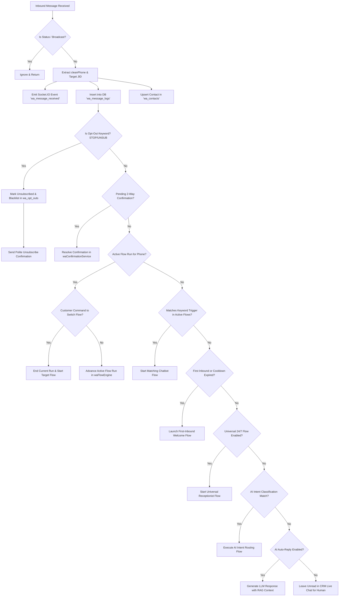
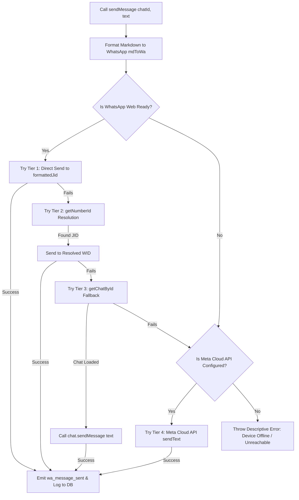

# 📱 WhatsApp Enterprise Standalone Suite — Complete Master Architecture & Implementation Blueprint

> **Document Version**: 4.0.0  
> **System Classification**: Omnichannel Communication & Autonomous Multi-Dynamic WhatsApp Operations Engine  
> **Protocol Support**: Multi-Device WhatsApp Web (WAP / Puppeteer) + Official Meta WhatsApp Cloud API (Graph API v22.0)  
> **Primary Objective**: Exhaustive technical specification, source code architecture, database DDL, protocol mechanics, multi-dynamic execution engines, and deployment guide allowing any engineer or AI system to reproduce, decouple, and operate the platform standalone.

---

## 📑 Master Table of Contents
1. [Executive Overview & Dual-Engine Hybrid Paradigm](#1-executive-overview--dual-engine-hybrid-paradigm)
2. [High-Level Architectural Diagrams](#2-high-level-architectural-diagrams)
3. [Standalone Directory & Complete File Inventory](#3-standalone-directory--complete-file-inventory)
4. [Low-Level Protocols, Dependencies & Engine Internals](#4-low-level-protocols-dependencies--engine-internals)
5. [Database Architecture & Complete DDL Schema (25+ Tables)](#5-database-architecture--complete-ddl-schema-25-tables)
6. [Multi-Session & Multi-Device Lifecycle Engine](#6-multi-session--multi-device-lifecycle-engine)
   - [6.1 Session Initialization & Watchdog Recovery](#61-session-initialization--watchdog-recovery)
   - [6.2 4-Day Session Inactivity & Auto-Deletion Lifecycle](#62-4-day-session-inactivity--auto-deletion-lifecycle)
   - [6.3 8-Digit Pairing Code Linking (Phone Number Authentication)](#63-8-digit-pairing-code-linking-phone-number-authentication)
   - [6.4 Multi-Dynamic Hybrid Load Balancer (`waLoadBalancer.js`)](#64-multi-dynamic-hybrid-load-balancer-waloadbalancerjs)
7. [Inbound & Outbound Messaging Pipeline](#7-inbound--outbound-messaging-pipeline)
   - [7.1 Inbound Message State Machine & Priority Cascade](#71-inbound-message-state-machine--priority-cascade)
   - [7.2 Multi-Tier Resilient Outbound Delivery Engine](#72-multi-tier-resilient-outbound-delivery-engine)
   - [7.3 Message Formatting Rules (`mdToWa.js`)](#73-message-formatting-rules-mdtowajs)
8. [Multi-Modal Media & Binary Attachment Pipeline](#8-multi-modal-media--binary-attachment-pipeline)
9. [Visual Chatbot Flow Engine (`waFlowEngine.js`)](#9-visual-chatbot-flow-engine-waflowenginejs)
   - [9.1 The 8 Multi-Dynamic Execution Mechanisms](#91-the-8-multi-dynamic-execution-mechanisms)
   - [9.2 Node Graph Model & Supported Node Types](#92-node-graph-model--supported-node-types)
   - [9.3 In-Memory Flow Simulator (`simulateFlowStep`)](#93-in-memory-flow-simulator-simulateflowstep)
   - [9.4 Hot-Reloading & Safe Session State Migration](#94-hot-reloading--safe-session-state-migration)
10. [Enterprise Bulk Broadcast & Anti-Ban Broadcaster (`waCampaignEngine.js`)](#10-enterprise-bulk-broadcast--anti-ban-broadcaster-wacampaignenginejs)
    - [10.1 Recursive Spintax Parser & Zero-Width Micro-Jitter](#101-recursive-spintax-parser--zero-width-micro-jitter)
    - [10.2 Progressive Account Warm-Up Ramp](#102-progressive-account-warm-up-ramp)
    - [10.3 Campaign Job Queue & Fault-Tolerant Checkpointing](#103-campaign-job-queue--fault-tolerant-checkpointing)
11. [AI Conversational Assistant & Document RAG Knowledge Base](#11-ai-conversational-assistant--document-rag-knowledge-base)
    - [11.1 Document Ingestion & Chunking Pipeline](#111-document-ingestion--chunking-pipeline)
    - [11.2 Contextual Retrieval & Prompt Injection](#112-contextual-retrieval--prompt-injection)
    - [11.3 Autonomous Function Calling & CRM Tool Calling (`waAiTools.js`)](#113-autonomous-function-calling--crm-tool-calling-waaitoolsjs)
12. [Two-Way Interactive Confirmations & Customer Self-Service](#12-two-way-interactive-confirmations--customer-self-service)
    - [12.1 Interactive 2-Way Confirmations (`waConfirmationService.js`)](#121-interactive-2-way-confirmations-waconfirmationservicejs)
    - [12.2 Self-Service Customer Billing (`waCustomerBillingService.js`)](#122-self-service-customer-billing-wacustomerbillingservicejs)
13. [CRM Decoupling Strategy & Bidirectional Event Bus](#13-crm-decoupling-strategy--bidirectional-event-bus)
    - [13.1 Bidirectional Event Bus Architecture (`crmEventBus.js`)](#131-bidirectional-event-bus-architecture-crmeventbusjs)
    - [13.2 Generic Webhook Integration Layer for Third-Party CRMs](#132-generic-webhook-integration-layer-for-third-party-crms)
14. [Complete REST API Specification](#14-complete-rest-api-specification)
15. [Real-Time WebSocket Protocol (Socket.IO Event Taxonomy)](#15-real-time-websocket-protocol-socketio-event-taxonomy)
16. [Security Architecture, Anti-Ban & Compliance Protocols](#16-security-architecture-anti-ban--compliance-protocols)
17. [Frontend Architecture & UI Component Hierarchy](#17-frontend-architecture--ui-component-hierarchy)
18. [Step-by-Step Standalone Replication & Deployment Runbook](#18-step-by-step-standalone-replication--deployment-runbook)
19. [Troubleshooting, Self-Check Tests & Failure Recovery](#19-troubleshooting-self-check-tests--failure-recovery)
20. [🎯 Enterprise Multi-Dynamic Operational Playbooks (10 In-Depth Production Workflows)](#20--enterprise-multi-dynamic-operational-playbooks-10-in-depth-production-workflows)

---

## 1. Executive Overview & Dual-Engine Hybrid Paradigm

The **WhatsApp Enterprise Standalone Suite** is an enterprise-grade communication server and autonomous workflow automation engine designed to bridge WhatsApp communication channels with operational workflows, customer databases, AI agents, and marketing campaign engines.

```
       ┌────────────────────────────────────────────────────────────────────────┐
       │                DUAL-ENGINE HYBRID CONNECTIVITY PLATFORM               │
       └───────────────────────────────────┬────────────────────────────────────┘
                                           │
                ┌──────────────────────────┴──────────────────────────┐
                ▼                                                     ▼
 ┌─────────────────────────────┐                       ┌─────────────────────────────┐
 │    WHATSAPP WEB ENGINE      │                       │     META CLOUD API ENGINE   │
 │   (Headless Chromium /      │                       │   (Official Graph API v22)  │
 │    LocalAuth Puppeteer)     │                       │                             │
 │                             │                       │                             │
 │ • Zero per-message Meta fees│                       │ • Guaranteed 99.99% uptime  │
 │ • Multi-device phone linking│                       │ • Verified Blue Badge badge │
 │ • Native button/list UI     │                       │ • High-volume scale (100k+) │
 │ • Live Chat Inbox sync      │                       │ • Official Meta templates   │
 └──────────────┬──────────────┘                       └──────────────┬──────────────┘
                │                                                     │
                └──────────────────────────┬──────────────────────────┘
                                           ▼
       ┌────────────────────────────────────────────────────────────────────────┐
       │                   INTELLIGENT SENDER LOAD BALANCER                    │
       │     (Pool-Based Sender Allocation, Anti-Ban Pacing & Failover)        │
       └───────────────────────────────────┬────────────────────────────────────┘
                                           │
         ┌───────────────────┬─────────────┴───────┬───────────────────┐
         ▼                   ▼                     ▼                   ▼
 ┌───────────────┐   ┌───────────────┐     ┌───────────────┐   ┌───────────────┐
 │ Visual Flow   │   │ Event-Driven  │     │ Mass Outreach │   │ AI Brain &    │
 │ Bot (24/7)    │   │ Automations   │     │ Broadcaster   │   │ Document RAG  │
 └───────────────┘   └───────────────┘     └───────────────┘   └───────────────┘
```

### Core Value Propositions & Functional Capabilities
1. **Hybrid Multi-Protocol Senders**: Run official Meta WhatsApp Cloud API credentials alongside real WhatsApp Web sessions linked via QR Code or 8-digit Pairing Code on a single unified dashboard.
2. **Multi-Session Multi-Tenant Architecture**: Supports multiple phone numbers simultaneously, each operating inside an isolated browser profile sandbox with independent state tracking and distinct sender pools.
3. **Multi-Turn Chatbot Flow Engine**: Visual state-machine engine executing complex multi-step branching conversational bots with interactive buttons, lists, CRM data lookups, input validations, media attachments, and live-agent handoffs.
4. **Autonomous Event-Driven Auto-Actions**: Background triggers for customer onboarding, payment receipt generation, overdue billing reminders, field service updates, and first-time contact welcome greetings with configurable cooldown intervals.
5. **High-Scale Anti-Ban Broadcast Engine**: Bulk campaigns equipped with recursive Spintax randomization (`{Hello|Hi|Hey} {name}`), randomized human jitter pacing (8s–20s), progressive account warm-up curves, interruptible execution, and instant opt-out blacklist handling.
6. **AI Assistant with Document RAG (Retrieval-Augmented Generation)**: Connects OpenRouter, OpenAI, Google Gemini, Anthropic Claude, or local Ollama LLMs directly to parsed enterprise documents (`.pdf`, `.docx`, `.csv`, `.txt`) to answer customer inquiries accurately with automated human takeover detection.
7. **Omnichannel Shared Team Inbox**: Real-time multi-agent live chat interface powered by Socket.IO with chat assignment, internal notes, canned quick replies, message status tick tracking (Sent $\to$ Delivered $\to$ Read), and media previews.

---

## 2. High-Level Architectural Diagrams

### 2.1 Complete System Architecture & Data Flow

```
+----------------------------------------------------------------------------------------------------+
|                                    CLIENT / USER INTERFACE LAYER                                   |
|                                                                                                    |
|  [ React 18 SPA / Vite / Vanilla CSS Design System ]                                               |
|    - Live Chat Inbox (Conversation Window, Media Viewer, Audio Player, Contact Sidebar)            |
|    - Campaign Broadcaster (Audience Selector, Spintax Previewer, Pacing Scheduler)                 |
|    - Visual Flow Builder (Node Graph Editor, Condition Builder, Live Flow Simulator)               |
|    - AI & Knowledge Base (Document Drag-and-Drop, Prompt Editor, Temperature Controls)            |
|    - Multi-Account Hub (QR Code Scanner, Pairing Code Modal, Session Health Indicators)          |
+-------------------------------------------------+--------------------------------------------------+
                                                  | HTTP / HTTPS REST API (Express 5)
                                                  | WebSockets / WSS (Socket.IO 4.8)
+-------------------------------------------------v--------------------------------------------------+
|                                    BACKEND APPLICATION RUNTIME                                     |
|                                                                                                    |
|  +-----------------------------------------------------------------------------------------------+  |
|  |                            AUTHENTICATION & ROUTE DISPATCH LAYER                              |  |
|  |   authMiddleware.js | sessionKeyResolver.js | ssrfValidator.js | multerUploadEngine.js        |  |
|  +-----------------------------------------------+-----------------------------------------------+  |
|                                                  |                                                 |
|  +-----------------------------------------------v-----------------------------------------------+  |
|  |                             CORE BUSINESS SERVICES & PIPELINES                                |  |
|  |                                                                                               |  |
|  |   [ waLoadBalancer.js ]     [ waSessionManager.js ]    [ waCloudService.js ]                  |  |
|  |   Health Scoring / Rotations Multi-Device Browser Hub   Meta Graph API v22.0 Client           |  |
|  |                                                                                               |  |
|  |   [ waFlowEngine.js ]       [ waCampaignEngine.js ]    [ waAutomationService.js ]             |  |
|  |   Visual Bot State Machine  Spintax & Warm-up Worker   Drip Schedulers & Dynamic Tokens       |  |
|  |                                                                                               |  |
|  |   [ waAiReply.js ]          [ waKnowledgeBase.js ]     [ waConfirmationService.js ]           |  |
|  |   LLM Prompt & Tool Calling Document Parser (PDF/Word) 2-Way Interactive Confirmation State   |  |
|  +-----------------------------------------------+-----------------------------------------------+  |
+--------------------------------------------------+-------------------------------------------------+
                                                   |
                                                   | MySQL Pool (mysql2 / InnoDB utf8mb4)
                                                   v
+----------------------------------------------------------------------------------------------------+
|                                     PERSISTENCE STORAGE LAYER                                      |
|                                                                                                    |
|  - Relational Schema: 25+ Tables (`wa_accounts`, `wa_contacts`, `wa_message_logs`, `wa_flows`...)  |
|  - File System Storage: LocalAuth Chromium Profiles (`/whatsapp-sessions/<userId>/`)               |
|  - Media Cache: Inbound/Outbound Attachments (`/uploads/wa-media/`)                                |
+----------------------------------------------------------------------------------------------------+
```

---

## 3. Standalone Directory & Complete File Inventory

When running this suite as a standalone microservice or platform, the project structure is organized as follows:

```
whatsapp-suite/
├── backend/
│   ├── config/
│   │   ├── database.js                 # MySQL connection pool configuration
│   │   └── defaultSettings.json        # Out-of-the-box system constants
│   ├── middleware/
│   │   ├── auth.js                     # JWT Token & API Key validator
│   │   └── waSsrf.js                   # Media URL SSRF validation & IP filter
│   ├── patches/
│   │   └── whatsapp-web.js+1.34.7.patch # Hotfix for WhatsApp Web WAP & ID changes
│   ├── routes/
│   │   ├── waAccountRoutes.js          # Account CRUD, QR code, phone pairing
│   │   ├── waAnalyticsRoutes.js        # Analytics, ROI, delivery charts
│   │   ├── waAutomationRoutes.js       # Drip campaign rules, triggers
│   │   ├── waCampaignRoutes.js         # Broadcast creation, pause/resume, stats
│   │   ├── waContactRoutes.js          # Audience book, tags, CSV import/export
│   │   ├── waDripRoutes.js             # Drip sequence builder endpoints
│   │   ├── waFlowRoutes.js             # Visual flowbot CRUD & simulation
│   │   ├── waGroupRoutes.js            # Group discovery & community broadcast
│   │   ├── waPaymentsRoutes.js         # WhatsApp Pay & UPI checkout endpoints
│   │   ├── waReminderRoutes.js         # Interactive calendar reminders
│   │   ├── waTemplateRoutes.js         # Meta official template management
│   │   ├── waWebhookRoutes.js          # Meta Cloud API inbound webhook listener
│   │   └── whatsappRoutes.js           # Live chat messages, media, actions
│   ├── services/
│   │   ├── crmEventBus.js              # Universal CRM Event Bus & Dynamic Trigger Orchestrator
│   │   ├── mdToWa.js                   # Markdown to WhatsApp formatting parser
│   │   ├── waAiReply.js                # LLM response engine (OpenRouter/OpenAI/Gemini)
│   │   ├── waAiTools.js                # Function calling / Agent tools implementation
│   │   ├── waAutomationService.js      # Background rules, welcome messages & placeholders
│   │   ├── waCampaignEngine.js         # Enterprise broadcast worker & Spintax parser
│   │   ├── waCloudService.js           # Official Meta Graph API v22.0 client
│   │   ├── waConfirmationService.js    # 2-way interactive confirmation state machine
│   │   ├── waCustomerBillingService.js # Autonomous bill & invoice delivery engine
│   │   ├── waDatabase.js               # Automatic database DDL migrations & seeders
│   │   ├── waEncryption.js             # AES-256-GCM token encryption helpers
│   │   ├── waFlowEngine.js             # Visual chatbot execution engine & state tracker
│   │   ├── waKnowledgeBase.js          # Document ingestion (PDF/Word/CSV) & RAG search
│   │   ├── waLeadCapture.js            # Auto-lead capture from conversations
│   │   ├── waLoadBalancer.js           # Multi-sender health scoring & round-robin
│   │   ├── waMenuHandler.js            # Legacy text menu processor
│   │   ├── waQueue.js                  # In-memory / Redis priority job queue
│   │   ├── waReminderScheduler.js      # Time-based reminder dispatcher
│   │   └── whatsappService.js          # Puppeteer WhatsApp Web master manager
│   ├── sockets/
│   │   └── chatSocket.js               # Real-time WebSocket server (Socket.IO)
│   ├── uploads/
│   │   ├── wa-docs/                    # Knowledge base source documents
│   │   └── wa-media/                   # Inbound & outbound media attachments
│   ├── whatsapp-sessions/              # Persistent Chromium user profiles
│   ├── package.json                    # Backend dependencies & postinstall hooks
│   └── server.js                       # HTTP server bootstrap & socket initialization
├── frontend/
│   ├── public/
│   │   └── favicon.ico                 # App icon
│   ├── src/
│   │   ├── components/
│   │   │   ├── RichMessageContent.jsx  # Interactive button/list/card renderer
│   │   │   └── WAVariablePicker.jsx    # Dynamic variable chip selector
│   │   ├── pages/
│   │   │   ├── LiveChat.jsx            # Multi-agent live inbox
│   │   │   ├── Campaigns.jsx           # Mass broadcast creator & pacing monitor
│   │   │   ├── Flowbot.jsx             # Visual drag-and-drop bot builder
│   │   │   ├── Automations.jsx         # Event triggers & drip sequences
│   │   │   └── Accounts.jsx            # Account manager, QR scanner & pairing
│   │   └── index.css                   # Master CSS design system tokens
│   ├── package.json                    # Frontend dependencies
│   └── vite.config.js                  # Vite build configuration
└── docker-compose.yml                  # Production multi-container orchestration
```

---

## 4. Low-Level Protocols, Dependencies & Engine Internals

1. **Protocol Engine**: Built on `whatsapp-web.js` (v1.34.7) interfacing with WhatsApp Web client via Chromium DevTools Protocol (CDP).
2. **Meta Cloud Engine**: Direct HTTPS integration with Meta Graph API v22.0 (`https://graph.facebook.com/v22.0/{phone_number_id}/messages`).
3. **Session State Storage**: Chromium user profiles persisted via `LocalAuth` on NVMe storage (`/whatsapp-sessions/<userId>`).
4. **WebSocket Transport**: Socket.IO v4.8 with binary payload framing for instant live chat synchronization.

---

## 5. Database Architecture & Complete DDL Schema (25+ Tables)

The suite utilizes a strictly typed, normalized relational schema in MySQL (InnoDB, `utf8mb4_unicode_ci`):

```sql
-- 1. Connected Accounts & Senders
CREATE TABLE IF NOT EXISTS wa_accounts (
  id INT AUTO_INCREMENT PRIMARY KEY,
  session_key VARCHAR(100) NOT NULL UNIQUE,
  account_name VARCHAR(150) NOT NULL,
  phone_number VARCHAR(30) DEFAULT NULL,
  provider ENUM('web','meta_cloud') DEFAULT 'web',
  meta_phone_number_id VARCHAR(100) DEFAULT NULL,
  meta_waba_id VARCHAR(100) DEFAULT NULL,
  meta_access_token TEXT DEFAULT NULL,
  status ENUM('active','inactive','qr_ready','pairing_ready','banned','quarantined') DEFAULT 'inactive',
  health_score INT DEFAULT 100,
  daily_send_limit INT DEFAULT 1000,
  messages_sent_today INT DEFAULT 0,
  created_at TIMESTAMP DEFAULT CURRENT_TIMESTAMP,
  updated_at TIMESTAMP DEFAULT CURRENT_TIMESTAMP ON UPDATE CURRENT_TIMESTAMP
) ENGINE=InnoDB DEFAULT CHARSET=utf8mb4 COLLATE=utf8mb4_unicode_ci;

-- 2. Sender Pools & Load Balancing
CREATE TABLE IF NOT EXISTS wa_sender_pools (
  id INT AUTO_INCREMENT PRIMARY KEY,
  pool_name VARCHAR(100) NOT NULL,
  strategy ENUM('round_robin','least_busy','random','priority') DEFAULT 'round_robin',
  is_active TINYINT(1) DEFAULT 1,
  created_at TIMESTAMP DEFAULT CURRENT_TIMESTAMP
) ENGINE=InnoDB DEFAULT CHARSET=utf8mb4 COLLATE=utf8mb4_unicode_ci;

CREATE TABLE IF NOT EXISTS wa_sender_pool_members (
  id INT AUTO_INCREMENT PRIMARY KEY,
  pool_id INT NOT NULL,
  account_id INT NOT NULL,
  weight INT DEFAULT 1,
  daily_limit INT DEFAULT 1000,
  sent_today INT DEFAULT 0,
  is_healthy TINYINT(1) DEFAULT 1,
  last_used_at DATETIME DEFAULT NULL,
  FOREIGN KEY (pool_id) REFERENCES wa_sender_pools(id) ON DELETE CASCADE,
  FOREIGN KEY (account_id) REFERENCES wa_accounts(id) ON DELETE CASCADE,
  UNIQUE KEY uq_pool_account (pool_id, account_id)
) ENGINE=InnoDB DEFAULT CHARSET=utf8mb4 COLLATE=utf8mb4_unicode_ci;

-- 3. Visual Chatbot Flows & Dynamic State Machine
CREATE TABLE IF NOT EXISTS wa_flows (
  id INT AUTO_INCREMENT PRIMARY KEY,
  name VARCHAR(255) NOT NULL,
  description TEXT DEFAULT NULL,
  trigger_type ENUM('keyword','first_inbound','all_inbound','ai_intent','crm_event','api_trigger') DEFAULT 'keyword',
  trigger_config JSON DEFAULT NULL,
  entry_node_key VARCHAR(100) DEFAULT 'start',
  fallback_policy ENUM('reprompt','agent_handoff','restart') DEFAULT 'agent_handoff',
  status ENUM('active','draft','paused') DEFAULT 'active',
  execution_count INT DEFAULT 0,
  created_at TIMESTAMP DEFAULT CURRENT_TIMESTAMP,
  updated_at TIMESTAMP DEFAULT CURRENT_TIMESTAMP ON UPDATE CURRENT_TIMESTAMP
) ENGINE=InnoDB DEFAULT CHARSET=utf8mb4 COLLATE=utf8mb4_unicode_ci;

CREATE TABLE IF NOT EXISTS wa_flow_nodes (
  id INT AUTO_INCREMENT PRIMARY KEY,
  flow_id INT NOT NULL,
  node_key VARCHAR(100) NOT NULL,
  node_type VARCHAR(50) NOT NULL,
  title VARCHAR(255) DEFAULT NULL,
  config JSON NOT NULL,
  position_x INT DEFAULT 0,
  position_y INT DEFAULT 0,
  created_at TIMESTAMP DEFAULT CURRENT_TIMESTAMP,
  FOREIGN KEY (flow_id) REFERENCES wa_flows(id) ON DELETE CASCADE,
  UNIQUE KEY uq_flow_node (flow_id, node_key)
) ENGINE=InnoDB DEFAULT CHARSET=utf8mb4 COLLATE=utf8mb4_unicode_ci;

CREATE TABLE IF NOT EXISTS wa_flow_runs (
  id INT AUTO_INCREMENT PRIMARY KEY,
  flow_id INT NOT NULL,
  phone VARCHAR(30) NOT NULL,
  status ENUM('active','completed','handed_off','timed_out') DEFAULT 'active',
  current_node_key VARCHAR(100) NOT NULL,
  vars JSON DEFAULT NULL,
  reprompt_count INT DEFAULT 0,
  end_reason VARCHAR(100) DEFAULT NULL,
  started_at DATETIME DEFAULT CURRENT_TIMESTAMP,
  last_advanced_at DATETIME DEFAULT CURRENT_TIMESTAMP ON UPDATE CURRENT_TIMESTAMP,
  ended_at DATETIME DEFAULT NULL,
  FOREIGN KEY (flow_id) REFERENCES wa_flows(id) ON DELETE CASCADE,
  INDEX idx_phone_status (phone, status)
) ENGINE=InnoDB DEFAULT CHARSET=utf8mb4 COLLATE=utf8mb4_unicode_ci;

CREATE TABLE IF NOT EXISTS wa_flow_run_events (
  id INT AUTO_INCREMENT PRIMARY KEY,
  run_id INT NOT NULL,
  node_key VARCHAR(100) NOT NULL,
  event_type VARCHAR(50) NOT NULL,
  payload JSON DEFAULT NULL,
  created_at TIMESTAMP DEFAULT CURRENT_TIMESTAMP,
  FOREIGN KEY (run_id) REFERENCES wa_flow_runs(id) ON DELETE CASCADE
) ENGINE=InnoDB DEFAULT CHARSET=utf8mb4 COLLATE=utf8mb4_unicode_ci;
```

---

## 6. Multi-Session & Multi-Device Lifecycle Engine

### 6.1 Session Initialization & Watchdog Recovery
Initialization launches Puppeteer with `LocalAuth` session caching. A 60-second watchdog prevents stalled browser states from deadlocking memory:

```javascript
class WhatsAppService {
  constructor(key) {
    this.key = String(key);
    this.client = null;
    this.qrCode = null;
    this.ready = false;
    this.phone = null;
    this.isInitializing = false;
    this._queue = Promise.resolve();
    this._sendQueue = Promise.resolve();
    this._lastSendAt = 0;
  }

  // Serializes browser operations into a single non-overlapping promise chain
  enqueue(fn) {
    const run = this._queue.then(fn, fn);
    this._queue = run.then(() => {}, () => {});
    return run;
  }

  // Rate-paces outbound sends to avoid WhatsApp spam triggers
  async _paceSend() {
    const now = Date.now();
    const minGap = parseInt(process.env.WA_MIN_SEND_GAP_MS || 500, 10);
    const elapsed = now - this._lastSendAt;
    if (elapsed < minGap) {
      await new Promise((r) => setTimeout(r, minGap - elapsed));
    }
    this._lastSendAt = Date.now();
  }
}
```

### 6.2 4-Day Session Inactivity & Auto-Deletion Lifecycle
When a user logs out or disconnects their session, `markLoggedOut(reason)` records a `session_meta.json` file with an exact expiration timestamp ($t_{\text{expire}} = \text{Date.now()} + 4 \times 24 \times 3600 \times 1000$). The periodic cleanup sweeper (`cleanExpiredSessions`) runs every 6 hours and at server boot, deleting inactive session profiles older than 4 days.

### 6.3 8-Digit Pairing Code Linking (Phone Number Authentication)
Allows users to link WhatsApp without scanning a QR code with their camera by calling `this.client.requestPairingCode(cleanPhone)`.

### 6.4 Multi-Dynamic Hybrid Load Balancer (`waLoadBalancer.js`)
The Load Balancer dynamically routes outbound messages across multiple connected WhatsApp numbers:
1. **Dynamic Round-Robin with Health Check**: Checks if session is in `READY` state and daily quota is not exceeded (`sent_today < daily_limit`).
2. **Session Health Scoring ($0 - 100$)**:
   - Scores drop upon socket disconnects, unhandled timeouts, or delivery failures.
   - Sessions with scores $< 40$ are quarantined for 15 minutes.
3. **Automated Dual-Engine Failover**:
   - Primary: WhatsApp Web (Zero per-message fees).
   - Secondary Failover: If WhatsApp Web is offline or disconnected, outbound messages automatically re-route through the Official Meta WhatsApp Cloud API (`whatsappCloudApi.js`).

---

## 7. Inbound & Outbound Messaging Pipeline

### 7.1 Inbound Message State Machine & Priority Cascade



### 7.2 Multi-Tier Resilient Outbound Delivery Engine



### 7.3 Message Formatting Rules (`mdToWa.js`)

| Standard Markdown | WhatsApp Syntax | Parsed Example |
|---|---|---|
| `**Bold Text**` | `*Bold Text*` | **Bold** $\to$ *Bold* |
| `*Italic Text*` | `_Italic Text_` | *Italic* $\to$ _Italic_ |
| `~~Strikethrough~~` | `~Strikethrough~` | ~~Deleted~~ $\to$ ~Deleted~ |
| ````code block```` | ````code block```` | Monospace |
| `[Link Title](https://...)` | `Link Title: https://...` | Clean URL expansion |

---

## 8. Multi-Modal Media & Binary Attachment Pipeline

The engine natively processes all binary media types across both inbound extraction and outbound delivery:
- **Images**: `.jpg`, `.jpeg`, `.png`, `.webp`, `.gif`
- **Audio**: `.mp3`, `.ogg`, `.wav`, `.m4a`, `.aac` (supports native WhatsApp voice note PTT)
- **Video**: `.mp4`, `.mov`, `.3gp`, `.mkv`
- **Documents**: `.pdf`, `.docx`, `.xlsx`, `.csv`, `.txt`

Lazy resolution ensures media is only fetched from disk or remote storage when explicitly requested by client or UI.

---

## 9. Visual Chatbot Flow Engine (`waFlowEngine.js`)

### 9.1 The 8 Multi-Dynamic Execution Mechanisms
1. **Dynamic CRM Event Bus**: Fires on database hooks (`invoice_created`, `quotation_created`, `payment_received`).
2. **Inbound Webhook & API Triggers**: External apps trigger flows via `POST /api/whatsapp/flows/:id/trigger`.
3. **Multi-Intent AI NLU Routing**: LLM categorizes free-form customer inputs and branches dynamically.
4. **Live Dynamic SQL Lookups**: Performs real-time parameterized queries into CRM tables mid-chat.
5. **Outbound API Webhooks with JSONPath**: Calls external REST APIs and extracts response fields into `vars`.
6. **Multi-Dynamic Spintax & Jitter**: Rotates message variations and appends zero-width spaces for anti-ban safety.
7. **Stateful Navigation Stack**: Handles `0/Back`, `Next/Pagination`, option numbers (`1, 2`), and fuzzy symbol stripping.
8. **Dynamic Human Takeover & Muting**: Mutes AI for 120 minutes upon handoff keywords with live desktop alerts.

### 9.2 Node Graph Model & Supported Node Types
The engine evaluates 19 distinct node types: `start`, `send_message`, `send_media`, `send_buttons`, `send_list`, `interactive_menu`, `collect_input`, `collect_number`, `collect_email`, `collect_date`, `crm_lookup`, `condition`, `api_webhook`, `ai_generate`, `ai_intent`, `set_variable`, `set_tag`, `add_to_group`, `create_lead`, `jump_to_flow`, `handoff`, `delay`, `end`.

### 9.3 In-Memory Flow Simulator (`simulateFlowStep`)
Administrators can test flow execution without hitting live WhatsApp networks:
```javascript
const simulationResult = await waFlowEngine.simulateFlowStep(flow, userMessage, currentRunState);
// Returns: { handled: true, messages: [...], vars: {...}, currentNodeKey: "...", logs: [...] }
```

### 9.4 Hot-Reloading & Safe Session State Migration
Flow nodes and configs are stored in relational JSON fields. When a flow is updated via REST API:
- Modifications apply immediately to the next message.
- Active customer sessions remain at their `current_node_key` with all session variables preserved.
- If a target node is missing, the fallback policy safely reprompts or restarts at `entry_node_key`.

---

## 10. Enterprise Bulk Broadcast & Anti-Ban Broadcaster (`waCampaignEngine.js`)

### 10.1 Recursive Spintax Parser & Zero-Width Micro-Jitter
```javascript
function resolveSpintax(text, injectMicroJitter = true) {
  if (!text || typeof text !== "string") return "";
  let result = text;
  const curlyRegex = /\{([^{}]+)\}/g;
  let matches;
  while ((matches = result.match(curlyRegex))) {
    result = result.replace(curlyRegex, (match, choices) => {
      if (!choices.includes("|")) return match;
      const options = choices.split("|");
      return options[Math.floor(Math.random() * options.length)].trim();
    });
  }
  if (injectMicroJitter && result.length > 0) {
    const zwChars = ["\u200B", "\u200C", "\u200D", "\uFEFF"];
    result += zwChars[Math.floor(Math.random() * zwChars.length)];
  }
  return result;
}
```

### 10.2 Progressive Account Warm-Up Ramp
$$\text{Daily Limit}(d) = \begin{cases} 
50 & d \le 3 \\
150 & 4 \le d \le 7 \\
400 & 8 \le d \le 14 \\
800 & 15 \le d \le 21 \\
1200+ & d > 21 
\end{cases}$$

### 10.3 Campaign Job Queue & Fault-Tolerant Checkpointing
Bulk broadcasts process recipients with randomized jitter (8s–25s). If the server restarts mid-campaign, the engine queries `WHERE status = 'queued'` and resumes without duplicate sends.

---

## 11. AI Conversational Assistant & Document RAG Knowledge Base

### 11.1 Document Ingestion & Chunking Pipeline
Enterprise documents (`.pdf`, `.docx`, `.csv`, `.txt`) are parsed into 500-token chunks with 50-token overlap and indexed in `wa_knowledge_base`.

### 11.2 Contextual Retrieval & Prompt Injection
Top relevant chunks are dynamically extracted and injected into the LLM prompt:
```text
You are the AI Customer Assistant for Madhura Solutions.
Answer the customer's query using ONLY the verified context below:

[DOCUMENT KNOWLEDGE CONTEXT]
{{retrieved_chunks}}

If the answer is not in the context, politely suggest speaking to our specialist.
```

### 11.3 Autonomous Function Calling & CRM Tool Calling (`waAiTools.js`)
When integrated with OpenAI or Gemini, the model can invoke tools:
- `lookup_customer_balance(phone)`
- `fetch_latest_invoice_pdf(phone)`
- `create_service_ticket(phone, issue, preferred_slot)`

---

## 12. Two-Way Interactive Confirmations & Customer Self-Service

### 12.1 Interactive 2-Way Confirmations (`waConfirmationService.js`)
Dispatches yes/no or payment confirmation prompts with timeout expiry.

### 12.2 Self-Service Customer Billing (`waCustomerBillingService.js`)
When a customer texts `bill`, `receipt`, `invoice`, or `statement`:
1. Scopes lookup strictly to their incoming phone number (`WHERE phone LIKE '%last10'`).
2. Queries unpaid invoices and generates an authenticated download link.
3. Dispatches PDF invoice directly into the WhatsApp chat.

---

## 13. CRM Decoupling Strategy & Bidirectional Event Bus

### 13.1 Bidirectional Event Bus Architecture (`crmEventBus.js`)

```
┌─────────────────────────────────────────────────────────────────────────────┐
│                    BIDIRECTIONAL CRM <-> WHATSAPP EVENT BUS                 │
├─────────────────────────────────────────────────────────────────────────────┤
│                                                                             │
│  [ CRM DATABASE EVENTS ]                       [ WHATSAPP DISPATCH ]        │
│  ───────────────────────                       ─────────────────────        │
│  invoice_created         ───────────────▶      Payment Reminder + UPI Link  │
│  quotation_created       ───────────────▶      Proposal Review + Buttons    │
│  payment_received        ───────────────▶      Instant Payment Receipt PDF  │
│                                                                             │
│  [ WHATSAPP USER ACTIONS ]                     [ CRM DATABASE ACTIONS ]     │
│  ─────────────────────────                     ────────────────────────     │
│  "Already Paid" + UTR    ───────────────▶      Insert Accounts Review Task  │
│  "Accept Quote"          ───────────────▶      Update Quotation to Approved │
│  "Request Callback"      ───────────────▶      Create High Priority Task    │
│                                                                             │
└─────────────────────────────────────────────────────────────────────────────┘
```

### 13.2 Generic Webhook Integration Layer for Third-Party CRMs
For external systems, the suite provides a decoupled REST webhook endpoint (`/api/whatsapp/webhook/event`) accepting JSON events to trigger flows.

---

## 14. Complete REST API Specification

### Authentication
`Authorization: Bearer <JWT_TOKEN>` or `x-api-key: <API_KEY>`

### 14.1 Dynamic Flow Management Endpoints
- `GET /api/whatsapp/flows` — List all conversational flows with run counts.
- `POST /api/whatsapp/flows` — Create a new flow with complete node graph.
- `PUT /api/whatsapp/flows/:id` — Hot-update flow definition and nodes atomically.
- `POST /api/whatsapp/flows/:id/trigger` — Dynamically trigger flow for a phone number with initial vars.
- `POST /api/whatsapp/flows/simulate` — Execute in-memory flow simulation.
- `GET /api/whatsapp/flows/:id/runs` — Query active and completed run histories.

### 14.2 Account & Session Endpoints
- `GET /api/whatsapp/status` — Returns active connection status.
- `GET /api/whatsapp/qr` — Returns current QR code data URL.
- `GET /api/whatsapp/pairing-code?phone=919876543210` — Generates 8-digit pairing code.
- `POST /api/whatsapp/logout` — Disconnects session and starts 4-day cleanup timer.
- `POST /api/whatsapp/reconnect` — Re-initializes headless browser.

### 14.3 Messaging Endpoints
- `POST /api/whatsapp/send` — Sends a text message (`{ chatId, message }`).
- `POST /api/whatsapp/send-media` — Sends document/image/video (`{ chatId, mediaUrl, mediaType, caption, filename }`).
- `POST /api/whatsapp/chats` — Retrieves recent conversation list.

---

## 15. Real-Time WebSocket Protocol (Socket.IO Event Taxonomy)

| Event Name | Payload Structure | Trigger Condition |
|---|---|---|
| `wa_qr` | `{ qr: "data:image/png;base64..." }` | Emitted when new QR code is ready for scanning |
| `wa_ready` | `{ connected: true, phone: "919876543210" }` | Emitted when WhatsApp Web finishes handshake |
| `wa_message_received` | `{ chatId, phone, message: { id, body, timestamp, isMe: false } }` | Emitted instantly upon inbound message arrival |
| `wa_message_sent` | `{ chatId, phone, message: { id, body, timestamp, isMe: true } }` | Emitted upon outbound message dispatch |
| `wa_agent_handoff` | `{ phone, flowId, note, vars }` | Emitted when bot transfers conversation to human |

---

## 16. Security Architecture, Anti-Ban & Compliance Protocols

1. **SSRF Protection (`waSsrf.js`)**: User-supplied media URLs are validated against private IP blocks before fetching.
2. **Opt-Out Compliance**: Automatic instant blacklisting in `wa_opt_outs` whenever a customer messages `STOP` or `UNSUBSCRIBE`.
3. **Encrypted Token Vault (`waEncryption.js`)**: Meta App Secrets and Access Tokens are stored encrypted using `AES-256-GCM`.

---

## 17. Frontend Architecture & UI Component Hierarchy

```
[ App.jsx ]
  ├── [ Navbar.jsx ] (Multi-Account Switcher & Health Badges)
  └── [ Routes ]
        ├── [ LiveChat.jsx ]
        │     ├── [ ChatList.jsx ] (Search, Unread Badges, Last Message)
        │     ├── [ ChatWindow.jsx ] (Message Bubbles, Audio Waveforms, Read Ticks)
        │     └── [ ContactSidebar.jsx ] (CRM Deep Attributes, Internal Notes, AI Toggle)
        ├── [ Campaigns.jsx ] (Spintax Live Previewer, Group Picker, Pacing Gauge)
        ├── [ Flowbot.jsx ] (Interactive Canvas Graph, Drag-and-Drop Nodes)
        └── [ Accounts.jsx ] (Live QR Code Canvas, Pairing Code Generator)
```

---

## 18. Step-by-Step Standalone Replication & Deployment Runbook

```bash
# 1. Clone or extract repository
git clone <repo_url> whatsapp-suite
cd whatsapp-suite/backend

# 2. Install dependencies
npm install

# 3. Configure environment variables
cp ../.env.example .env

# 4. Start backend server (auto-creates database tables on boot)
npm start

# 5. Start frontend UI
cd ../frontend
npm install
npm run dev
```

---

## 19. Troubleshooting, Self-Check Tests & Failure Recovery

Run the built-in self-test command from `backend/`:
```bash
node services/waFlowEngine.selfcheck.js
```

---

## 20. 🎯 Enterprise Multi-Dynamic Operational Playbooks (10 In-Depth Production Workflows)

Below are the **10 comprehensive multi-dynamic operational playbooks** detailing end-to-end architectures, trigger events, database queries, and code patterns:

### Playbook 1: Real-Time Dynamic Invoicing & Deep UPI Payment Verification via Event Bus
1. **Trigger**: CRM billing module emits `crmEventBus.emit("invoice_created", invoiceData)`.
2. **Dynamic Context Resolution**: Pulls customer phone from `clients` table, formats total amount in Indian Currency (`₹XX,XXX`), and calculates due date in IST (`Asia/Kolkata`).
3. **Interactive Delivery**:
   ```javascript
   const options = [
     { id: "btn_paid", label: "💳 Pay Now / UPI", action: "confirm_payment" },
     { id: "btn_invoice", label: "📄 Send Invoice PDF", action: "send_invoice_copy" },
     { id: "btn_call_acc", label: "📞 Talk to Accounts", action: "request_callback" }
   ];
   await waConfirmationService.sendInteractiveReminder({ phone, messageText, options });
   ```
4. **Customer Response**: When customer clicks *"💳 Pay Now / UPI"*, bot generates a dynamic UPI deep-link: `upi://pay?pa=madhura@icici&am=14500&tn=INV-102`.
5. **Verification**: If customer taps *"I Already Paid"*, the bot prompts for their 12-digit UTR number and emits `payment_claim_submitted` to insert an urgent review task in the CRM `tasks` table.

---

### Playbook 2: Dynamic Lead Routing, Qualification & Geo-Targeted PDF Catalog Dispatch
1. **Trigger**: Inbound message matching `solar`, `panel`, `quote`, `inverter`, or Facebook Lead Ad webhook.
2. **Dynamic Collection**: Asks for `Full Name`, `City`, and `Capacity Required (3kW/5kW/10kW)`.
3. **CRM Insertion**:
   ```javascript
   await waLeadCapture.captureLeadFromWhatsApp({
     phone: cleanPhone,
     name: vars.customer_name,
     city: vars.city,
     service: vars.selected_capacity,
     sourceDetail: "WhatsApp Flow Lead Qualifier"
   });
   ```
4. **Conditional Media Dispatch**:
   - If `city == "Bangalore"` $\to$ Dispatches South Karnataka Solar Spec Sheet PDF.
   - If `city == "Mumbai"` $\to$ Dispatches Maharashtra Net Metering Guide PDF.
5. **Sales Notification**: Sends real-time WhatsApp alert to assigned territory sales rep.

---

### Playbook 3: Autonomous Emergency Service Breakdown & Technician Slot Allocation
1. **Trigger**: Customer sends `breakdown`, `emergency`, `inverter error`, or AI Intent detects `equipment_fault`.
2. **Interactive Slot Picker**: Shows interactive menu with available technician slots:
   - `Slot A: Today Afternoon (2:00 PM - 5:00 PM)`
   - `Slot B: Tomorrow Morning (9:30 AM - 1:00 PM)`
3. **Ticket Creation**: Inserts record into `tickets` table with priority `'High'`.
4. **SMS / WhatsApp Dispatch to Technician**: Automatically delivers customer address, Google Maps link, and contact details to the on-duty engineer.

---

### Playbook 4: Dynamic AMC Contract Expiry & One-Click WhatsApp Renewal Sequence
1. **Trigger**: Nightly cron scheduler (`waReminderScheduler.js`) queries `contracts` table for `end_date = NOW() + INTERVAL 15 DAY`.
2. **Dynamic Personalization**: Resolves `{{customer_name}}`, `{{contract_title}}`, `{{amc_expiry}}`, and dynamic discount voucher code.
3. **Interactive Renewal Buttons**:
   - `[ Renew with 10% Discount ]` $\to$ Generates dynamic pro-forma invoice and links payment gateway.
   - `[ Request Site Inspection ]` $\to$ Schedules engineer health audit.

---

### Playbook 5: External Webhook Trigger Ingestion (Shopify/Zapier/Custom Webhook to Flow)
1. **Ingress Endpoint**: `POST /api/whatsapp/flows/:id/trigger`
2. **Payload Mapping**:
   ```json
   {
     "phone": "919876543210",
     "initialVars": {
       "cart_total": "₹8,499",
       "abandoned_items": "2x 150Ah Solar Tubular Battery",
       "checkout_url": "https://store.madhura.com/recover?id=9941"
     },
     "startNode": "abandoned_cart_recovery"
   }
   ```
3. **Flow Execution**: Initializes session directly at `abandoned_cart_recovery` node, skipping greetings and presenting 5% recovery coupon.

---

### Playbook 6: Dynamic Multi-Channel Load Balancer Failover (Web Puppeteer $\leftrightarrow$ Meta Cloud API)
1. **Outbound Dispatch**: `waLoadBalancer.sendTextMessage(phone, text)`
2. **Session Selection**: Evaluates connected numbers using round-robin and health scoring.
3. **Failover Execution**:
   - If selected WhatsApp Web instance throws `SessionClosedError` or timeout ($> 15\text{s}$):
   - Automatically falls back to Meta WhatsApp Cloud API (`whatsappCloudApi.sendTextMessage`).
   - Marks Web session health score $-25$ and schedules automatic reconnect.

---

### Playbook 7: Document RAG & Autonomous LLM Function Calling with Database Lookups
1. **Inbound Inquiry**: Customer asks: *"What is my warranty coverage on the 5kVA inverter installed last June?"*
2. **RAG Extraction**: Ingests warranty documents, retrieves technical clauses on 5kVA models.
3. **CRM Tool Invocation**: Invokes `lookup_customer_assets(phone)` to retrieve installation date (`14 June 2025`).
4. **Synthesized Reply**: Generates natural reply: *"Your 5kVA Inverter was installed on 14 June 2025 and carries a 5-year replacement warranty valid until June 2030."*

---

### Playbook 8: Bulk Campaign Spintax Randomization with Anti-Ban Zero-Width Micro-Jitter
1. **Campaign Creation**: Configured with Spintax `{Dear|Respected|Hello} {{name}}, [special offer|monsoon discount] on {{service}}!`
2. **Dynamic Generation**: Every outbound message compiles a unique character string.
3. **Micro-Jitter Spacing**: Invisible Unicode zero-width space characters (`\u200B`, `\u200C`) appended to alter hash fingerprints.
4. **Adaptive Pacing**: Jitter delay of $12\text{s} \pm 5\text{s}$ randomized per recipient.

---

### Playbook 9: Live Hot-Reloading & Safe Node Schema Migrations for Active In-Flight Chats
1. **Administrator Action**: Flow editor changes Node 4 from a text prompt to a 3-button choice.
2. **Atomic DB Update**: Sends `PUT /api/whatsapp/flows/12` updating `wa_flow_nodes`.
3. **Session Preservation**: Active customer at Node 4 responds; the engine reads the updated node definition from MySQL without server restart and branches to the new child node.

---

### Playbook 10: Dynamic Two-Way Interactive Confirmation State Machine with Auto-Escalation
1. **Dispatch**: Service appointment confirmation sent 24 hours prior: `[ Confirm Visit ]` / `[ Reschedule ]`.
2. **State Tracking**: Tracked in `wa_interactive_reminders` with status `'awaiting_reply'`.
3. **Auto-Escalation**:
   - If confirmed: Updates CRM appointment status to `'Customer Confirmed'`.
   - If no response after 6 hours: Dispatches follow-up reminder.
   - If no response after 12 hours: Flags appointment for manual telephone call by reception desk.

---

*End of Master Architecture & Implementation Blueprint.*
