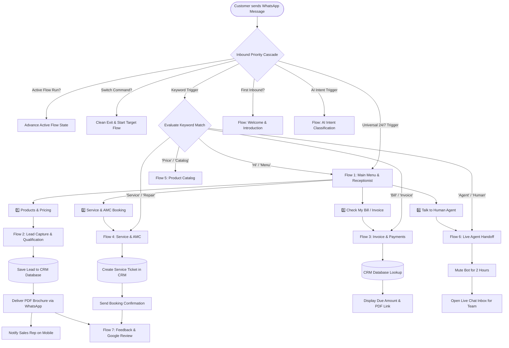
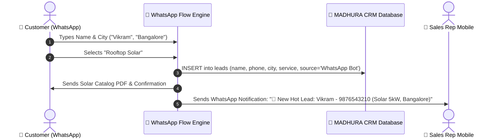
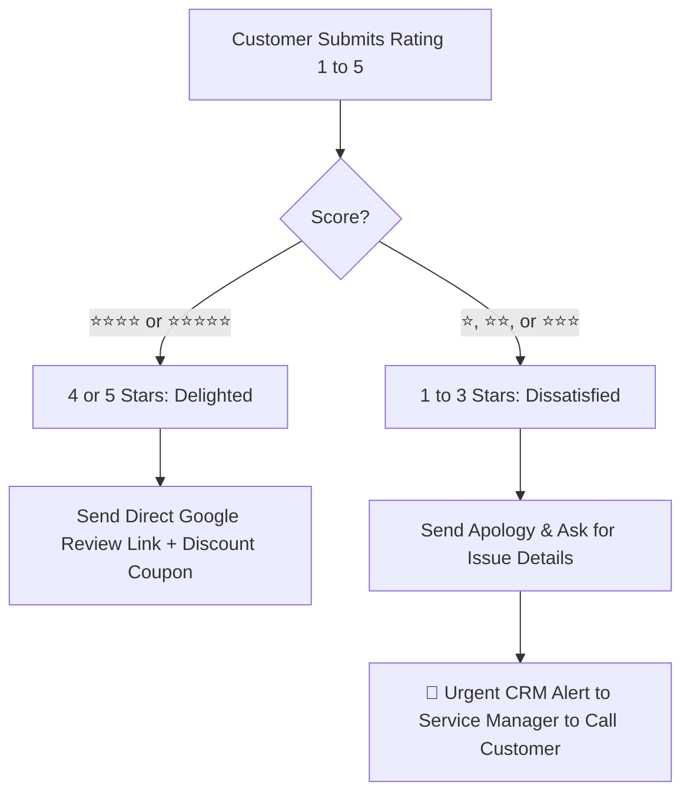
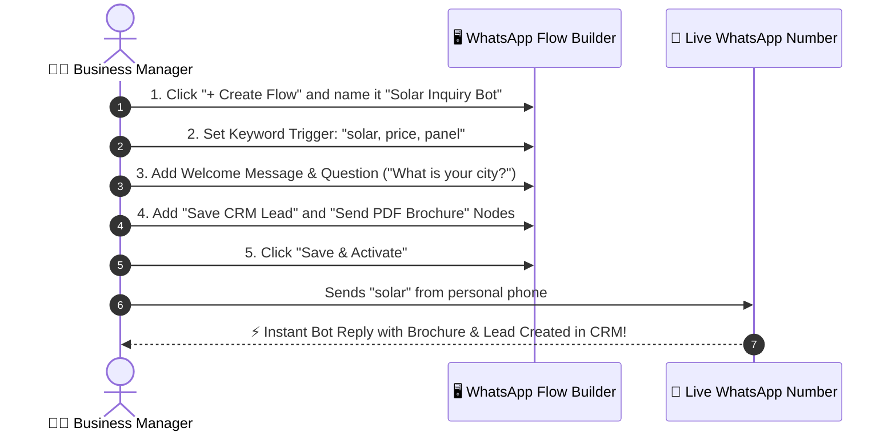

# 💬 WhatsApp Conversational Flows — Visual Business Guide & Presentation Blueprint

> **System**: MADHURA CRM — Intelligent WhatsApp Automation & Multi-Dynamic Flow Engine  
> **Audience**: Business Owners, Sales Teams, Support Executives, Developers, and Solution Architects  
> **Key Goal**: Transform WhatsApp into a 24/7 autonomous sales, billing self-service, and customer support machine using multi-dynamic triggers, real-time CRM lookups, AI intent routing, and zero-downtime hot-reloadable flows.

---

## 📑 Table of Contents
1. [🌟 Executive Summary & Customer Journey Map](#1-executive-summary--customer-journey-map)
2. [🗺️ Master WhatsApp Bot Flow Map](#2-master-whatsapp-bot-flow-map)
3. [⚡ Multi-Dynamic Flow Execution Engine (The 8 Multi-Dynamic Operational Ways)](#3--multi-dynamic-flow-execution-engine-the-8-multi-dynamic-operational-ways)
   - [Way 1: Dynamic CRM Event Bus Invocations (Invoices, Quotes, Payments)](#way-1-dynamic-crm-event-bus-invocations-invoices-quotes-payments)
   - [Way 2: Inbound Webhook & Programmatic REST API Flow Triggers](#way-2-inbound-webhook--programmatic-rest-api-flow-triggers)
   - [Way 3: Multi-Intent AI NLU Routing & Dynamic Slot Extraction](#way-3-multi-intent-ai-nlu-routing--dynamic-slot-extraction)
   - [Way 4: Live Dynamic CRM Database Lookups (On-the-Fly SQL Queries)](#way-4-live-dynamic-crm-database-lookups-on-the-fly-sql-queries)
   - [Way 5: Outbound External REST API Webhook Nodes with JSONPath Extraction](#way-5-outbound-external-rest-api-webhook-nodes-with-jsonpath-extraction)
   - [Way 6: Multi-Dynamic Spintax Randomization & Anti-Ban Zero-Width Jitter](#way-6-multi-dynamic-spintax-randomization--anti-ban-zero-width-jitter)
   - [Way 7: Stateful Dynamic Navigation Stack (Back, Next, Fuzzy & Number Matching)](#way-7-stateful-dynamic-navigation-stack-back-next-fuzzy--number-matching)
   - [Way 8: Dynamic Human Takeover, AI Mute Policies & Agent Handoff](#way-8-dynamic-human-takeover-ai-mute-policies--agent-handoff)
4. [📱 Ready-to-Use Working Flows (Real-Life Chat Examples)](#4-ready-to-use-working-flows-real-life-chat-examples)
   - [Flow 1: 🏢 24/7 Smart Digital Receptionist & Main Menu](#flow-1--247-smart-digital-receptionist--main-menu)
   - [Flow 2: 🎯 Instant Lead Qualification & CRM Capture](#flow-2--instant-lead-qualification--crm-capture)
   - [Flow 3: 💰 Self-Service Invoice & Payment Status Lookup](#flow-3--self-service-invoice--payment-status-lookup)
   - [Flow 4: 🛠️ Service Booking & AMC Renewal Assistant](#flow-4--service-booking--amc-renewal-assistant)
   - [Flow 5: 📦 Instant Product Catalog & PDF Delivery](#flow-5--instant-product-catalog--pdf-delivery)
   - [Flow 6: 👤 Smooth Human Agent Handoff](#flow-6--smooth-human-agent-handoff)
   - [Flow 7: ⭐ Post-Service Feedback & Google Review Collector](#flow-7--post-service-feedback--google-review-collector)
5. [🧱 Visual Flow Building Blocks (The 19 Node Types)](#5-visual-flow-building-blocks-the-19-node-types)
6. [🔀 Decision Rules & Branching Logic (How the Bot Thinks)](#6-decision-rules--branching-logic-how-the-bot-thinks)
7. [🧩 Comprehensive Multi-Dynamic Variables & Smart Tags Matrix](#7-comprehensive-multi-dynamic-variables--smart-tags-matrix)
8. [🚦 Flow Triggers & Auto-Launch Priority Cascade](#8-flow-triggers--auto-launch-priority-cascade)
9. [🔄 Dynamic Hot-Reloading, Schema Updating & Session Migration](#9-dynamic-hot-reloading-schema-updating--session-migration)
10. [📋 Production Multi-Dynamic Flow JSON Schemas (Ready to Import)](#10-production-multi-dynamic-flow-json-schemas-ready-to-import)
11. [📊 Business Metrics & Analytics Dashboard](#11-business-metrics--analytics-dashboard)
12. [🛡️ Safe Messaging, Anti-Ban & Compliance Best Practices](#12-safe-messaging-anti-ban--compliance-best-practices)
13. [🚀 5-Minute Guide: How to Build Your First Flow](#13-5-minute-guide-how-to-build-your-first-flow)

---

## 1. 🌟 Executive Summary & Customer Journey Map

Traditional customer service takes hours or days to respond. **WhatsApp Flows** give your customers **instant answers in less than 2 seconds**, 24 hours a day, 7 days a week.

```
┌─────────────────────────────────────────────────────────────────────────────────────────────┐
│                            THE 24/7 WHATSAPP CUSTOMER EXPERIENCE                            │
├─────────────────────────────────────────────────────────────────────────────────────────────┤
│                                                                                             │
│  👤 CUSTOMER                 🤖 SMART BOT (0–2s)              🏢 CRM & SALES TEAM           │
│  ───────────                 ────────────────────              ───────────────────           │
│                                                                                             │
│  Sends "Hi" / Inquires ─────▶ Greet Customer                                                │
│                               Display Interactive Menu                                      │
│                                                                                             │
│  Selects "Solar Inquiry" ───▶ Asks 3 Quick Questions                                        │
│                               (Location, Capacity, Name)                                    │
│                                                                                             │
│  Provides Details ──────────▶ Instantly Sends PDF Catalog ───▶ Auto-Creates Lead in CRM     │
│                                                                Assigns Sales Executive      │
│                                                                Sends WhatsApp Alert to Team │
│                                                                Trigger Dynamic Drip Followup│
│                                                                                             │
│  Asks for Human ────────────▶ Transfers to Live Chat ────────▶ Agent Chats in Real-Time     │
│                               (Bot Mutes Automatically)                                     │
│                                                                                             │
│  Service Completed ─────────▶ Sends Feedback & Rating ───────▶ Logs 5-Star Review to Google │
│                                                                                             │
└─────────────────────────────────────────────────────────────────────────────────────────────┘
```

### 🏆 Key Business Benefits at a Glance

| 🎯 Feature | ❌ Without WhatsApp Flows | ✅ With WhatsApp Flows |
| :--- | :--- | :--- |
| **Response Speed** | 2 to 6 hours during office hours | **Instant (< 2 seconds)** 24/7/365 |
| **Lead Capture** | Unanswered midnight leads are lost | **100% Leads Captured & Saved in CRM** |
| **Invoice / Balance Inquiries** | Staff manually searches accounting system | **Instant Self-Service** via phone lookup |
| **Sales Pitch Consistency** | Depends on the agent's mood and memory | **Flawless, structured pricing & PDF catalogs** |
| **Customer Support Load** | Repetitive FAQs overwhelm your staff | **80% FAQs resolved automatically by bot** |
| **Human Handoff** | Disconnected & frustrating for clients | **1-click seamless handoff with full chat history** |
| **Multi-Dynamic Adaptability** | Static autoresponders with fixed text | **Context-aware dynamic tokens, live DB lookups & AI** |

---

## 2. 🗺️ Master WhatsApp Bot Flow Map

Here is how all the conversation branches connect into one unified, intelligent navigation tree:



---

## 3. ⚡ Multi-Dynamic Flow Execution Engine (The 8 Multi-Dynamic Operational Ways)

The MADHURA CRM WhatsApp Suite is engineered with **8 powerful multi-dynamic mechanisms** that operate in real time. These allow flows to dynamically adapt content, pull live database records, query third-party APIs, handle user navigation, and switch execution pathways autonomously.

```
┌─────────────────────────────────────────────────────────────────────────────────────────────┐
│                       THE 8 MULTI-DYNAMIC WAYS OF WHATSAPP FLOW ENGINE                      │
├─────────────────────────────────────────────────────────────────────────────────────────────┤
│                                                                                             │
│  [1. CRM EVENT BUS]        ──▶ Database events (Invoice, Quote, Task) trigger flows live    │
│  [2. INBOUND WEBHOOK/API]  ──▶ Third-party forms, Zapier, Shopify trigger customized flows   │
│  [3. AI INTENT NLU]        ──▶ Free-form text parsed into intents & extracted variables     │
│  [4. LIVE SQL LOOKUPS]     ──▶ Real-time DB lookup (Bills, Contracts, Profiles) during chat │
│  [5. OUTBOUND API WEBHOOK] ──▶ Dynamic HTTP calls to external ERP/Logistics with JSONPath   │
│  [6. SPINTAX & JITTER]     ──▶ Dynamic phrase variations with anti-ban zero-width spacing   │
│  [7. STATEFUL NAVIGATION]  ──▶ History stack for '0/Back', pagination & fuzzy option matches │
│  [8. DYNAMIC HUMAN MUTE]   ──▶ 120-minute smart auto-mute on agent takeover with CRM sync   │
│                                                                                             │
└─────────────────────────────────────────────────────────────────────────────────────────────┘
```

### Way 1: Dynamic CRM Event Bus Invocations (Invoices, Quotes, Payments)
Instead of waiting for a customer to start a conversation, the CRM Event Bus (`crmEventBus.js`) monitors database updates across the CRM and autonomously launches dynamic WhatsApp interactive flows:

1. **`invoice_created`**: Fires when an invoice is saved. Dynamically pulls client phone, calculates due date in IST, formats currency as `₹X,XXX`, and delivers an interactive button message:
   - `[💳 Pay Now / UPI]` $\to$ Shows instant UPI payment link with pre-filled amount.
   - `[📄 Send Invoice PDF]` $\to$ Sends official invoice PDF via media node.
   - `[📞 Talk to Accounts]` $\to$ Creates a high-priority callback task for the finance team.
2. **`quotation_created`**: Delivers instant proposal summary with interactive approval buttons (`Accept Quote`, `Request Changes`, `Not Interested`).
3. **`payment_received`**: Dispatches official payment receipt with reference number, timestamp, and updates CRM status to `PAID`.
4. **`payment_claim_submitted`**: When a customer taps *"I Already Paid"*, the bot captures their UTR reference number and automatically inserts a high-priority task in the CRM `tasks` table for the accounts desk.

### Way 2: Inbound Webhook & Programmatic REST API Flow Triggers
External applications can programmatically start or advance flows for any customer using REST endpoints:
- **Endpoint**: `POST /api/whatsapp/flows/:id/trigger`
- **Payload**:
```json
{
  "phone": "919876543210",
  "initialVars": {
    "source": "Facebook Lead Ad",
    "campaign_id": "Solar_Monsoon_Promo",
    "customer_name": "Deepak Patel",
    "interested_kw": "10kW On-Grid",
    "city": "Ahmedabad"
  },
  "startNode": "lead_welcome_node"
}
```
The flow engine initializes the session with these custom variables, skipping generic greetings and diving straight into customized product pitches.

### Way 3: Multi-Intent AI NLU Routing & Dynamic Slot Extraction
When customers type long, unstructured paragraphs (e.g., *"my rooftop solar inverter is making a continuous beeping sound since yesterday afternoon, please send a technician"*), standard keyword matching fails.
The flow engine executes an **`ai_intent`** node:
1. Calls OpenRouter / LLaMA 3.3 / Claude / GPT-4o with configured intent categories (`breakdown`, `billing`, `sales_quote`, `general_inquiry`).
2. Extracts variables (slots) dynamically:
   - `vars.issue_type = "Inverter Beeping / Fault"`
   - `vars.urgency = "High"`
3. Branches conversation immediately to the emergency service technician scheduling branch without forcing the customer to navigate through the main menu.

### Way 4: Live Dynamic CRM Database Lookups (On-the-Fly SQL Queries)
Using the **`crm_lookup`** node type, the flow queries the live MySQL database mid-conversation using the customer's sanitized 10-digit phone number:
- **Invoice Lookup (`lookup_type: 'invoice'`)**:
  ```sql
  SELECT i.invoice_number, i.total_amount, i.status, i.due_date 
  FROM clientinvoices i 
  LEFT JOIN clients c ON i.client_id = c.id 
  WHERE (c.phone LIKE '%9876543210' OR c.mobile LIKE '%9876543210') 
  ORDER BY i.id DESC LIMIT 1;
  ```
- **Dynamic Branching on Result (`branch_on_result: true`)**:
  - If record found: Injects `{{invoice_no}}`, `{{invoice_amount}}`, `{{due_date}}` into `vars` and routes to `found_next`.
  - If no record found: Routes to `not_found_next` to ask customer for their invoice reference ID.

### Way 5: Outbound External REST API Webhook Nodes with JSONPath Extraction
The **`api_webhook`** node allows WhatsApp flows to communicate with external systems (Logistics, ERP, Payment Gateways):
- **Dynamic URL & Body Interpolation**:
  - `URL`: `https://api.tracking.com/v1/shipments/{{tracking_id}}`
  - `Headers`: `{"Authorization": "Bearer {{env_token}}"}`
- **JSONPath Response Extraction (`extractJsonPath`)**:
  - `status_text`: `response.shipment.status`
  - `delivery_eta`: `response.shipment.estimated_delivery`
- **Automated Failover**:
  - If HTTP 200: Proceeds to `success_next`.
  - If HTTP 4xx/5xx or timeout: Catches error in `vars.webhook_error` and branches to `error_next`.

### Way 6: Multi-Dynamic Spintax Randomization & Anti-Ban Zero-Width Jitter
To prevent WhatsApp anti-spam algorithms from flagging automated messages sent to multiple customers:
1. **Spintax Substitution**: Evaluates nested curly brackets `{option1|option2|option3}` and square brackets `[optionA|optionB]`:
   - `"{Hello|Hi|Greetings} {{customer_name}}, [hope you are well|thank you for reaching out]!"`
   - Produces randomized variations on every single execution.
2. **Invisible Micro-Jitter Characters**: Injects randomized zero-width non-breaking characters (`\u200B`, `\u200C`, `\u200D`, `\uFEFF`) at the end of outbound messages. These are completely invisible to the recipient but alter the cryptographic SHA-256 hash of the message payload, preventing bulk-pattern detection by Meta.

### Way 7: Stateful Dynamic Navigation Stack (Back, Next, Fuzzy & Number Matching)
Customers do not always respond as expected. The flow engine features advanced human-tolerant input handling:
1. **Universal Back Command**: If the customer types `0`, `back`, `previous`, `prev`, `return`, `undo`, or emojis `⬅️`/`🔙`, the engine pops the previous node from `vars._nav_history` and re-renders the previous menu.
2. **Universal Next Command**: If options exceed 10 (WhatsApp List limit), typing `next`, `more`, or `page 2` triggers `config.next_page_key`.
3. **Number Matching**: Supports `1`, `2`, `1.`, `#1`, `option 1`, `opt 2`, `choice 1`.
4. **Leading Number Stripping**: If user types `1. Rooftop Solar`, the engine detects option `1`.
5. **Fuzzy Symbol Stripping**: Strips emojis and punctuation to match `"solar"` against `"1️⃣ ☀️ Rooftop Solar Installation"`.

### Way 8: Dynamic Human Takeover, AI Mute Policies & Agent Handoff
When an issue requires human empathy or complex negotiation:
1. **Trigger Words**: Typing `agent`, `human`, `support`, `person`, `representative`, or `help desk` instantly triggers the handoff routine.
2. **Automatic AI Mute**: Sets `ai_paused_until = NOW() + INTERVAL 120 MINUTE` in `wa_contacts`. The bot will not interfere while human agents chat.
3. **WebSocket Desktop Notification**: Emits `wa_agent_handoff` over Socket.IO to the CRM dashboard with audio chimes and full chat history.
4. **Auto-Resume**: If no human messages are sent for 2 hours, or if the agent clicks *"Resume Bot"*, autonomous flow capability is restored.

---

## 4. 📱 Ready-to-Use Working Flows (Real-Life Chat Examples)

### Flow 1: 🏢 24/7 Smart Digital Receptionist & Main Menu

#### 🎯 Purpose:
Greets any customer immediately, establishes trust, and guides them with clear, numbered options or tap-friendly buttons.

#### 💬 Live Chat Simulation:

```
┌─────────────────────────────────────────────────────────────┐
│ 👤 Customer:                                                │
│    Hi                                                       │
│                                                             │
│ 🤖 Madhura Assistant:                                       │
│    👋 *Welcome to Madhura Solutions!*                       │
│    We are here to assist you with sales, services & support.│
│                                                             │
│    Please choose an option below:                           │
│    *1️⃣* 📦 Explore Products & Catalogs                      │
│    *2️⃣* 🛠️ Book Service / Maintenance                      │
│    *3️⃣* 💰 Check Invoice & Payment Status                  │
│    *4️⃣* 👤 Speak with a Support Executive                  │
│                                                             │
│    _Reply with 1, 2, 3, 4 or type MENU anytime._            │
└─────────────────────────────────────────────────────────────┘
```

#### 📊 Step-by-Step Flow Design:

| Step # | Node Name | Node Type | Action Performed | Next Target |
| :---: | :--- | :--- | :--- | :--- |
| **01** | `welcome_entry` | 🚀 **Start** | Inbound message detected | `greet_message` |
| **02** | `greet_message` | 🔘 **Interactive Menu** | Displays welcome text and 4 interactive choices | Evaluates selection |
| **03** | `route_1` | 🔀 **Branch** | If choice = 1 $\to$ Go to Catalog & Lead flow | `lead_capture_flow` |
| **04** | `route_2` | 🔀 **Branch** | If choice = 2 $\to$ Go to Service booking flow | `service_booking_flow` |
| **05** | `route_3` | 🔀 **Branch** | If choice = 3 $\to$ Go to CRM invoice lookup | `invoice_lookup_flow` |
| **06** | `route_4` | 🔀 **Branch** | If choice = 4 $\to$ Transfer to human executive | `agent_handoff_flow` |

---

### Flow 2: 🎯 Instant Lead Qualification & CRM Capture

#### 🎯 Purpose:
Collects high-value lead information (Name, City, Required Service) automatically without human intervention, stores it in the CRM, and sends instant notifications to your sales reps.

#### 💬 Live Chat Simulation:

```
┌─────────────────────────────────────────────────────────────┐
│ 🤖 Madhura Assistant:                                       │
│    Great! Let's get you the right quotation.                │
│    May I know your *Full Name*?                             │
│                                                             │
│ 👤 Customer:                                                │
│    Vikram Sharma                                            │
│                                                             │
│ 🤖 Madhura Assistant:                                       │
│    Thanks Vikram! Which *City / Area* are you located in?   │
│                                                             │
│ 👤 Customer:                                                │
│    Bangalore, Indiranagar                                   │
│                                                             │
│ 🤖 Madhura Assistant:                                       │
│    What service do you need?                                │
│    *1.* ☀️ Rooftop Solar Installation (3kW - 10kW)           │
│    *2.* ⚡ Commercial UPS & Inverter Setup                   │
│    *3.* 🛠️ Annual Maintenance (AMC)                         │
│                                                             │
│ 👤 Customer:                                                │
│    1                                                        │
│                                                             │
│ 🤖 Madhura Assistant:                                       │
│    ✅ *Thank you, Vikram!*                                  │
│    Here is our 2026 Solar Catalog: 📄 [Solar_Brochure.pdf]  │
│                                                             │
│    Our Senior Engineer, *Ananth*, has been assigned to you  │
│    and will call you within 15 minutes.                     │
└─────────────────────────────────────────────────────────────┘
```

#### 📊 CRM Behind-the-Scenes Action:



---

### Flow 3: 💰 Self-Service Invoice & Payment Status Lookup

#### 🎯 Purpose:
Allows existing clients to check their unpaid balances, download GST invoices, and get UPI payment links instantly using just their registered mobile number.

#### 💬 Live Chat Simulation:

```
┌─────────────────────────────────────────────────────────────┐
│ 👤 Customer:                                                │
│    Invoice                                                  │
│                                                             │
│ 🤖 Madhura Assistant:                                       │
│    🔍 _Looking up your account in our billing system..._     │
│                                                             │
│ 🤖 Madhura Assistant:                                       │
│    📋 *Invoice Details for Vikram Sharma:*                  │
│                                                             │
│    • *Invoice #*: INV-2026-088                              │
│    • *Total Amount*: ₹14,500                                │
│    • *Payment Status*: ⚠️ *Pending (Due on 25 Aug)*          │
│    • *Service*: Rooftop Solar 5kW Maintenance               │
│                                                             │
│    📄 *Download Invoice PDF*:                               │
│    https://crm.madhura.com/invoices/INV-2026-088.pdf        │
│                                                             │
│    💳 *Pay Now via UPI*:                                    │
│    upi://pay?pa=madhura@icici&am=14500&tn=INV-2026-088      │
│                                                             │
│    Reply *PAID* once completed or *HELP* for assistance.    │
└─────────────────────────────────────────────────────────────┘
```

#### 📊 Flow Logic & Rules:

| Scenario | Condition | Bot Action |
| :--- | :--- | :--- |
| **Customer Phone Matches CRM** | Record found & Status = `Pending` | Shows Invoice #, Due Date, ₹ Amount, PDF link & UPI Pay link |
| **Customer Has No Due Balance** | Record found & Status = `Paid` | Shows: *"All clear! You have zero outstanding balance. Thank you!"* |
| **Phone Number Not Registered** | Record not found in CRM | Asks: *"Please provide your 6-digit Invoice Number or Client ID"* |

---

### Flow 4: 🛠️ Service Booking & AMC Renewal Assistant

#### 🎯 Purpose:
Enables customers to request on-site repairs, schedule routine maintenance, or renew expiring Annual Maintenance Contracts (AMC) without calling the office.

#### 💬 Live Chat Simulation:

```
┌─────────────────────────────────────────────────────────────┐
│ 👤 Customer:                                                │
│    Book Service                                             │
│                                                             │
│ 🤖 Madhura Assistant:                                       │
│    🔧 *Madhura Maintenance & Field Service*                 │
│    Please choose your service category:                     │
│                                                             │
│    [ 1️⃣ Solar Inverter Breakdown ]                          │
│    [ 2️⃣ Routine AMC Inspection   ]                          │
│    [ 3️⃣ Battery Health Check     ]                          │
│    [ 4️⃣ General Electrical Audit  ]                          │
│                                                             │
│ 👤 Customer:                                                │
│    1                                                        │
│                                                             │
│ 🤖 Madhura Assistant:                                       │
│    Please select your preferred visit slot:                 │
│    *A.* Tomorrow Morning (9:30 AM - 1:00 PM)                │
│    *B.* Tomorrow Afternoon (2:00 PM - 6:00 PM)              │
│    *C.* Weekend Slot (Saturday 10:00 AM)                    │
│                                                             │
│ 👤 Customer:                                                │
│    A                                                        │
│                                                             │
│ 🤖 Madhura Assistant:                                       │
│    📅 *Service Ticket Confirmed!*                           │
│    • *Ticket #*: TKT-9042                                   │
│    • *Slot*: Tomorrow (9:30 AM - 1:00 PM)                   │
│    • *Technician*: Ramesh Kumar (+91 98450 11223)           │
│                                                             │
│    Our technician will call you 30 minutes before arrival.  │
└─────────────────────────────────────────────────────────────┘
```

---

### Flow 5: 📦 Instant Product Catalog & PDF Delivery

#### 🎯 Purpose:
Delivers high-resolution brochures, pricing sheets, technical spec sheets, and installation guides instantly to interested buyers.

#### 💬 Live Chat Simulation:

```
┌─────────────────────────────────────────────────────────────┐
│ 👤 Customer:                                                │
│    Catalog                                                  │
│                                                             │
│ 🤖 Madhura Assistant:                                       │
│    📁 *Madhura Product & Solutions Catalog (2026)*          │
│    Which product brochure would you like to download?       │
│                                                             │
│    *1.* ☀️ On-Grid & Hybrid Solar Inverters (1kW - 50kW)    │
│    *2.* 🔋 Lithium-Ion & Tubular Battery Systems            │
│    *3.* ⚡ Industrial Servo Voltage Stabilizers              │
│    *4.* 📜 Full Price List & Warranty Guide (PDF)           │
│                                                             │
│ 👤 Customer:                                                │
│    1                                                        │
│                                                             │
│ 🤖 Madhura Assistant:                                       │
│    📄 *Delivering: Solar_Inverters_2026.pdf* (4.2 MB)       │
│    [ 📄 Document Attached ]                                 │
│                                                             │
│    💡 *Special Offer*: Order this week and receive          │
│    *FREE 1-Year AMC Coverage*!                              │
│                                                             │
│    Would you like an instant price quote? Reply *YES* or *NO*│
└─────────────────────────────────────────────────────────────┘
```

---

### Flow 6: 👤 Smooth Human Agent Handoff

#### 🎯 Purpose:
When an issue is complex or a customer explicitly asks for human support, the bot immediately steps aside, alerts the team, and opens the live chat.

```
┌─────────────────────────────────────────────────────────────────────────────────────────────┐
│                                   HUMAN HANDOFF PIPELINE                                    │
├─────────────────────────────────────────────────────────────────────────────────────────────┤
│                                                                                             │
│  👤 Customer types "agent", "human", "talk to person", or "help desk"                       │
│                                │                                                            │
│                                ▼                                                            │
│  🤖 Bot responds: "👤 Connecting you to our support specialist now. Please stay online."   │
│                                │                                                            │
│                                ▼                                                            │
│  🔒 Bot auto-mutes for 2 hours (no annoying robotic interruptions while human chats)        │
│                                │                                                            │
│                                ▼                                                            │
│  🔔 Real-time desktop beep & popup alert sent to CRM Live Chat dashboard                    │
│                                │                                                            │
│                                ▼                                                            │
│  👨‍💼 Support Executive opens chat, reads full bot conversation history, and replies         │
│                                                                                             │
└─────────────────────────────────────────────────────────────────────────────────────────────┘
```

---

### Flow 7: ⭐ Post-Service Feedback & Google Review Collector

#### 🎯 Purpose:
Collects customer ratings after a service visit or purchase. High ratings (4 or 5 stars) are directed to Google Reviews, while low ratings (1 to 3 stars) alert the management for urgent resolution.

#### 💬 Live Chat Simulation:

```
┌─────────────────────────────────────────────────────────────┐
│ 🤖 Madhura Assistant:                                       │
│    Hi Vikram! 👋 Our technician completed your solar        │
│    maintenance visit today.                                 │
│                                                             │
│    How would you rate your experience?                      │
│    ⭐⭐⭐⭐⭐ (Reply with a number: 1 to 5)                    │
│                                                             │
│ 👤 Customer:                                                │
│    5                                                        │
│                                                             │
│ 🤖 Madhura Assistant:                                       │
│    🎉 *Thank you so much for the 5-star rating!*            │
│    It means the world to our team.                          │
│                                                             │
│    Could you take 10 seconds to share your review on Google?│
│    ⭐ https://g.page/r/madhura-solutions/review             │
│                                                             │
│    As a token of appreciation, we've added a ₹500 discount  │
│    voucher to your next AMC renewal! 🎁                     │
└─────────────────────────────────────────────────────────────┘
```

#### 🔀 Smart Rating Routing Logic:



---

## 5. 🧱 Visual Flow Building Blocks (The 19 Node Types)

Every WhatsApp flow is constructed by combining modular building blocks. The visual builder supports **19 specialized node types**:

| Icon | Block Type | Technical Key | Config Payload Highlights | Business Role |
| :---: | :--- | :--- | :--- | :--- |
| 💬 | **Text Message** | `send_message` | `{ "text": "Hello {{name}}!" }` | Sends standard formatted WhatsApp message |
| 🔘 | **Quick Buttons** | `send_buttons` | `{ "text": "...", "buttons": [{"id": "b1", "title": "Yes"}] }` | Shows up to 3 clickable buttons |
| 📋 | **List Menu** | `send_list` | `{ "body": "...", "button_text": "Select", "rows": [...] }` | Rich menu supporting up to 10 choices |
| 🔘 | **Interactive Menu** | `interactive_menu` | `{ "header_text": "...", "sections": [...] }` | Sectioned menu adapting to Web/Cloud API |
| 📥 | **Collect Input** | `collect_input` | `{ "prompt_text": "...", "var_key": "city" }` | Waits for customer text reply |
| 🔢 | **Collect Number** | `collect_number` | `{ "prompt_text": "...", "invalid_prompt": "..." }` | Validates integer/decimal numeric input |
| 📧 | **Collect Email** | `collect_email` | `{ "prompt_text": "...", "invalid_prompt": "..." }` | Validates standard RFC email syntax |
| 📅 | **Collect Date** | `collect_date` | `{ "prompt_text": "...", "invalid_prompt": "..." }` | Validates date format (DD/MM/YYYY) |
| 🔍 | **CRM Live Lookup**| `crm_lookup` | `{ "lookup_type": "invoice", "branch_on_result": true }`| Executes live SQL queries against CRM tables |
| 🔀 | **Condition Branch**| `condition` | `{ "subject_key": "amount", "operator": "greater_than" }`| Evaluates multi-conditional If/Else logic |
| 💼 | **Save CRM Lead** | `create_lead` | `{ "default_service": "Solar", "notes": "..." }` | Inserts validated lead into CRM database |
| 📷 | **Media / PDF** | `send_media` | `{ "media_url": "...", "media_type": "document" }` | Dispatches PDF, image, video, or audio file |
| 🧾 | **Meta Template** | `send_template` | `{ "template_id": 12, "vars": { "1": "{{name}}" } }` | Sends pre-approved WhatsApp Cloud API template |
| ⏱️ | **Pacing Delay** | `delay` | `{ "delay_seconds": 3 }` | Human-like typing delay (1s–30s) |
| 🌐 | **API Webhook** | `api_webhook` | `{ "url": "https://...", "method": "POST", "body": {} }` | Outbound HTTP call with JSONPath extraction |
| 🧠 | **AI Smart Reply** | `ai_generate` | `{ "system_prompt": "...", "max_tokens": 150 }` | LLM generates contextual reply |
| 🎯 | **AI Intent Router**| `ai_intent` | `{ "branches": { "billing": "node_x", "quote": "node_y" } }`| LLM categorizes text into branches |
| ⚙️ | **Set Variable** | `set_variable` | `{ "variable_name": "tier", "variable_value": "VIP" }` | Updates or sets runtime session variables |
| 🏷️ | **Tag Contact** | `set_tag` | `{ "tag": "High Intent" }` | Appends JSON tag to `wa_contacts` record |
| 👥 | **Add to Group** | `add_to_group` | `{ "group_id": 4 }` | Enrolls contact into broadcast audience group |
| ↪️ | **Jump to Flow** | `jump_to_flow` | `{ "target_flow_id": 7 }` | Hands off execution to another flow |
| 👤 | **Agent Handoff** | `handoff` | `{ "note": "Customer requested human desk" }` | Mutes bot for 120m and alerts CRM team |
| 🛑 | **End Flow** | `end` | `{}` | Gracefully ends session and clears memory |

---

## 6. 🔀 Decision Rules & Branching Logic (How the Bot Thinks)

The bot evaluates incoming messages and directs customers down the right path using 12+ logical operators:

```
┌─────────────────────────────────────────────────────────────────────────────────────────────┐
│                               HOW THE BOT MAKES DECISIONS                                   │
├─────────────────────────────────────────────────────────────────────────────────────────────┤
│                                                                                             │
│     INPUT VARIABLE                     OPERATOR                       TARGET ACTION         │
│     ──────────────                     ────────                       ─────────────         │
│                                                                                             │
│     customer.city           equals "Bangalore"               ──▶  Assign to Bangalore Team  │
│     invoice_amount          greater_than 50000               ──▶  Route to Senior Manager   │
│     last_input              contains "price" or "cost"       ──▶  Show Price List Flow      │
│     record_found            equals false                     ──▶  Ask for Client ID Number  │
│     amc_status              equals "Expired"                 ──▶  Trigger Renewal Discount  │
│     input                   matches_regex "^[0-9]{10}$"      ──▶  Accept Valid Phone Number │
│                                                                                             │
└─────────────────────────────────────────────────────────────────────────────────────────────┘
```

### Complete Decision Operators Matrix:

| Operator | Plain English Meaning | Evaluation Logic | Example Rule |
| :--- | :--- | :--- | :--- |
| **`equals`** | Exact match (case insensitive) | `var.toLowerCase() === target.toLowerCase()` | Option selected is `"1"` |
| **`not_equals`** | Value does not match target | `var.toLowerCase() !== target.toLowerCase()` | Status is not `"Paid"` |
| **`contains`** | Sentence contains substring | `var.includes(target)` | Message has `"urgent"` |
| **`not_contains`** | Sentence does not contain word | `!var.includes(target)` | Message lacks `"order"` |
| **`starts_with`** | Starts with specific characters | `var.startsWith(target)` | Tracking code starts with `"MAD-"` |
| **`ends_with`** | Ends with specific characters | `var.endsWith(target)` | Domain ends with `".edu"` |
| **`greater_than`** | Numeric value is strictly higher | `parseFloat(var) > parseFloat(target)` | Balance $> 10000$ |
| **`less_than`** | Numeric value is strictly lower | `parseFloat(var) < parseFloat(target)` | Stock quantity $< 3$ |
| **`greater_or_equal`**| Numeric value is equal or higher | `parseFloat(var) >= parseFloat(target)` | Rating $\ge 4$ stars |
| **`less_or_equal`** | Numeric value is equal or lower | `parseFloat(var) <= parseFloat(target)` | Age $\le 18$ |
| **`is_empty`** | Variable is undefined or blank | `var === "" \|\| var === null` | Email was not provided |
| **`is_not_empty`** | Variable contains a value | `var !== "" && var !== null` | AMC contract exists |
| **`is_numeric`** | Valid integer or decimal | `!isNaN(parseFloat(var))` | Quantity check |
| **`matches_regex`** | Matches regular expression pattern| `new RegExp(target, "i").test(var)` | Valid 10-digit mobile number |

---

## 7. 🧩 Comprehensive Multi-Dynamic Variables & Smart Tags Matrix

Make every WhatsApp message feel personal and context-rich by inserting dynamic placeholders. The flow engine automatically resolves tokens using live CRM database records, current system time in IST, and session variables:

### 1. 👤 Contact & Customer Tokens
| Smart Token | Description | Example Output |
| :--- | :--- | :--- |
| `{{name}}` / `{{customer_name}}` | Full name of customer | `Vikram Sharma` |
| `{{first_name}}` | Automatically extracted first name | `Vikram` |
| `{{last_name}}` | Extracted last name | `Sharma` |
| `{{phone}}` / `{{mobile}}` | 10 or 12 digit phone number | `9845012345` |
| `{{email}}` | Registered email address | `vikram@apextech.in` |
| `{{city}}` / `{{location_city}}` | Customer city or headquarters | `Bangalore` |

### 2. 🏢 Business & Company Tokens
| Smart Token | Description | Example Output |
| :--- | :--- | :--- |
| `{{company}}` / `{{company_name}}` | Customer's registered enterprise | `Apex Technologies Pvt Ltd` |
| `{{brand_name}}` / `{{sender_company}}`| Your company name | `Madhura Tech Solutions` |
| `{{support_phone}}` | Official company helpline | `+91 80 2345 6789` |
| `{{portal_url}}` | Self-service web portal | `https://crm.madhura.com` |

### 3. 💰 Billing, Invoices & Quotations Tokens
| Smart Token | Description | Example Output |
| :--- | :--- | :--- |
| `{{invoice_no}}` / `{{invoice_number}}`| Latest invoice reference | `INV-2026-088` |
| `{{amount}}` / `{{invoice_amount}}` | Due balance with rupee symbol | `₹14,500` |
| `{{due_date}}` | Payment due date in Indian format | `25-Aug-2026` |
| `{{payment_status}}` | Current state | `Pending`, `Paid`, `Overdue` |
| `{{quotation_no}}` | Proposal reference number | `QT-2026-042` |
| `{{quote_amount}}` | Total proposed quotation value | `₹1,85,000` |
| `{{upi_link}}` | Dynamic deep UPI payment URL | `upi://pay?pa=madhura@icici&am=14500` |

### 4. 🛠️ Service, AMC & Support Tokens
| Smart Token | Description | Example Output |
| :--- | :--- | :--- |
| `{{service}}` / `{{service_name}}` | Requested or contracted service | `Rooftop Solar 5kW Maintenance` |
| `{{ticket_id}}` / `{{ticket_no}}` | CRM support ticket reference | `TKT-9042` |
| `{{technician_name}}` | Assigned field technician | `Ramesh Kumar` |
| `{{technician_phone}}` | Technician mobile number | `+91 98450 11223` |
| `{{amc_contract_no}}` | AMC agreement reference | `AMC-BLR-2026-04` |
| `{{amc_expiry}}` | Expiration date of active AMC | `31-Dec-2026` |

### 5. 🕒 Time & Calendar Tokens (Indian Standard Time Asia/Kolkata)
| Smart Token | Description | Example Output |
| :--- | :--- | :--- |
| `{{date}}` / `{{ist_date}}` | Today's date | `11 Sep 2026` |
| `{{time}}` / `{{ist_time}}` | Current time (12-hour format) | `01:45 PM` |
| `{{day_name}}` | Day of the week | `Friday` |
| `{{greeting_time}}` | Smart time-based greeting | `Good morning`, `Good afternoon`, `Good evening` |
| `{{tomorrow_date}}` | Calculated tomorrow's date | `12 Sep 2026` |
| `{{tomorrow_day}}` | Tomorrow's weekday | `Saturday` |

---

## 8. 🚦 Flow Triggers & Auto-Launch Priority Cascade

When an incoming WhatsApp message arrives, the flow engine evaluates it through a strict **4-tier priority cascade** to ensure seamless customer routing:

```
                      INBOUND WHATSAPP MESSAGE
                                │
                                ▼
         ┌──────────────────────────────────────────────┐
         │ 1. Active Flow Run Check                     │
         │    Is customer currently inside a flow?      │
         └──────────────────────┬───────────────────────┘
                                │
                 YES ───────────┴─────────── NO
                  │                           │
                  ▼                           ▼
       ┌─────────────────────┐   ┌──────────────────────────────────────────────┐
       │ Did customer type a │   │ 2. Exact Keyword Trigger Match               │
       │ command to switch to│   │    Does text match keywords in active flows? │
       │ another flow?       │   └──────────────────────┬───────────────────────┘
       └──────────┬──────────┘                          │
                  │                              YES ───┴─── NO
          YES ────┴──── NO                        │           │
           │             │                        ▼           ▼
           ▼             ▼               ┌─────────────┐ ┌──────────────────────────────┐
     [Switch Flow] [Advance Run]         [Launch Flow] │ 3. First-Inbound Trigger       │
                                                       │    Has phone ever messaged us? │
                                                       └──────────────┬─────────────────┘
                                                                      │
                                                       YES ───────────┴─────────── NO
                                                        │                           │
                                                        ▼                           ▼
                                                 [Launch Welcome] ┌──────────────────────────────┐
                                                                  │ 4. Universal 24/7 Catch-All  │
                                                                  │    Launch Default Receptionist│
                                                                  └──────────────────────────────┘
```

### Trigger Types Summary Table:

| Trigger Type | Config Key | When Does It Fire? | Example Use Cases |
| :--- | :--- | :--- | :--- |
| **Keyword Trigger** | `keyword` | Incoming text exactly or loosely matches configured words | `"hi"`, `"catalog"`, `"invoice"`, `"amc"`, `"service"` |
| **First Inbound** | `first_inbound`| Customer has 0 previous inbound messages or no chat in 24h | Brand introduction, GDPR/Opt-in consent, welcome menu |
| **Universal 24/7** | `all_inbound` / `universal` | Any inbound message that does not match specific keywords | Catch-all digital receptionist, outside office hours bot |
| **AI Intent** | `ai_intent` | Evaluates message semantics using LLM classification | Complex technical support, complaint detection |
| **CRM Event Bus** | `crm_event` | Fired programmatically by database action in backend | `invoice_created`, `quotation_created`, `payment_received` |
| **Inbound Webhook** | `api_trigger` | Triggered by HTTP POST request from external system | Website lead form submissions, Shopify abandon cart |

---

## 9. 🔄 Dynamic Hot-Reloading, Schema Updating & Session Migration

One of the greatest challenges in conversational automation is modifying bot flows while hundreds of customers are actively chatting. MADHURA CRM solves this with **zero-downtime hot-reloading**:

### 1. Database-Backed Atomic Updates
Flow structures are stored in normalized relational tables:
- `wa_flows`: High-level flow metadata, status (`active`/`draft`), triggers, execution metrics.
- `wa_flow_nodes`: Every individual step, node type, and dynamic JSON config.
- `wa_flow_runs`: State pointers (`current_node_key`), serialized variables (`vars`), reprompt counters.

When an administrator edits a flow in the UI and clicks **Save & Publish**:
1. Changes are committed to MySQL within **< 15ms**.
2. No server restart or Node.js process recycling is required.
3. The next inbound message immediately executes the updated node logic.

### 2. In-Flight Session Resilience & Versioning
- **Safe Step Preservation**: An active customer's state is pinned to `current_node_key`. If other branches are updated, their ongoing step executes flawlessly.
- **Variable Carry-Forward**: Any new variables set in updated nodes seamlessly merge into the customer's existing `vars` dictionary without overwriting previous user inputs.
- **Orphan Node Recovery**: If an administrator deletes the node an active customer is currently waiting on, the engine's fallback handler catches the missing pointer, reprompts the user, or safely restarts them at `entry_node_key`.

### 3. In-Memory Flow Simulation Sandbox
Before publishing changes live, administrators can test flows using the built-in simulator (`simulateFlowStep`):
- Runs entirely in-memory inside the browser or backend without sending live WhatsApp packets.
- Emulates customer choices, evaluates condition branching, and displays step logs.
- Previews dynamic token interpolation with realistic mock data (`Rahul Sharma`, `INV-2026-088`, `₹14,500`).

---

## 10. 📋 Production Multi-Dynamic Flow JSON Schemas (Ready to Import)

Below is an enterprise-grade, multi-dynamic flow schema that demonstrates live CRM lookups, branching, and automated lead capture:

```json
{
  "name": "Dynamic Solar Quote & Lead Qualifier",
  "description": "Multi-dynamic lead qualification with city routing and instant PDF delivery",
  "trigger_type": "keyword",
  "trigger_config": {
    "keywords": ["solar", "quote", "panel", "solar price", "inverter"]
  },
  "entry_node_key": "node_welcome",
  "nodes": [
    {
      "node_key": "node_welcome",
      "node_type": "send_message",
      "config": {
        "text": "{Hello|Hi|Greetings} {{name}}! 👋 Welcome to *{{brand_name}}*.\nLet's get you an instant rooftop solar estimate for {{city}}.",
        "next_node_key": "node_ask_capacity"
      }
    },
    {
      "node_key": "node_ask_capacity",
      "node_type": "send_buttons",
      "config": {
        "text": "What is your average monthly electricity bill?",
        "buttons": [
          { "id": "bill_low", "title": "Under ₹3,000", "next_node_key": "node_rec_3kw" },
          { "id": "bill_mid", "title": "₹3,000 - ₹8,000", "next_node_key": "node_rec_5kw" },
          { "id": "bill_high", "title": "Above ₹8,000", "next_node_key": "node_rec_10kw" }
        ]
      }
    },
    {
      "node_key": "node_rec_5kw",
      "node_type": "set_variable",
      "config": {
        "variable_name": "recommended_system",
        "variable_value": "5kW On-Grid Solar System",
        "next_node_key": "node_show_estimate"
      }
    },
    {
      "node_key": "node_show_estimate",
      "node_type": "send_message",
      "config": {
        "text": "💡 *Recommended for you:* {{recommended_system}}\n• *Estimated Monthly Savings:* ₹4,500 - ₹6,000\n• *Govt Subsidy:* Up to ₹78,000 via PM Surya Ghar Muft Bijli Yojana\n\nMay I know your *Full Name* to generate your official PDF estimate?",
        "next_node_key": "node_collect_name"
      }
    },
    {
      "node_key": "node_collect_name",
      "node_type": "collect_input",
      "config": {
        "var_key": "lead_name",
        "prompt_text": "Please type your full name:",
        "next_node_key": "node_save_lead"
      }
    },
    {
      "node_key": "node_save_lead",
      "node_type": "create_lead",
      "config": {
        "default_service": "Rooftop Solar 5kW",
        "notes": "Qualified via WhatsApp Flow. System: {{recommended_system}}",
        "next_node_key": "node_deliver_pdf"
      }
    },
    {
      "node_key": "node_deliver_pdf",
      "node_type": "send_media",
      "config": {
        "media_type": "document",
        "media_url": "/uploads/catalogs/solar_5kw_specs.pdf",
        "filename": "Solar_5kW_Estimate_2026.pdf",
        "caption": "📄 Here is your customized specification sheet and subsidy breakdown, {{lead_name}}!\nOur senior solar engineer will connect with you shortly.",
        "next_node_key": "node_end"
      }
    },
    {
      "node_key": "node_end",
      "node_type": "end",
      "config": {}
    }
  ]
}
```

---

## 11. 📊 Business Metrics & Analytics Dashboard

Track the performance of your WhatsApp flows in real-time through the built-in analytics dashboard:

```
┌─────────────────────────────────────────────────────────────────────────────────────────────┐
│                               FLOW ANALYTICS DASHBOARD VIEW                                 │
├───────────────────────────────┬───────────────────────────────┬─────────────────────────────┤
│   🚀 TOTAL SESSIONS STARTED   │   ✅ COMPLETED SESSIONS       │   👤 HUMAN HANDOFFS         │
│            1,420              │        1,248 (87.9%)          │          172 (12.1%)        │
├───────────────────────────────┴───────────────────────────────┴─────────────────────────────┤
│                                                                                             │
│  TOP PERFORMING FLOWS:                                                                      │
│  ─────────────────────                                                                      │
│  1. 🏢 24/7 Smart Receptionist Menu      ████████████████████  680 Runs (94% Completion)    │
│  2. 🎯 Instant Lead Capture & Brochure   ██████████████        440 Runs (91% Completion)    │
│  3. 💰 Self-Service Invoice Lookup       ████████              220 Runs (98% Completion)    │
│  4. 🛠️ Service & AMC Booking Ticket      ███                    80 Runs (85% Completion)    │
│                                                                                             │
│  ⏱️ AVERAGE CONVERSATION TIME: 42 Seconds                                                   │
│  💼 LEADS GENERATED THIS MONTH: 312 Leads (₹18.4 Lakh Estimated Pipeline Value)             │
│                                                                                             │
└─────────────────────────────────────────────────────────────────────────────────────────────┘
```

### Key Performance Indicators (KPIs) to Monitor:

| KPI Metric | Target Benchmark | How to Improve if Low |
| :--- | :--- | :--- |
| **Flow Completion Rate** | **$> 85\%$** | Reduce number of steps; make options shorter & clearer |
| **Drop-off Node** | Minimal drop-offs | Check if a question is too difficult (e.g. asking for GSTIN upfront) |
| **Average Response Speed** | **$< 2$ seconds** | Ensure server is running with active WhatsApp session |
| **Lead Conversion Rate** | **$> 30\%$** | Offer instant PDF catalogs or time-limited bonus coupons |
| **Human Transfer Rate** | **$10\% - 15\%$** | Train bot with more FAQ answers to reduce human workload |

---

## 12. 🛡️ Safe Messaging, Anti-Ban & Compliance Best Practices

Protect your WhatsApp business number from spam flags and temporary account bans by following these gold standards:

```
┌─────────────────────────────────────────────────────────────────────────────────────────────┐
│                                 WHATSAPP ANTI-BAN SAFETY RULES                              │
├─────────────────────────────────────────────────────────────────────────────────────────────┤
│                                                                                             │
│   ✅ DO THIS                                  ❌ DON'T DO THIS                              │
│   ──────────                                  ───────────────                               │
│                                                                                             │
│   • Use natural 5s–15s human delay pacing    • Never blast 1,000 messages in 1 minute       │
│   • Include an easy "Type STOP to opt-out"   • Never send spam to purchased phone lists     │
│   • Randomize greetings using Spintax        • Never send identical copy to hundreds of contacts│
│   • Warm up new numbers gradually (50/day)   • Don't send 500 messages on Day 1 of new SIM  │
│   • Provide real value (catalogs, invoices)  • Don't send misleading clickbait promo links  │
│                                                                                             │
└─────────────────────────────────────────────────────────────────────────────────────────────┘
```

### Anti-Ban Checklist Table:

| Safety Layer | How It Works | Recommended Setting |
| :--- | :--- | :--- |
| **Human Pacing Jitter** | Adds random delay between sequential messages | **8 to 25 seconds** per broadcast message |
| **Message Spintax** | Rotates phrases: `{Hello\|Hi\|Greetings} {name}` | Always enable Spintax on promotional broadcasts |
| **Account Warm-Up** | Gradually increases daily message volume over 14 days | Start: 50 msgs/day $\to$ Day 14: 800 msgs/day |
| **Opt-Out Compliance** | Automatically blacklists anyone typing `"STOP"` | Built-in blacklist filter in MADHURA CRM |
| **Session Watchdog** | Auto-reconnects disconnected WhatsApp Web sessions | Built-in 24/7 background watchdog service |

---

## 13. 🚀 5-Minute Guide: How to Build Your First Flow

You can create a fully working flow in the MADHURA CRM visual builder in just 5 simple steps:



### The 5 Simple Steps Explained:

1. **Step 1: Open Flow Builder**  
   Navigate to **WhatsApp $\to$ Chatbot Flows** in your CRM sidebar and click **`+ New Flow`**.

2. **Step 2: Set Trigger Keywords**  
   Enter the words that should start this flow (e.g., `solar`, `inverter`, `quote`, `pricing`).

3. **Step 3: Add Question & Menu Nodes**  
   Drag and drop a **Menu Node** with choices (`1. Rooftop Solar`, `2. Commercial UPS`) and an **Input Node** asking for their city.

4. **Step 4: Connect Lead Capture & PDF Delivery**  
   Add a **Save CRM Lead** node to log the lead, and a **Media Node** with your brochure URL.

5. **Step 5: Click Save & Test Live!**  
   Toggle status to **`Active`**. Send a test message from your mobile phone to see your brand-new automated flow in action!

---

## 🎯 Summary Checklist for Presentations

- [x] **24/7 Response Capability**: Answers customer questions in $< 2$ seconds.
- [x] **Zero Code Required**: Drag-and-drop visual building blocks with 19 node types.
- [x] **Deep CRM Integration**: Live invoice queries, AMC status lookups & instant lead capture.
- [x] **Multi-Dynamic Operations**: 8 real-time dynamic ways to route, fetch data, and update flows.
- [x] **Multi-Media Delivery**: Sends brochures, catalogs, and invoices in PDF/Image format.
- [x] **Safe & Compliant**: Built-in human delay pacing, opt-out management, and anti-ban safeguards.
- [x] **Human Collaboration**: Instant alert to support desk with seamless live chat takeover.

---

> **MADHURA CRM — WhatsApp Automation Suite**  
> *Turning Conversations into Revenue, 24 Hours a Day.*
