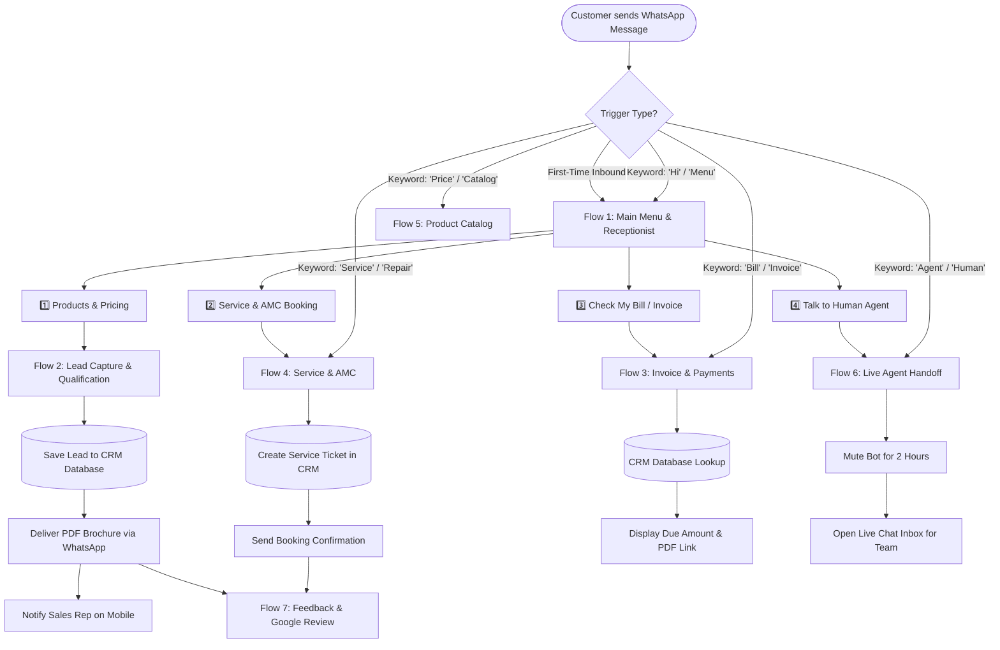
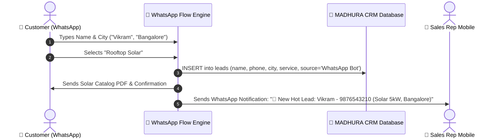
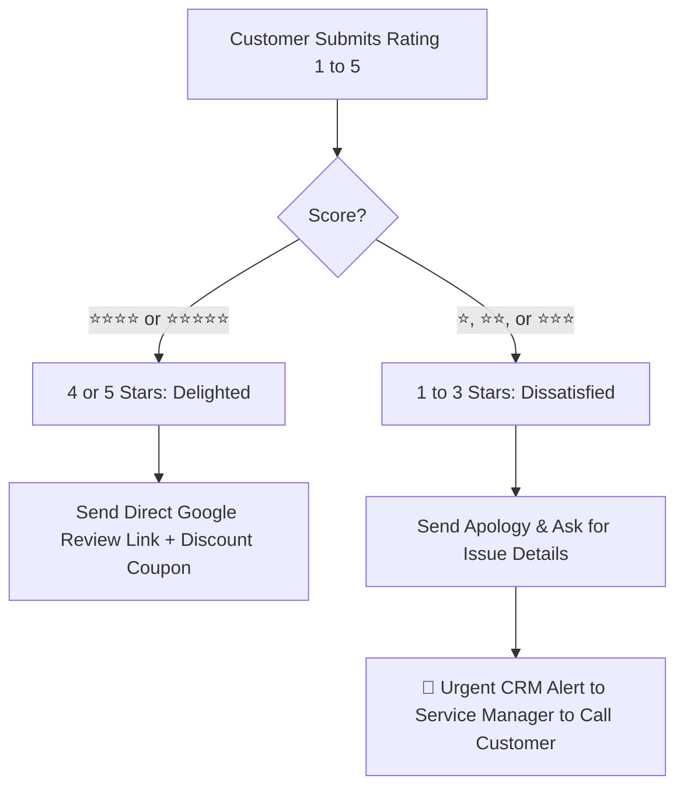
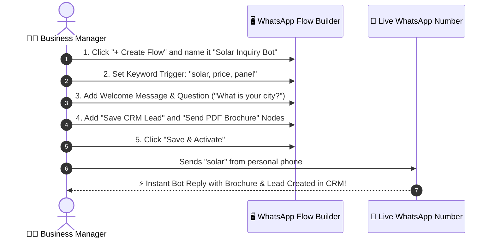

# 💬 WhatsApp Conversational Flows — Visual Business Guide & Presentation Blueprint

> **System**: MADHURA CRM — Intelligent WhatsApp Automation & Flow Engine  
> **Audience**: Business Owners, Sales Teams, Support Executives, and Presentation Viewers  
> **Key Goal**: Transform WhatsApp into a 24/7 automated sales, service, and customer support machine without complex coding.

---

## 📑 Table of Contents
1. [🌟 Executive Summary & Customer Journey Map](#1-executive-summary--customer-journey-map)
2. [🗺️ Master WhatsApp Bot Flow Map](#2-master-whatsapp-bot-flow-map)
3. [📱 Ready-to-Use Working Flows (Real-Life Chat Examples)](#3-ready-to-use-working-flows-real-life-chat-examples)
   - [Flow 1: 🏢 24/7 Smart Digital Receptionist & Main Menu](#flow-1--247-smart-digital-receptionist--main-menu)
   - [Flow 2: 🎯 Instant Lead Qualification & CRM Capture](#flow-2--instant-lead-qualification--crm-capture)
   - [Flow 3: 💰 Self-Service Invoice & Payment Status Lookup](#flow-3--self-service-invoice--payment-status-lookup)
   - [Flow 4: 🛠️ Service Booking & AMC Renewal Assistant](#flow-4--service-booking--amc-renewal-assistant)
   - [Flow 5: 📦 Instant Product Catalog & PDF Delivery](#flow-5--instant-product-catalog--pdf-delivery)
   - [Flow 6: 👤 Smooth Human Agent Handoff](#flow-6--smooth-human-agent-handoff)
   - [Flow 7: ⭐ Post-Service Feedback & Google Review Collector](#flow-7--post-service-feedback--google-review-collector)
4. [🧱 Visual Flow Building Blocks (The 19 Node Types)](#4-visual-flow-building-blocks-the-19-node-types)
5. [🔀 Decision Rules & Branching Logic (How the Bot Thinks)](#5-decision-rules--branching-logic-how-the-bot-thinks)
6. [🧩 Personalization & Dynamic Smart Tags Matrix](#6-personalization--dynamic-smart-tags-matrix)
7. [🚦 Flow Triggers & Auto-Launch Strategy](#7-flow-triggers--auto-launch-strategy)
8. [📊 Business Metrics & Analytics Dashboard](#8-business-metrics--analytics-dashboard)
9. [🛡️ Safe Messaging, Anti-Ban & Compliance Best Practices](#9-safe-messaging-anti-ban--compliance-best-practices)
10. [🚀 5-Minute Guide: How to Build Your First Flow](#10-5-minute-guide-how-to-build-your-first-flow)

---

## 1. 🌟 Executive Summary & Customer Journey Map

Traditional customer service takes hours or days to respond. **WhatsApp Flows** give your customers **instant answers in less than 2 seconds**, 24 hours a day, 7 days a week.

```
┌─────────────────────────────────────────────────────────────────────────────────────────────┐
│                            THE 24/7 WHATSAPP CUSTOMER EXPERIENCE                            │
├─────────────────────────────────────────────────────────────────────────────────────────────┤
│                                                                                             │
│  👤 CUSTOMER                 🤖 SMART BOT (0–2s)              🏢 CRM & SALES TEAM           │
│  ───────────                 ────────────────────              ───────────────────           │
│                                                                                             │
│  Sends "Hi" / Inquires ─────▶ Greet Customer                                                │
│                               Display Interactive Menu                                      │
│                                                                                             │
│  Selects "Solar Inquiry" ───▶ Asks 3 Quick Questions                                        │
│                               (Location, Capacity, Name)                                    │
│                                                                                             │
│  Provides Details ──────────▶ Instantly Sends PDF Catalog ───▶ Auto-Creates Lead in CRM     │
│                                                                Assigns Sales Executive      │
│                                                                Sends WhatsApp Alert to Team │
│                                                                                             │
│  Asks for Human ────────────▶ Transfers to Live Chat ────────▶ Agent Chats in Real-Time     │
│                               (Bot Mutes Automatically)                                     │
│                                                                                             │
│  Service Completed ─────────▶ Sends Feedback & Rating ───────▶ Logs 5-Star Review to Google │
│                                                                                             │
└─────────────────────────────────────────────────────────────────────────────────────────────┘
```

### 🏆 Key Business Benefits at a Glance

| 🎯 Feature | ❌ Without WhatsApp Flows | ✅ With WhatsApp Flows |
| :--- | :--- | :--- |
| **Response Speed** | 2 to 6 hours during office hours | **Instant (< 2 seconds)** 24/7/365 |
| **Lead Capture** | Unanswered midnight leads are lost | **100% Leads Captured & Saved in CRM** |
| **Invoice / Balance Inquiries** | Staff manually searches accounting system | **Instant Self-Service** via phone lookup |
| **Sales Pitch Consistency** | Depends on the agent's mood and memory | **Flawless, structured pricing & PDF catalogs** |
| **Customer Support Load** | Repetitive FAQs overwhelm your staff | **80% FAQs resolved automatically by bot** |
| **Human Handoff** | Disconnected & frustrating for clients | **1-click seamless handoff with full chat history** |

---

## 2. 🗺️ Master WhatsApp Bot Flow Map

Here is how all the conversation branches connect into one unified, intelligent navigation tree:



---

## 3. 📱 Ready-to-Use Working Flows (Real-Life Chat Examples)

### Flow 1: 🏢 24/7 Smart Digital Receptionist & Main Menu

#### 🎯 Purpose:
Greets any customer immediately, establishes trust, and guides them with clear, numbered options or tap-friendly buttons.

#### 💬 Live Chat Simulation:

```
┌─────────────────────────────────────────────────────────────┐
│ 👤 Customer:                                                │
│    Hi                                                       │
│                                                             │
│ 🤖 Madhura Assistant:                                       │
│    👋 *Welcome to Madhura Solutions!*                       │
│    We are here to assist you with sales, services & support.│
│                                                             │
│    Please choose an option below:                           │
│    *1️⃣* 📦 Explore Products & Catalogs                      │
│    *2️⃣* 🛠️ Book Service / Maintenance                      │
│    *3️⃣* 💰 Check Invoice & Payment Status                  │
│    *4️⃣* 👤 Speak with a Support Executive                  │
│                                                             │
│    _Reply with 1, 2, 3, 4 or type MENU anytime._            │
└─────────────────────────────────────────────────────────────┘
```

#### 📊 Step-by-Step Flow Design:

| Step # | Node Name | Node Type | Action Performed | Next Target |
| :---: | :--- | :--- | :--- | :--- |
| **01** | `welcome_entry` | 🚀 **Start** | Inbound message detected | `greet_message` |
| **02** | `greet_message` | 🔘 **Buttons / Menu** | Displays welcome text and 4 interactive choices | Evaluates selection |
| **03** | `route_1` | 🔀 **Branch** | If choice = 1 $\to$ Go to Catalog & Lead flow | `lead_capture_flow` |
| **04** | `route_2` | 🔀 **Branch** | If choice = 2 $\to$ Go to Service booking flow | `service_booking_flow` |
| **05** | `route_3` | 🔀 **Branch** | If choice = 3 $\to$ Go to CRM invoice lookup | `invoice_lookup_flow` |
| **06** | `route_4` | 🔀 **Branch** | If choice = 4 $\to$ Transfer to human executive | `agent_handoff_flow` |

---

### Flow 2: 🎯 Instant Lead Qualification & CRM Capture

#### 🎯 Purpose:
Collects high-value lead information (Name, City, Required Service) automatically without human intervention, stores it in the CRM, and sends instant notifications to your sales reps.

#### 💬 Live Chat Simulation:

```
┌─────────────────────────────────────────────────────────────┐
│ 🤖 Madhura Assistant:                                       │
│    Great! Let's get you the right quotation.                │
│    May I know your *Full Name*?                             │
│                                                             │
│ 👤 Customer:                                                │
│    Vikram Sharma                                            │
│                                                             │
│ 🤖 Madhura Assistant:                                       │
│    Thanks Vikram! Which *City / Area* are you located in?   │
│                                                             │
│ 👤 Customer:                                                │
│    Bangalore, Indiranagar                                   │
│                                                             │
│ 🤖 Madhura Assistant:                                       │
│    What service do you need?                                │
│    *1.* ☀️ Rooftop Solar Installation (3kW - 10kW)           │
│    *2.* ⚡ Commercial UPS & Inverter Setup                   │
│    *3.* 🛠️ Annual Maintenance (AMC)                         │
│                                                             │
│ 👤 Customer:                                                │
│    1                                                        │
│                                                             │
│ 🤖 Madhura Assistant:                                       │
│    ✅ *Thank you, Vikram!*                                  │
│    Here is our 2026 Solar Catalog: 📄 [Solar_Brochure.pdf]  │
│                                                             │
│    Our Senior Engineer, *Ananth*, has been assigned to you  │
│    and will call you within 15 minutes.                     │
└─────────────────────────────────────────────────────────────┘
```

#### 📊 CRM Behind-the-Scenes Action:



---

### Flow 3: 💰 Self-Service Invoice & Payment Status Lookup

#### 🎯 Purpose:
Allows existing clients to check their unpaid balances, download GST invoices, and get UPI payment links instantly using just their registered mobile number.

#### 💬 Live Chat Simulation:

```
┌─────────────────────────────────────────────────────────────┐
│ 👤 Customer:                                                │
│    Invoice                                                  │
│                                                             │
│ 🤖 Madhura Assistant:                                       │
│    🔍 _Looking up your account in our billing system..._     │
│                                                             │
│ 🤖 Madhura Assistant:                                       │
│    📋 *Invoice Details for Vikram Sharma:*                  │
│                                                             │
│    • *Invoice #*: INV-2026-088                              │
│    • *Total Amount*: ₹14,500                                │
│    • *Payment Status*: ⚠️ *Pending (Due on 25 Aug)*          │
│    • *Service*: Rooftop Solar 5kW Maintenance               │
│                                                             │
│    📄 *Download Invoice PDF*:                               │
│    https://crm.madhura.com/invoices/INV-2026-088.pdf        │
│                                                             │
│    💳 *Pay Now via UPI*:                                    │
│    upi://pay?pa=madhura@icici&am=14500&tn=INV-2026-088      │
│                                                             │
│    Reply *PAID* once completed or *HELP* for assistance.    │
└─────────────────────────────────────────────────────────────┘
```

#### 📊 Flow Logic & Rules:

| Scenario | Condition | Bot Action |
| :--- | :--- | :--- |
| **Customer Phone Matches CRM** | Record found & Status = `Pending` | Shows Invoice #, Due Date, ₹ Amount, PDF link & UPI Pay link |
| **Customer Has No Due Balance** | Record found & Status = `Paid` | Shows: *"All clear! You have zero outstanding balance. Thank you!"* |
| **Phone Number Not Registered** | Record not found in CRM | Asks: *"Please provide your 6-digit Invoice Number or Client ID"* |

---

### Flow 4: 🛠️ Service Booking & AMC Renewal Assistant

#### 🎯 Purpose:
Enables customers to request on-site repairs, schedule routine maintenance, or renew expiring Annual Maintenance Contracts (AMC) without calling the office.

#### 💬 Live Chat Simulation:

```
┌─────────────────────────────────────────────────────────────┐
│ 👤 Customer:                                                │
│    Book Service                                             │
│                                                             │
│ 🤖 Madhura Assistant:                                       │
│    🔧 *Madhura Maintenance & Field Service*                 │
│    Please choose your service category:                     │
│                                                             │
│    [ 1️⃣ Solar Inverter Breakdown ]                          │
│    [ 2️⃣ Routine AMC Inspection   ]                          │
│    [ 3️⃣ Battery Health Check     ]                          │
│    [ 4️⃣ General Electrical Audit  ]                          │
│                                                             │
│ 👤 Customer:                                                │
│    1                                                        │
│                                                             │
│ 🤖 Madhura Assistant:                                       │
│    Please select your preferred visit slot:                 │
│    *A.* Tomorrow Morning (9:30 AM - 1:00 PM)                │
│    *B.* Tomorrow Afternoon (2:00 PM - 6:00 PM)              │
│    *C.* Weekend Slot (Saturday 10:00 AM)                    │
│                                                             │
│ 👤 Customer:                                                │
│    A                                                        │
│                                                             │
│ 🤖 Madhura Assistant:                                       │
│    📅 *Service Ticket Confirmed!*                           │
│    • *Ticket #*: TKT-9042                                   │
│    • *Slot*: Tomorrow (9:30 AM - 1:00 PM)                   │
│    • *Technician*: Ramesh Kumar (+91 98450 11223)           │
│                                                             │
│    Our technician will call you 30 minutes before arrival.  │
└─────────────────────────────────────────────────────────────┘
```

---

### Flow 5: 📦 Instant Product Catalog & PDF Delivery

#### 🎯 Purpose:
Delivers high-resolution brochures, pricing sheets, technical spec sheets, and installation guides instantly to interested buyers.

#### 💬 Live Chat Simulation:

```
┌─────────────────────────────────────────────────────────────┐
│ 👤 Customer:                                                │
│    Catalog                                                  │
│                                                             │
│ 🤖 Madhura Assistant:                                       │
│    📁 *Madhura Product & Solutions Catalog (2026)*          │
│    Which product brochure would you like to download?       │
│                                                             │
│    *1.* ☀️ On-Grid & Hybrid Solar Inverters (1kW - 50kW)    │
│    *2.* 🔋 Lithium-Ion & Tubular Battery Systems            │
│    *3.* ⚡ Industrial Servo Voltage Stabilizers              │
│    *4.* 📜 Full Price List & Warranty Guide (PDF)           │
│                                                             │
│ 👤 Customer:                                                │
│    1                                                        │
│                                                             │
│ 🤖 Madhura Assistant:                                       │
│    📄 *Delivering: Solar_Inverters_2026.pdf* (4.2 MB)       │
│    [ 📄 Document Attached ]                                 │
│                                                             │
│    💡 *Special Offer*: Order this week and receive          │
│    *FREE 1-Year AMC Coverage*!                              │
│                                                             │
│    Would you like an instant price quote? Reply *YES* or *NO│
└─────────────────────────────────────────────────────────────┘
```

---

### Flow 6: 👤 Smooth Human Agent Handoff

#### 🎯 Purpose:
When an issue is complex or a customer explicitly asks for human support, the bot immediately steps aside, alerts the team, and opens the live chat.

```
┌─────────────────────────────────────────────────────────────────────────────────────────────┐
│                                   HUMAN HANDOFF PIPELINE                                    │
├─────────────────────────────────────────────────────────────────────────────────────────────┤
│                                                                                             │
│  👤 Customer types "agent", "human", "talk to person", or "help desk"                       │
│                                │                                                            │
│                                ▼                                                            │
│  🤖 Bot responds: "👤 Connecting you to our support specialist now. Please stay online."   │
│                                │                                                            │
│                                ▼                                                            │
│  🔒 Bot auto-mutes for 2 hours (no annoying robotic interruptions while human chats)        │
│                                │                                                            │
│                                ▼                                                            │
│  🔔 Real-time desktop beep & popup alert sent to CRM Live Chat dashboard                    │
│                                │                                                            │
│                                ▼                                                            │
│  👨‍💼 Support Executive opens chat, reads full bot conversation history, and replies         │
│                                                                                             │
└─────────────────────────────────────────────────────────────────────────────────────────────┘
```

---

### Flow 7: ⭐ Post-Service Feedback & Google Review Collector

#### 🎯 Purpose:
Collects customer ratings after a service visit or purchase. High ratings (4 or 5 stars) are directed to Google Reviews, while low ratings (1 to 3 stars) alert the management for urgent resolution.

#### 💬 Live Chat Simulation:

```
┌─────────────────────────────────────────────────────────────┐
│ 🤖 Madhura Assistant:                                       │
│    Hi Vikram! 👋 Our technician completed your solar        │
│    maintenance visit today.                                 │
│                                                             │
│    How would you rate your experience?                      │
│    ⭐⭐⭐⭐⭐ (Reply with a number: 1 to 5)                    │
│                                                             │
│ 👤 Customer:                                                │
│    5                                                        │
│                                                             │
│ 🤖 Madhura Assistant:                                       │
│    🎉 *Thank you so much for the 5-star rating!*            │
│    It means the world to our team.                          │
│                                                             │
│    Could you take 10 seconds to share your review on Google?│
│    ⭐ https://g.page/r/madhura-solutions/review             │
│                                                             │
│    As a token of appreciation, we've added a ₹500 discount  │
│    voucher to your next AMC renewal! 🎁                     │
└─────────────────────────────────────────────────────────────┘
```

#### 🔀 Smart Rating Routing Logic:



---

## 4. 🧱 Visual Flow Building Blocks (The 19 Node Types)

Every WhatsApp flow is constructed by combining simple visual building blocks. You don't need any programming knowledge—just connect one block to the next!

| Icon | Block Name | Purpose in Simple Business Terms | Real-World Example |
| :---: | :--- | :--- | :--- |
| 💬 | **Text Message** | Sends standard text with bold/italic formatting | *"Hello! Welcome to our store."* |
| 🔘 | **Quick Buttons** | Shows up to 3 clickable buttons | `[Book Now]` `[Prices]` `[Support]` |
| 📋 | **List Menu** | Displays a rich popup menu with up to 10 options | 10 Service categories list |
| 📥 | **Collect Input** | Asks a question and waits for customer response | *"What is your email address?"* |
| 🔍 | **CRM Live Lookup** | Checks CRM database in real-time | Pulls unpaid invoice amount by phone |
| 🔀 | **Condition Branch** | Checks rules (If / Else logic) | If city is `"Bangalore"` $\to$ Branch A |
| 💼 | **Save CRM Lead** | Auto-saves a new inquiry into CRM leads table | Creates lead with name, phone, service |
| 📷 | **Media / PDF** | Sends images, PDFs, videos, or audio guides | Delivers Solar Inverter Catalog PDF |
| 🧾 | **Meta Template** | Sends pre-approved official Meta template | Official 24-hr re-engagement template |
| ⏱️ | **Pacing Delay** | Pauses 3 to 10 seconds before next message | Simulates human typing delay |
| 🌐 | **API Webhook** | Connects to external systems (Payment gateways, ERP) | Checks courier tracking from BlueDart |
| 🧠 | **AI Smart Reply** | Uses ChatGPT / Gemini to answer custom questions | Answers technical FAQ from product docs |
| 🎯 | **AI Intent Router** | Detects customer's intent automatically | Recognizes customer wants a refund |
| ⚙️ | **Set Variable** | Stores a piece of data during conversation | Saves `selected_product = "5kVA Solar"` |
| 🏷️ | **Tag Contact** | Attaches a label to the contact in CRM | Adds tag `VIP Client` or `Solar Buyer` |
| 👥 | **Add to Group** | Adds contact into a WhatsApp broadcast group | Adds to `"Bangalore Leads 2026"` group |
| ↪️ | **Jump to Flow** | Moves conversation into another flow | Redirects from Menu $\to$ Feedback flow |
| 👤 | **Live Agent Handoff** | Mutes bot and transfers chat to human team | Alerts support desk on live dashboard |
| 🛑 | **End Flow** | Cleanly finishes the conversation session | Closes session and resets state |

---

## 5. 🔀 Decision Rules & Branching Logic (How the Bot Thinks)

The bot evaluates incoming messages and directs customers down the right path using simple logical operators:

```
┌─────────────────────────────────────────────────────────────────────────────────────────────┐
│                               HOW THE BOT MAKES DECISIONS                                   │
├─────────────────────────────────────────────────────────────────────────────────────────────┤
│                                                                                             │
│     INPUT VALUE                        OPERATOR                       TARGET ACTION         │
│     ───────────                        ────────                       ─────────────         │
│                                                                                             │
│     Customer City           equals "Bangalore"               ──▶  Assign to Bangalore Team  │
│     Invoice Amount          greater than ₹50,000             ──▶  Route to Senior Manager   │
│     Customer Message        contains "price" or "cost"       ──▶  Show Price List Flow      │
│     CRM Lookup Record       is empty (not found)             ──▶  Ask for Client ID Number  │
│     Selected Button         equals "Solar"                   ──▶  Send Solar Brochure PDF   │
│                                                                                             │
└─────────────────────────────────────────────────────────────────────────────────────────────┘
```

### Supported Decision Operators Table:

| Operator | Plain English Meaning | Example Rule |
| :--- | :--- | :--- |
| **`equals`** | Exact match (case insensitive) | Customer choice is exactly `"1"` |
| **`contains`** | The sentence includes the word | Message contains the word `"urgent"` |
| **`starts_with`** | Starts with specific letters | Tracking number starts with `"MAD-"` |
| **`greater_than`** | Numeric value is higher | Invoice amount $> 10000$ |
| **`less_than`** | Numeric value is lower | Stock count $< 5$ |
| **`is_empty`** | Customer did not provide value | Email field was left blank |
| **`is_not_empty`** | Value exists in database | Customer has an active AMC contract |
| **`matches_regex`**| Matches a pattern (e.g. Email / Phone) | Valid 10-digit mobile number check |

---

## 6. 🧩 Personalization & Dynamic Smart Tags Matrix

Make every WhatsApp message feel personal and customized by inserting dynamic placeholders. The bot automatically replaces these tags with real CRM data:

```
┌─────────────────────────────────────────────────────────────────────────────────────────────┐
│                               TAG INSERTION & REPLACEMENT                                   │
├─────────────────────────────────────────────────────────────────────────────────────────────┤
│                                                                                             │
│  Template Configured in Flow:                                                               │
│  "Hi {name}, your maintenance visit for {service} is scheduled for {booking_date}."        │
│                                                                                             │
│  What the Customer Actually Receives on WhatsApp:                                           │
│  "Hi Vikram Sharma, your maintenance visit for Rooftop Solar is scheduled for 26 Aug 2026." │
│                                                                                             │
└─────────────────────────────────────────────────────────────────────────────────────────────┘
```

### Complete Smart Tag Reference Table:

| Smart Tag | Data Source | Output Example |
| :--- | :--- | :--- |
| `{name}` | Customer's Name | `Vikram Sharma` |
| `{company}` | Registered Business / Firm Name | `Apex Technologies Pvt Ltd` |
| `{service}` | Inquired Product / Service | `5kVA Solar Hybrid Inverter` |
| `{city}` | Customer City / Region | `Bangalore, Indiranagar` |
| `{invoice_no}` | Latest Invoice Number | `INV-2026-088` |
| `{amount}` | Total Due Amount (₹) | `₹14,500` |
| `{due_date}` | Billing Due Date | `25-Aug-2026` |
| `{booking_date}`| Scheduled Service Appointment | `26-Aug-2026 at 10:30 AM` |
| `{amc_contract_no}` | Annual Maintenance Contract # | `AMC-BLR-2026-04` |
| `{date}` | Today's Date | `01-Sep-2026` |
| `{time}` | Current Local Time | `02:30 PM` |

---

## 7. 🚦 Flow Triggers & Auto-Launch Strategy

How does a WhatsApp flow start? Choose the best trigger depending on your business requirement:

```
┌─────────────────────────────────────────────────────────────────────────────────────────────┐
│                                   FLOW TRIGGER TAXONOMY                                     │
├─────────────────────────────────────────────────────────────────────────────────────────────┤
│                                                                                             │
│   [ 1. KEYWORD TRIGGER ]       ──▶ Customer types "Hi", "Menu", "Price", "AMC"             │
│                                                                                             │
│   [ 2. FIRST-INBOUND TRIGGER ] ──▶ Automatically welcomes brand new customers               │
│                                                                                             │
│   [ 3. 24/7 UNIVERSAL BOT ]    ──▶ Catches any message outside working hours                │
│                                                                                             │
│   [ 4. AI INTENT TRIGGER ]     ──▶ AI reads sentence and classifies intent                  │
│                                    (e.g., "my inverter is beeping" ──▶ Breakdown Flow)      │
│                                                                                             │
│   [ 5. CRM EVENT TRIGGER ]     ──▶ CRM creates an invoice ──▶ Launches Payment Reminder Flow│
│                                                                                             │
└─────────────────────────────────────────────────────────────────────────────────────────────┘
```

### Trigger Configuration Summary:

| Trigger Type | When Does It Fire? | Best Use Case |
| :--- | :--- | :--- |
| **`keyword`** | When incoming text matches configured keywords | Menu shortcuts (`"hi"`, `"catalog"`, `"help"`, `"bill"`) |
| **`first_inbound`**| Customer is messaging your number for the very first time | First-time welcome greeting and company introduction |
| **`universal` / `fallback`**| Any message that doesn't match any keyword | 24/7 Catch-all digital receptionist |
| **`ai_intent`** | AI detects the meaning of free-form sentences | Technical troubleshooting & complex service requests |
| **`crm_event`** | Triggered by database action in CRM | Payment receipt, AMC expiry, service milestone alerts |

---

## 8. 📊 Business Metrics & Analytics Dashboard

Track the performance of your WhatsApp flows in real-time through the built-in analytics dashboard:

```
┌─────────────────────────────────────────────────────────────────────────────────────────────┐
│                               FLOW ANALYTICS DASHBOARD VIEW                                 │
├───────────────────────────────┬───────────────────────────────┬─────────────────────────────┤
│   🚀 TOTAL SESSIONS STARTED   │   ✅ COMPLETED SESSIONS       │   👤 HUMAN HANDOFFS         │
│            1,420              │        1,248 (87.9%)          │          172 (12.1%)        │
├───────────────────────────────┴───────────────────────────────┴─────────────────────────────┤
│                                                                                             │
│  TOP PERFORMING FLOWS:                                                                      │
│  ─────────────────────                                                                      │
│  1. 🏢 24/7 Smart Receptionist Menu      ████████████████████  680 Runs (94% Completion)    │
│  2. 🎯 Instant Lead Capture & Brochure   ██████████████        440 Runs (91% Completion)    │
│  3. 💰 Self-Service Invoice Lookup       ████████              220 Runs (98% Completion)    │
│  4. 🛠️ Service & AMC Booking Ticket      ███                    80 Runs (85% Completion)    │
│                                                                                             │
│  ⏱️ AVERAGE CONVERSATION TIME: 42 Seconds                                                   │
│  💼 LEADS GENERATED THIS MONTH: 312 Leads (₹18.4 Lakh Estimated Pipeline Value)             │
│                                                                                             │
└─────────────────────────────────────────────────────────────────────────────────────────────┘
```

### Key Performance Indicators (KPIs) to Monitor:

| KPI Metric | Target Benchmark | How to Improve if Low |
| :--- | :--- | :--- |
| **Flow Completion Rate** | **$> 85\%$** | Reduce number of steps; make options shorter & clearer |
| **Drop-off Node** | Minimal drop-offs | Check if a question is too difficult (e.g. asking for GSTIN upfront) |
| **Average Response Speed** | **$< 2$ seconds** | Ensure server is running with active WhatsApp session |
| **Lead Conversion Rate** | **$> 30\%$** | Offer instant PDF catalogs or time-limited bonus coupons |
| **Human Transfer Rate** | **$10\% - 15\%$** | Train bot with more FAQ answers to reduce human workload |

---

## 9. 🛡️ Safe Messaging, Anti-Ban & Compliance Best Practices

Protect your WhatsApp business number from spam flags and temporary account bans by following these gold standards:

```
┌─────────────────────────────────────────────────────────────────────────────────────────────┐
│                                 WHATSAPP ANTI-BAN SAFETY RULES                              │
├─────────────────────────────────────────────────────────────────────────────────────────────┤
│                                                                                             │
│   ✅ DO THIS                                  ❌ DON'T DO THIS                              │
│   ──────────                                  ───────────────                               │
│                                                                                             │
│   • Use natural 5s–15s human delay pacing    • Never blast 1,000 messages in 1 minute       │
│   • Include an easy "Type STOP to opt-out"   • Never send spam to purchased phone lists     │
│   • Randomize greetings using Spintax        • Never send identical copy to hundreds of contacts│
│   • Warm up new numbers gradually (50/day)   • Don't send 500 messages on Day 1 of new SIM  │
│   • Provide real value (catalogs, invoices)  • Don't send misleading clickbait promo links  │
│                                                                                             │
└─────────────────────────────────────────────────────────────────────────────────────────────┘
```

### Anti-Ban Checklist Table:

| Safety Layer | How It Works | Recommended Setting |
| :--- | :--- | :--- |
| **Human Pacing Jitter** | Adds random delay between sequential messages | **8 to 25 seconds** per broadcast message |
| **Message Spintax** | Rotates phrases: `{Hello\|Hi\|Greetings} {name}` | Always enable Spintax on promotional broadcasts |
| **Account Warm-Up** | Gradually increases daily message volume over 14 days | Start: 50 msgs/day $\to$ Day 14: 800 msgs/day |
| **Opt-Out Compliance** | Automatically blacklists anyone typing `"STOP"` | Built-in blacklist filter in MADHURA CRM |
| **Session Watchdog** | Auto-reconnects disconnected WhatsApp Web sessions | Built-in 24/7 background watchdog service |

---

## 10. 🚀 5-Minute Guide: How to Build Your First Flow

You can create a fully working flow in the MADHURA CRM visual builder in just 5 simple steps:



### The 5 Simple Steps Explained:

1. **Step 1: Open Flow Builder**  
   Navigate to **WhatsApp $\to$ Chatbot Flows** in your CRM sidebar and click **`+ New Flow`**.

2. **Step 2: Set Trigger Keywords**  
   Enter the words that should start this flow (e.g., `solar`, `inverter`, `quote`, `pricing`).

3. **Step 3: Add Question & Menu Nodes**  
   Drag and drop a **Menu Node** with choices (`1. Rooftop Solar`, `2. Commercial UPS`) and an **Input Node** asking for their city.

4. **Step 4: Connect Lead Capture & PDF Delivery**  
   Add a **Save CRM Lead** node to log the lead, and a **Media Node** with your brochure URL.

5. **Step 5: Click Save & Test Live!**  
   Toggle status to **`Active`**. Send a test message from your mobile phone to see your brand-new automated flow in action!

---

## 🎯 Summary Checklist for Presentations

- [x] **24/7 Response Capability**: Answers customer questions in $< 2$ seconds.
- [x] **Zero Code Required**: Drag-and-drop visual building blocks.
- [x] **Deep CRM Integration**: Live invoice queries, AMC status lookups & instant lead capture.
- [x] **Multi-Media Delivery**: Sends brochures, catalogs, and invoices in PDF/Image format.
- [x] **Safe & Compliant**: Built-in human delay pacing, opt-out management, and anti-ban safeguards.
- [x] **Human Collaboration**: Instant alert to support desk with seamless live chat takeover.

---

> **MADHURA CRM — WhatsApp Automation Suite**  
> *Turning Conversations into Revenue, 24 Hours a Day.*
